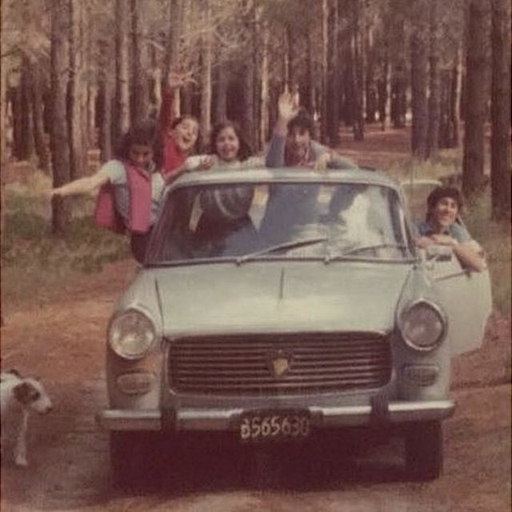
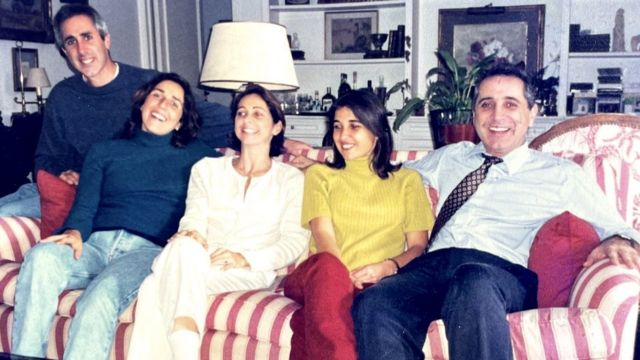
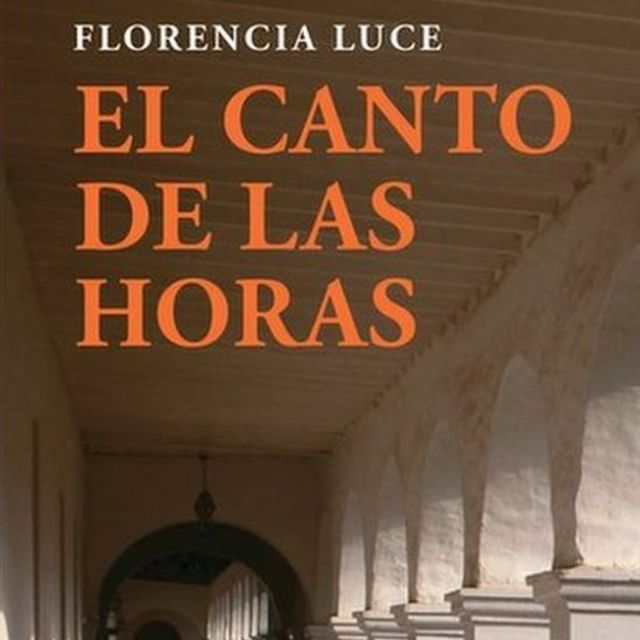
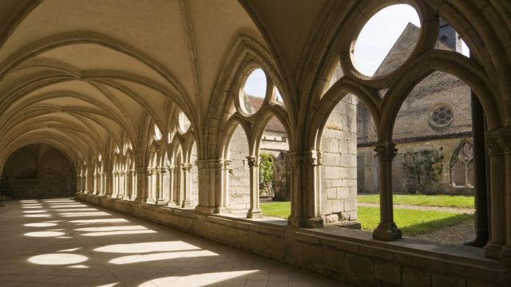
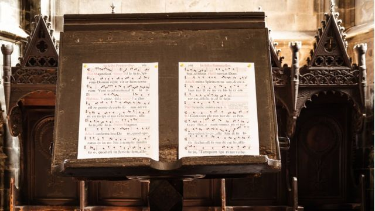
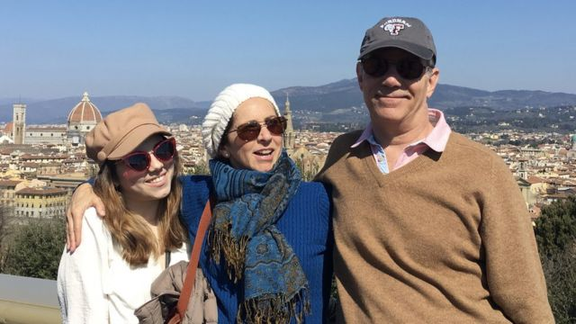

# [World] 静默修女的故事：我是如何“逃离”12年修道院生活的？

#  静默修女的故事：我是如何“逃离”12年修道院生活的？

  * 劳拉·普利特（Laura Plitt） 
  * BBC西班牙语记者 

9 小时前

> 图像来源，  Florencia Luce
>
> 图像加注文字，弗洛伦西亚成为与世隔绝修道院的一名修女，一呆就是12年。

**一个周日的早晨，弗洛伦西亚·卢斯在未经许可的情况下拿起电话给她兄弟姐妹打电话。**

她告诉他们，“在家里等我。我需要跟你们说话。”

她收拾了几件随身物品，走出门，来到大街上。其实，这一想法已经在她头脑中酝酿了几个月，甚至好几年了。

但一直到12月的一个早晨，她才鼓足勇气逃离修道院，过去12年中，她一直在修道院过着静默修女（cloistered nun）的生活 - 几乎完全与外部世界隔绝。

正是这段经历启发了这位阿根廷女性，赚写了在今年早些时候发表的小说《The Song of the Hours》。

虽然卢斯并没有被强迫关在修道院，但她称她在这一宗教机构所经历的控制和心理操纵让她无法离开。

她在阿根廷布宜诺斯艾利斯一个传统街区的中产家庭长大，如今她认为当初那样做是因为自己的困惑，需要在一个大家庭中找到自己的声音。

她还认为理想主义以及她从精神导师那里得到的糟糕建议加起来导致她走上了错误道路。

虽然卢斯承认，她与世隔绝的生活也有“美好的时刻”，但却因为许多琐碎担心的日积月累而受损，这些与她刚进修道院时所渴望的那种精神生活相去甚远。

尽管如此，她还是花了10多年的时间才走出去。

她目前跟丈夫和女儿居住在新泽西，她向BBC讲述了自己的故事：

> 图像来源，  Florencia Luce
>
> 图像加注文字，卢斯和她的兄弟姐妹

##  早年生活

我在布宜诺斯艾利斯的一个有5个孩子的中产阶级家庭长大。

虽然过去常常参加弥撒，但我们家基本上不太信教。尽管我高中上的是一所世俗学校，但它的宗教氛围很浓。我19岁时开始考虑从事宗教职业。

在天主教大学（Catholic University）学习农学时，我感到了“召唤”。它来的迅猛而突然。我还记得上帝召唤我的那一刻，很完美 - 它有强烈的肉体感觉。我有一个神父精神向导，他告诉我关于修道院的事，并说我是过那种静默生活的理想人选。

但我现在回想这一切时，我认为当时的“宗教召唤”其实是谵妄和质疑的一部分。而今天，我认为那是我碰巧遇到的事情，并试图去拥抱它，因为我觉得我需要离开家。

就像也同样生活在传统和保守环境中的我朋友一样，他们出于想离开家的缘故而结了婚，而我正好碰到了可以去修道院的可能性。

虽然我家中没有什么主要矛盾，但家里人很多，很吵。我想要自己的空间。那是一时冲动的错误。我当时非常理想主义，想为世界做点事。

##  做出决定

我父母反应非常不好，他们无法理解我的决定。我的兄弟姐妹则说我疯了。

在进修道院前，我有许多朋友。我喜欢交际、爱运动。我还有一个男朋友。

但当我去跟修道院院长谈话时，我没有考虑任何事情。我变得非常狂热，决定加入修道院。他们立即就接受了我，从没告诉我要等待和思考一下，或是先完成我的学位再说。他们也未对我脆弱的信仰提出任何质疑。

> 图像来源，  Florencia Luce
>
> 图像加注文字，卢斯希望有自己的空间。

当他们告诉我修道院生活时，对我来说似乎很完美。

##  修道院规矩

一进修道院，就要切断与外部世界的联系。我只带了一个袋子，里面有几件简单衣物 - 不能把书、收音机或是任何私人物品带进来。

他们指派一名年轻女子来带我，她带我参观修道院，并为我解释每天的日常以及规矩，因为进入的是一个必须遵守很多规矩的世界。其中之一就是保持沉默，例如，在做饭、打扫卫生，或是去上课时都不允许讲话。只有在休息的时候才可以自由讲话。

黎明前起床，然后有许多礼仪式祈祷 - 唱赞美诗和集体祷告 - 以及冥想、学习、工作和更多的祈祷。

为家人祈祷，或是为他们指出的冲突而祷告。例如，现在将会为乌克兰战争而祈祷。

这一切由修道院院长来决定，她每天都会收到报纸，她会剪下那些被认为大家都有兴趣的文章，然后把它们放在我们都可以阅读到的房间里。

但信息被过滤、审查。没有其他信息来源：信息来源就是院长，或是家人告诉的消息（如果他们来修道院看望的话，随着时间推移越来越少）。其理念是所有这些活动都将人引入一种冥想的境界，并膜拜上帝。

##  渺小世界

我变得非常喜欢修道院里的姐妹们。她们都是很注重精神世界的人，她们成了我的家人。但我现在知道其实也有很多矛盾，因为那是一个极其封闭的环境，许多规则也得不到遵守。

人们期望能够获得精神上的纯洁，把自己献给上帝。但这一目标太远大了，很少有人能做得到。而且，能看到许多人都不应在那里。会发现那是一个充满嫉妒和竞争的世界，在这里有不同群体和个人希望能往上爬，就像在一个公司里一样。

修道院是一个自上而下的组织，院长是所有修女的最高精神向导。她是唯一一个允许你倾诉个人冲突世界的人，而且，她自己也经常处于矛盾中心，因为开始被她吸引，并争相希望自己能得到她的喜欢和恩惠。

> 图像来源，  Florencia Luce
>
> 图像加注文字，卢斯把自己的经历写成小说

跟其他修女的感情也是如此 - 出现了一种不健康的关系，只是为那些关系纽带而存在，这样人们才会关注和在意你。已经停止为上帝而存在，一切都围绕修道院长而转。

所有这些都是导致精神疾病的原因，之后还会表现为身体疾患。许多修女有胃病及头痛，而当医生为她们检查时却什么也查不出来。

我们是一群被关在同一个地方的女人，没有任何其他活动，于是看到的每个小事都会被放大。还由于是静默修女，不允许讲话，所以就不停地想，思考那些最细小的事情。

此外，我们也不做任何运动。

这让许多修道院里的年轻女性感到困惑。那种环境让人的精神和情感都感到非常疲惫不堪。这也让我开始怀疑自己在那里到底在干什么。

##  开始怀疑

我开始疑问在第一年是否从事了宗教工作。但一开始我喜欢集体生活，我热爱学习和唱歌。

我经常有职业危机，但院长总是告诉我这发生在所有修女身上，它只是一时的。她还告诉我，我适应地非常好，并在从事一份真正的工作。

当我去看院长时，她总会哭，其结果总是又让我留了下来。我真的认为她并没有任何恶意 - 我认为她试图想让一些有知识背景的女孩留下来。院长庇护我们，因为她认为她可以塑造我们的未来。

> 图像来源，  Getty Images
>
> 图像加注文字，修道院里有许多日常活动和规矩，但规矩并不总是得到遵守。

因为我会开车，她会带我去看她母亲，出去吃午饭、喝茶或是购物，所有这些我不可能做的事情，但我不能对任何人讲。

起初，我喜欢这一切，但之后也正是它导致了我的危机。

##  危机

最后我终于认识到，虽然进修道院时认为将会转变自己，并帮助改变世界，但实际上却过着一种必须关注小事的生活。

我祈祷过，但最终，最重要的事情是要与其他修女搞好关系，这样她们会给我一份更好的活，而不是去打扫浴室。这让人非常自相矛盾，因为它并没让人忘掉自我，献身上帝，而是每天盯着一些小事。

但让（我离开）的导火索是我到法国一家修道院的旅行，我被送去帮忙。离开一段距离让我有机会从另外一个角度看问题。当我回来后，我觉得自己已经不属于那里了。

雪上加霜的是，一直和我关系非常亲近的祖母的去世。他们不允许我去参加她的葬礼，但与此同时，我却能跟院长一起出去喝茶。

这帮我更清楚地看清了一切。我开始更加怀疑我的职业，更严重的是我认识到我正在患上心理疾病。

因此，在12年后，我终于能够做出决定。

##  离开修道院

我之前也曾多次试图离开，但每次院长都能说服我留下。那就是我不跟她说的原因。我靠自己解决。

一天天气不错，我趁她不在，在她桌子上留了一封信。我解释了这样离开的原因，因为我没有别的办法。我拿了自己的东西，正像我平时出去办事时一样，让他们给我开门。

> 图像来源，  Getty Images
>
> 图像加注文字，卢斯喜欢修道院中的一项活动是格列高利圣咏。

我并不认为是出逃。它是我100%摆脱这种心理和情感束缚的唯一途径。但后来，在修道院我因为离开受到了严厉的批评。

我虽然离开时并没有什么计划，但我知道我需要离开，而且会得到我家人的支持。

见面令人十分兴奋。这么多年过去了，我家人根本不知道我内心的矛盾与挣扎。我们聊天、哭泣。我家人很开心。

##  新生活

刚出来后，我看上去苍白、消瘦。我一直吃的很少，饱受痛苦煎熬。好几个星期后我身体才开始得到恢复。我一点一点开始学习，并找到一份工作。

我还遇到了今天成为我丈夫的人，余下的都是历史了。

理疗，以及家人和朋友的支持帮助我走出阴影。我很幸运。在重返现实世界后，我的思维几乎又回到了加入修道院前的境界。我对一切都充满了好奇心。

我很容易适应 - 就像鱼儿又回到了水中一样。

> 图像来源，  Florencia Luce
>
> 图像加注文字，卢斯与丈夫和女儿

我也思考了许多我为什么在修道院呆了这么多年的问题，到现在我还在想。

我喜欢集体生活，并能有时间学习和阅读。但我想最主要的原因还是修道院长的影响，她很有感召力，她对所有人都具有强大的影响力。

有点像人们很想知道，为什么有些人会留在邪教中，或是留在明知并不适合于自己的婚姻中。我并不后悔加入修道院，因为我获得了非常丰富的阅历，但我确实后悔呆了这么久。

##  反思和建议

我的经历并没有让我对上帝或是精神生活失去信仰，但是现在我则在文学作品，或是听音乐会的时候体会得更多 - 而不是在教会机构中，我反对和拒绝教会的那些矛盾、虚伪和训令。

我会建议任何考虑开始出家生活的人不要草率决定，在放弃自己事业前要拥有一些其他体验。

而对那些做精神导师的神父们，我会告诉他们不要试图把年轻人领进门，他们应该让年轻人等一等，因为年轻人在那一时刻非常脆弱，他们会百分之百相信神父的话就是上帝的旨意。

