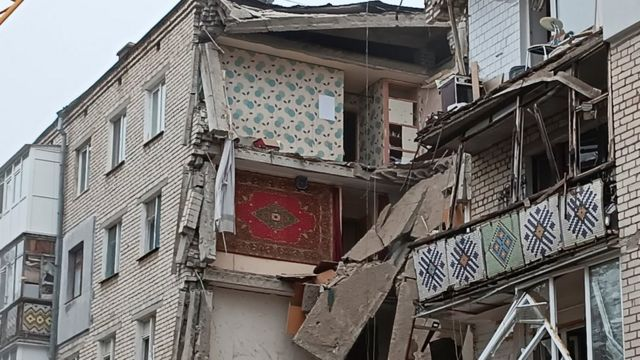

# [World] 乌克兰战争：俄罗斯军队全部撤出赫尔松“完成重新部署”的四大看点

#  乌克兰战争：俄罗斯军队全部撤出赫尔松“完成重新部署”的四大看点

> 图像来源，  Reuters

**俄罗斯入侵乌克兰的战争持续多月后, 俄罗斯宣布从赫尔松（Kherson）撤军。**

BBC驻莫斯科记者威尔·维尔农（Will Vernon）报道说，俄罗斯国防部在每日战报更新中宣布，“莫斯科时间今天早晨5点，俄罗斯部队向第聂伯河东岸的重新部署已经完成。”

“在重新部署期间，没有留下任何一件军事装备。所有俄罗斯军人都转移到了河对面，俄罗斯部队人员、装备和物资没有任何损失“。

俄罗斯国防部还列举了部队在过去24小时内在乌克兰取得的战绩。

不过，在外界看来，赫尔松作为俄军入侵后夺取的乌克兰的唯一地区首府，全部撤出对俄罗斯而言无疑是重大打击。

BBC中文梳理俄罗斯从赫尔松撤军的四大看点。

##  俄罗斯表述的“重新部署”和“调动”

此前，俄罗斯国防部已经宣布，俄军正在从赫尔松地区转移到第聂伯罗河的另一边。

周四，俄罗斯国防部发言人伊戈尔·科纳申科夫中将（Igor Konashenkov） 在向记者的每日简报中简要提到正在撤出，但他没有使用“撤退”一词，而用的是“调动”。

他说：“俄罗斯部队正在严格按照批准的计划向第聂伯河左岸预先准备好的阵地调动”。但他没有提供更多的细节，也没有提供俄军“调动”的照片。

BBC驻莫斯科记者罗森伯格注意到，在俄罗斯的媒体报道中都特别强调，撤军的决定出自俄罗斯国防部、而不是总统普京。

##  各方作何反应？

对最近几天有关俄罗斯从赫尔松撤军的报道，乌克兰总理泽连斯基表示持“非常谨慎”态度。

此前，据国际文传电讯社-乌克兰新闻社援引乌克兰武装部队主要作战部副主任奥列克西·赫罗莫夫（ Oleksiy Hromov）表示，乌克兰军队”既不能否认也不能证实所谓俄罗斯军队从赫尔松撤退的报道“。

他说：”我们继续按照计划开展进攻行动"，并说俄罗斯并没有要求为撤军提供绿色通道。

乌克兰方面仍然担心，俄罗斯的撤军宣布可能是个“陷阱”。

不过，周五时间，社交媒体上出现的照片显示，离开赫尔松的唯一公路桥有几段被毁。密切关注战争的博主们据此判断，俄罗斯从第聂伯河西岸的撤退已经结束。

美国总统拜登发表评论说，俄罗斯从赫尔松撤军的决定显示俄军对乌克兰的战争”有一些真正的问题“。

北约秘书长斯托尔滕贝格说，随着战争持续到第九个月，俄罗斯离开赫尔松将是乌克兰的”又一个胜利“。

斯托尔滕贝格在与意大利总理梅洛尼会晤后向记者表示，撤军可能意味着俄罗斯”面临沉重压力“，只要乌克兰有需要，北约将继续支持。

英国首相苏纳克办公室的发言人表示，苏纳克周四（11月10日）在与乌克兰总统泽连斯基通电话时双方一致认为，俄罗斯从被占领的赫尔松市的撤退将显示乌克兰部队“取得重大进展”。

但两人也认为，在乌克兰国旗重新飘扬在赫尔松之前，对撤军持谨慎态度是正确的，

##  控制赫尔松为什么重要？

赫尔松位于乌克兰南部，第聂伯罗河口入口处的黑海沿岸。

作为主要的港口城市，赫尔松距离被俄罗斯吞并的克里米亚仅约100公里，是航运，海军和其他重要海上航线的通道。

城市以东不远就是北克里米亚运河的源头，这条运河提供克里米亚半岛淡水供应的很大一部分。

实际上，赫尔松这座城市就仿佛是连接自2014年以来被俄罗斯吞并的克里米亚半岛与乌克兰其他地区之间的桥梁。

俄罗斯在3月初占领了赫尔松，并在最近宣布吞并赫尔松地区以及乌克兰的其他三个地区。

伦敦国王学院国防问题研究员玛丽娜·米隆（Marina Miron）说：“赫尔松是通往克里米亚的门户，夺回它将为重新控制克里米亚铺平道路，而这正是乌克兰在这场战争中的目标。”

米隆女士说，夺回赫尔松传出的信号是：战争正在向有利于乌克兰的方向发展。

”这将向西方证明，花钱支持乌克兰并向他们提供武器仍然是值得的。“

##  和平协议的可能性？

_BBC乌克兰事务记者_ _詹姆斯·沃特豪斯（_ _James Waterhouse_ _）_ _发自基辅_ _：_

如果你认为俄罗斯和乌克兰距离签署和平协议还很遥远，那么你的预判可能非常正确。

泽连斯基总统以前的和平协议条件包括俄罗斯完全撤出，赔偿损失，以及莫斯科领导层换人。

然而，最后一个要求似乎已经被放弃。乌克兰官员曾表示，与普京达成协议并非不可能。

但很难看出俄罗斯怎么可能同意这些条件。

莫斯科说它对谈判持开放态度，但基辅称这只是“烟幕”。

美国否认向乌克兰总统泽连斯基施压要求他妥协的说法，但美国一名高级官员表示，随着冬季到来形成的局面可能会带来一个谈判和平的机会。

美国参谋长联席会议主席马克·米利将军（General Mark Milley）说：通过军事手段达成双方都认可的军事胜利是无法实现的。

因此，战争将不得不通过协议来结束。

泽连斯基总统长期以来一直认为妥协的想法在政治上是不可取的，但美国很希望他表示出有谈判的意愿。

