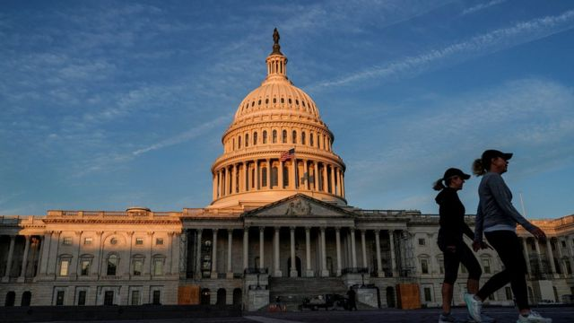
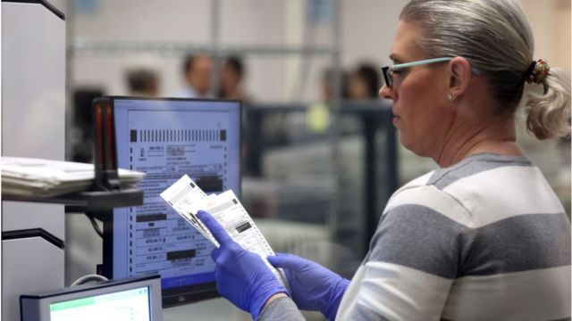

# [World] 美国中期选举：为什么民主党赢得参议院控制权很重要

#  美国中期选举：为什么民主党赢得参议院控制权很重要

  * 安东尼·泽克尔（Anthony Zurcher） 
  * BBC记者 发自华盛顿 

> 图像来源，  Reuters

**现在可以肯定，美国共和党已经在中期选举落败。民主党人仍然控制着美国参议院。不过，为什么这很重要？**

在数千万美国人参加投票四天后，凯瑟琳·科尔特斯·马斯托（Catherine Cortez Masto）上周六（11月12日）晚些时候在内华达州以微弱优势获胜，终于给这场全国政治决斗带来决定性的结果。

民主党目前在美国国会参议院选举中以50比49领先。即使共和党赢得了剩下的乔治亚州参议员选举，副总统卡玛拉·哈里斯（Kamala Harris）仍手握决胜一票。

当然，过去两年的情况一直如此。这为拜登总统在接下来的两年用他的提名人选来填补联邦法院的空缺，并在很大程度上按照他认为合适的方式进行人事安排奠定了基础。

最重要的是，如果最高法院的一个席位因大法官意外退休或去世而空缺，共和党人将无法阻止拜登提出的人选。民主党人还记得2016年，当时共和党的参议院多数党领袖麦康奈尔（Mitch McConnell）阻止了奥巴马提名人举行听证会。

内华达州的胜利意味着12月6日乔治亚州参议员投票不再是决定参议院控制权的关键之争。但拜登表示，民主党获得51个席位“只会更好”。额外的缓冲当然会让管理多数席位更容易，而且在2024年也会有帮助，到时候民主党需要捍卫更多受到威胁的席位。

尽管还不确定，共和党仍有可能以微弱多数控制众议院，给总统带来各种麻烦。

他的立法议程已死，更激进的共和党监督正等待着，但即使这样也有一线希望：那就是他的政治对手由于内部不和而无法有效管理。

这个打破历史的中期选举结果的后果仍在显现。

拜登在党内的地位得到了巩固。他的顾问们现在更加自信地谈论他寻求连任的意图。他的前竞争对手，如自由派的马萨诸塞州参议员伊丽莎白·沃伦（Elizabeth Warren）都对他表示称赞。

“这场胜利属于乔·拜登，”她在周日说。“总统带领我们到这样一个位置，上上下下每个候选人，谈论民主党为什么而奋斗，我们兑现什么。”

同时，特朗普的政治前途有所受挫，尽管这种挫败持续多久还有待观察。

在民主党赢得美国参议院的一天后，随着他们在众议院继续赢得摇摆不定的竞选，一些共和党人走到镜头前，把责任直接推到特朗普。

不过，总的来说，他们可能就是过去经常批评这位前总统的人。

> 图像来源，  Getty Images

参议员比尔·卡西迪（Bill Cassidy）说，特朗普支持的候选人在中期选举中“表现不佳”，他在对这位前总统的第二次弹劾审理中投票支持定罪。马里兰州州长拉里·霍甘（Larry Hogan）曾表示，这位前总统在最近的选举中让共和党付出了代价，他在2020年的总统选举中把票投给了“罗纳德·里根”（已经去世的美国前总统），而不是特朗普。

真正的考验将是特朗普的长期盟友，如南卡罗来纳州参议员林赛·格雷厄姆（Lindsey Graham）极度保守的众议院自由党团（House Freedom Caucus）成员或著名的共和党州长，是否会攻击他。

当特朗普在他们的州举行集会时，他们会找到其他事情做（来避开他）吗？如果特朗普竞选总统，他们会保持沉默吗？如果他们不够支持特朗普，他们会冒着激怒特朗普的风险吗？至少到目前为止，还没有这样的迹象。

根据最近报道，这位前总统的盟友们正在推动那些对国会领导职位感兴趣的共和党人公开支持特朗普的总统抱负。

纽约州众议员伊莉斯·斯特凡尼克（Elise Stefanik）已经这么做了。如果有更多的人效仿，这可能表明，尽管最近发生了一些事，但雄心勃勃的共和党政客仍认为，他们通往成功之路取决于这位前总统的福气。

与仅仅一周前相比，美国的政治形势看起来大不相同。

民主党人对自己的位置感到更加安心，而共和党人则在努力稳住阵脚。但是，考虑到现在美国政治的不确定性，谁也不能保证不久之后形势不会再次发生变化。

