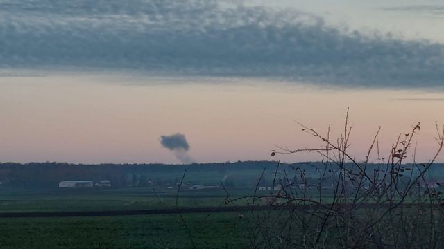
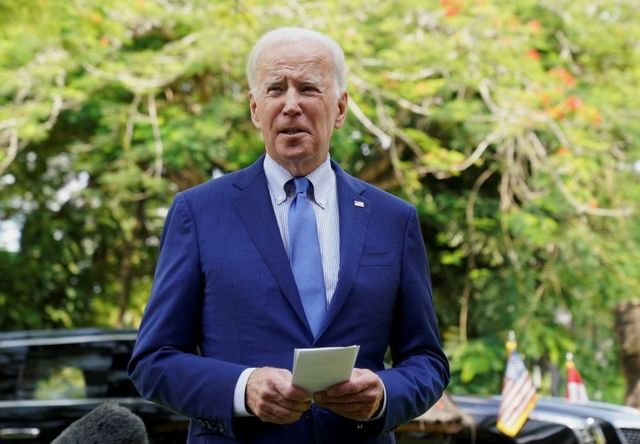
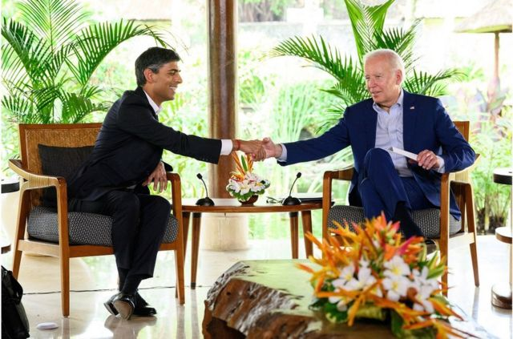
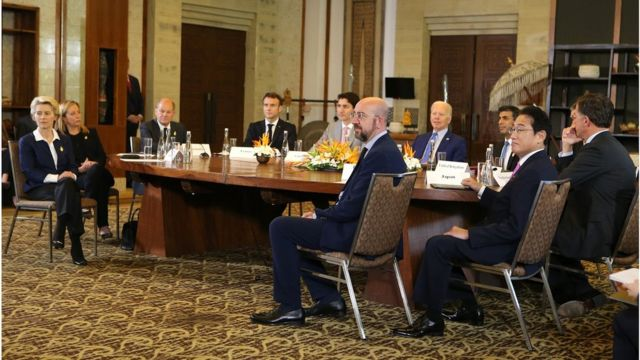
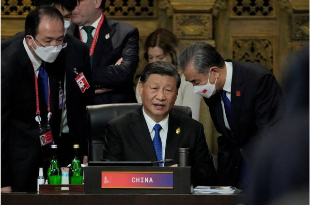
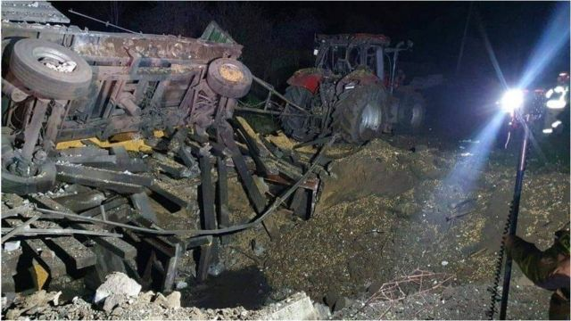
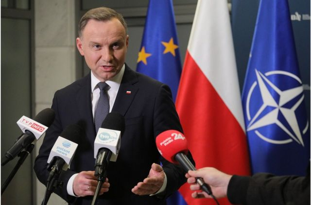
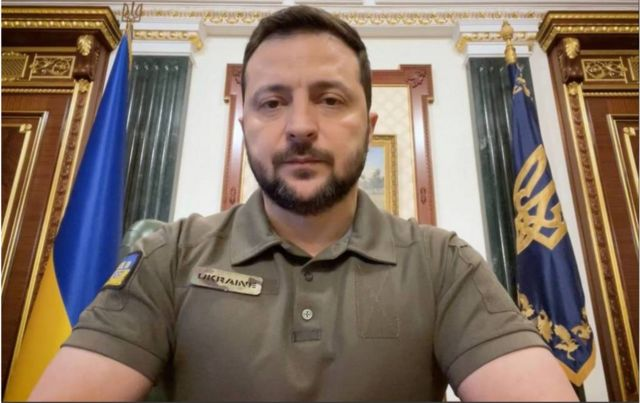

# [World] 俄制导弹落入波兰境内 拜登称初步认为“不大可能”从俄罗斯发射

#  俄制导弹落入波兰境内 拜登称初步认为“不大可能”从俄罗斯发射

> 图像来源，  Reuters
>
> 图像加注文字，在靠近乌克兰边境的波兰诺沃西奥尔基 (Nowosiolki) 看到远处导弹落下后有浓烟升起。

**据报道有导弹落在波兰境内靠近乌克兰边境热沃多夫（Przewodów）的一处农庄，波兰证实有两人丧生。**

美联社援引三名美国官员的话说，初步评估显示，落在波兰的导弹是乌克兰军队向一枚来袭的俄罗斯导弹发射后落在波兰境内的。

无法公开讨论此事的美方官员在匿名的情况下接受了美联社的采访。早些时候，美国总统拜登已经表示，落在波兰的导弹“不太可能”是从俄罗斯发射的。

波兰官方尚未证实导弹由谁发射。

由于意外发生在北约（NATO）国家波兰境内，又正值G20高峰会的敏感时刻，此事成为全球关注焦点。G7七大工业国，包含欧盟的领导人已经在印尼巴厘岛召开紧急会议。出席的有英、美、日及欧盟主席等代表。

> 图像来源，  Reuters
>
> 图像加注文字，美国总统拜登称，造成波兰两人死亡的导弹“不太可能”是从俄罗斯发射的。

美国总统拜登表示，造成波兰两人死亡的导弹“不太可能”是从俄罗斯发射的。“在我们完全调查之前我不想这么说，但在轨迹上它不太可能是从俄罗斯发射的，但我们会继续调查。”

他补充说，全球领导人将在了解及调查发生导弹事件后决定下一步行动。

此外英国新任首相苏纳克（Rishi Sunak）和拜登在G20会场上举行了双边会谈。

“当世界各国领导人齐聚在此，寻求在世界和平方面取得进展之际，普京袭击了平民——儿童和妇女。我的意思是，这几乎是用我的话，而非你的话来说，是野蛮的行为，”拜登说。

> 图像来源，  Reuters
>
> 图像加注文字，英国新任首相苏纳克（Rishi Sunak）和拜登在G20会场上举行了双边会谈。

苏纳克随后同意说，俄罗斯的导弹袭击是野蛮行为。

不过，两人拒绝回答波兰导弹事件。

虽然早期的报道表明俄罗斯的导弹是罪魁祸首，但波兰总统安杰伊·杜达（Andrzej Duda）表示，没有“确凿的证据”证明谁应该对此负责。

波兰总统杜达告诉记者：“我们目前没有任何确凿证据证明是谁发射了这枚导弹……它很可能是俄罗斯制造的导弹，但这一切目前仍在调查中。”

中国外交部发言人毛宁周三（11月16日）在例行记者会上回应有俄制导弹落入波兰境内爆炸一事的提问时呼吁相关方“保持冷静克制，避免局势升级”。

该发言人说：“中方在乌克兰问题上的立场是一贯和明确的，开展对话谈判，和平解决危机是当务之急。”

早些时候，法国敦促在评估导弹的来源时要“极其谨慎”。

##  G20现场：有舞台没剧本的峰会

**BBC中文记者陈岩 发自印尼巴厘岛**

> 图像来源，  EPA
>
> 图像加注文字，G7七大工业国，包含欧盟的领导人已经在印尼巴厘岛召开紧急会议。出席的有英、美、日及欧盟主席等代表。

这次峰会，记者们几乎没办法按照媒体手册的议程来工作。

就好像主办方搭建了一个大舞台，邀请来一众演员，但大家都不按照剧本，即兴发挥。

峰会第一天的媒体聚焦点，发生在晚上，俄外长突然离开，同时远在欧洲的乌克兰遭到轰炸。当晚盛装出席晚宴的各国领导人，被抢尽风头。

当一枚俄制导弹落到波兰境内，第二天的议程也被打乱。周三（11月16日）一大早，拜登与G7、北约领导人临时加开一场会议。记者们风风火火赶到新闻中心，试图挤进这场议程之外的重要活动。印尼的工作人员却很无奈，因为关于这场临时会议，他们没有信息，也无力掌控，没办法帮助记者。

当年之所以组织G20峰会，就是因为G7在全球经济中代表性不足，才加入更多国家，从而更具代表性地讨论事项，一致行动。但在G20会议期间，会场之内，加开了一场G7，似乎是对G20初衷的嘲讽。

但也折射出本届G20草案中的一个观点，虽然G20是协调经济的舞台，但地缘政治冲突对经济冲击过大，无法在不讨论安全议题的情况下，应对经济危机。

会前我们采访印尼财长慕利亚妮。她参加了2008年第一次G20峰会，她回忆，全球领袖们在金融海啸的压力下，有种团结的精神，本次财长会时就有些紧张。大家甚至有点怀念上一场经济危机，因为单纯得多，只讨论财政、货币政策就行；但这一次，俄乌战争、中美对峙、再加上新冠疫情，大家要对付一场过于复杂的危机。

##  G20现场：中方如何回应乌克兰战争的发展？

**BBC** **News** **记者** **黄晓恩（Tessa Wong） 发自** **印尼巴厘** **岛**

> 图像来源，  Reuters
>
> 图像加注文字，习近平在G20领导人峰会上。

在过去的几天里，中国国家主席习近平在G20会议上明确表示——至少在公开场合——他不打算在乌克兰战争问题上向俄罗斯更加倾斜。

但随着俄罗斯昨天对乌克兰发动的大规模导弹攻击，以及在乌克兰边境的波兰境内落下的导弹，北京现在该如何反应？

“我不认为中国会谴责俄罗斯，尽管习近平很可能对在乌克兰的战争越来越感到不安。”德国马歇尔基金会亚洲项目主任葛来仪（Bonnie Glaser）告诉BBC：“中国人将继续呼吁和平，但避免指责。”

澳大利亚国立大学讲师宋文笛则认为，中国现在可能会通过呼吁耐心和事实调查来“玩等待游戏”。

“中国不想削弱俄罗斯或促成针对俄罗斯的多边努力，因为今天对俄罗斯的制裁可能明天就落到中国头上。因此，北京没动力协助西方建立协调多边制裁的机制或规范。”

关于这可能对G20公报的影响，宋文笛认为，在公报上直接谴责俄罗斯侵略的可能性仍不确定，取而代之的可能是呼吁尊重领土完整的一般性语言。

目前尚不清楚是谁发射了落在波兰的导弹，但宋文笛认为不管是谁发射的，这一事件可能对中国有利，而在美国的思维中总有一股暗流，即美国无法同时对付俄罗斯和中国。

“在美中关系似乎趋于稳定之际，此次导弹袭击提升了人们对俄罗斯威胁的紧迫性。”

“它将给在美国的对中鸽派提供一个谈资，解释美国为何应该抓住这一势头，对北京能较宽容以对。”

##  俄罗斯否认

> 图像来源，  Reuters
>
> 图像加注文字，爆炸现场的残骸。

在网路上流传的一张图片显示，当地媒体报导波兰农田上有一个大弹坑，这显示飞弹造成了破坏。另一张图片似乎显示了飞弹碎片。

早前，俄罗斯国防部否认这些报导，称它们相当于“旨在升级蓄意挑衅”。但是，美国和其他大国表示，他们正在调查所发生的事情。

波兰国家安全局正在召开紧急会议，并将发表声明，波兰总统安杰伊·杜达在事件发生后与美国总统拜登（Joe Biden）通了电话。

在俄制导弹在乌克兰边境附近的波兰村庄造成两人死亡后，波兰总理马特乌什·莫拉维茨基（Mateusz Morawiecki）敦促人们保持冷静。

“面对这场悲剧，我呼吁所有波兰人保持冷静……我们必须保持克制和谨慎，”莫拉维茨基在华沙召开紧急政府会议后表示。

莫拉维茨基还表示，波兰将在事件发生后加强对其领空的监视。

> 图像来源，  EPA
>
> 图像加注文字，波兰总统杜达表示，目前没有“确凿的证据”证明谁应该对此负责。

在本周二（11月15日），俄罗斯向乌克兰众多城市发起了大规模的导弹攻击，首都基辅是受袭城市之一，官员称至少发现一人死亡。

如果这些导弹被证实是从俄罗斯发射，这将标志着其飞弹首次落在北约成员国境内，势必将引发北约讨论将如何应对相关安全问题。

BBC记者亚当斯（ Paul Adams ）说，对这一事件有多种可能的解释。他说，俄罗斯对瞄准波兰农场没有兴趣，因此似乎可能出现某种故障。而且，在乌克兰的防空系统试图击落俄罗斯飞弹的那一天，其中一枚导弹也有可能被打偏方向。

##  乌克兰否认阴谋论

> 图像来源，  Ukrainian President's Office
>
> 图像加注文字，乌克兰总统泽连斯基说，周二俄罗斯对乌克兰的导弹袭击是莫斯科发出的信息，即它无意结束战争。

早些时候，美联社和一些波兰媒体说，俄罗斯的导弹从乌克兰越过边界，落在了波兰。乌克兰和俄罗斯相互指责，乌克兰总统泽连斯基指责莫斯科故意攻击波兰。他说，这是莫斯科军事侵略的 “重大升级”，并警告说，“俄罗斯的恐怖行动进一步发展只是时间早晚的问题”。

泽连斯基还说，周二俄罗斯对乌克兰的导弹袭击是莫斯科发出的信息，即它无意结束战争。

俄罗斯国家新闻社则说，是乌克兰的导弹击中了波兰领土。乌克兰外交部长库列巴（Dmytro Kuleba）在推特上澄清“这只是俄罗斯宣传的阴谋论之一”。

库列巴又在推文强调“自从马航M17被击落后，我们就应该记取教训”。他说，当初莫斯科也拒绝表示此事与俄罗斯有关，并且带风向质疑是乌克兰军方误击客机。

这两项指控都没有得到证实。

北约秘书长斯托尔滕贝格说，他已经与波兰总统谈过，军事联盟正在 “监测局势”。

他在推特上发文说：“北约盟国正在密切磋商。重要的是，所有的事实都能得到证实。”

据乌克兰空军发言人伊哈特（Yuri Ihnatw）称，乌克兰在本周遭到了90多枚俄罗斯飞弹袭击，他说有70多枚飞弹被乌军成功击落。

