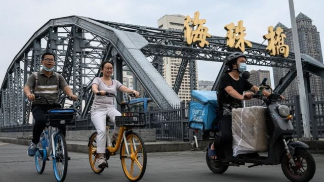
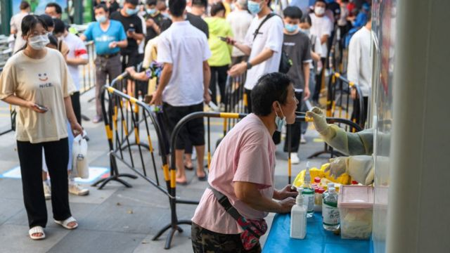

# [World] 中国疫情持续升温， 防疫措施混乱致冲突和谣言四起

#  中国疫情持续升温， 防疫措施混乱致冲突和谣言四起

> 图像来源，  Social media
>
> 图像加注文字，广州居民反抗严格的封锁措施，与警方爆发冲突

**中国疫情持续升温， 在不断升高的确诊数下，广州居民反抗严格的封锁措施，与警方爆发冲突。**

中国国家卫健委周三（11月16日）公布，周二全国报告新增新冠肺炎病例超过两万例，其中无症状感染者超18000例。

根据官方数据，感染病例和无症状感染者主要出现在广东、重庆、甘肃、河南和北京。

##  反抗与谣言

最近，广州出现了自新冠病毒出现以来最严重的一波疫情。世界羽毛球联合会（BWF）宣布，原定于12月举行的2022世界羽联世界巡回赛总决赛将不会在中国广州举办，赛事将迁往泰国曼谷。

尽管广州这轮疫情规模大，但是感染者情况都不严重。

中国媒体报道称，广州10月22日本轮疫情以来，所有感染者情况均稳定，无一重型、危重型病例。

近日，广州大批居民不满新冠病毒的严格封锁措施，他们逃离强制封锁，并与警方发生冲突。

视频显示，一些人推翻了一辆警车，并且拆除了防控屏障。有防暴警察进入在该地区。

冲突是在该市的海珠区，这个区实施了严格的居家令。该地区居住着许多贫穷的流动劳工。他们抱怨说，如果不能上班就拿不到工资，在新冠疫情限制措施下生活，食品短缺、价格飙升。

几个晚上，他们一直在和穿白衣的防疫人员争斗。 周一晚上，局势升级，出现了大规模的反抗行为。

未经证实的谣言再次起了作用。有传言说，检测公司伪造核酸结果，人为增加感染人数，以赚取更多钱。

中国北部也有类似的谣言。河北省官员宣布石家庄市将停止大规模检测。但这导致人们猜测，这些人将被当作豚鼠用来实验，当病毒不受控制地传播时，监测会发生什么。讨论还出现在社交媒体上。

> 图像来源，  Getty Images
>
> 图像加注文字，中国媒体报道称，广州10月22日本轮疫情以来，所有感染者情况均稳定，无一重型、危重型病例。

许多惊慌失措的当地人开始囤积据称有助于治疗新冠病毒感染的中药。

两周前，类似的谣言在网上疯传，导致中部城市郑州富士康厂区工人大规模出逃，影响了苹果手机 iPhone的全球供应。

##  管理混乱

近日，中国国家卫健委下发《关于进一步优化新冠肺炎疫情防控措施 科学精准做好防控工作的通知》，该文件被称为“二十条”。

文件要求放宽部分措施如取消入境航班熔断机制，隔离期限由“7+3”缩短至“5+3”，一般不按行政区域开展全员核酸检测，纠正“一天两三检”等不科学做法，并严禁随意“静默”管理或停工停产。

> 图像来源，  Getty Images
>
> 图像加注文字，尽管广州这轮疫情规模大，但是感染者情况都不严重。

文件下发后，部分地区调整了防疫措施，其中包括河北省石家庄。

中国媒体报道指，11月14日，石家庄疫情防控指挥部称，石家庄已经取消常态化核酸检测，该市的核酸采样点也在减少， 但乘坐公交、地铁等公共交通工具仍需持有72小时核酸阴性证明。

不过，周二石家庄重开部分采样点。 虽然许多地方已经不需要查验核酸，但也有部分单位上班、员工出差需要持核酸阴性证明。当局工作人员称，政策执行有时间差，医院排队检测的人太多，决定重启免费采样点。

