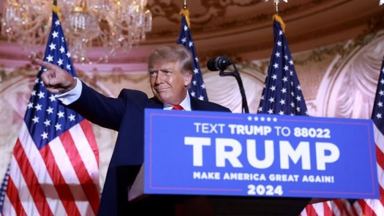
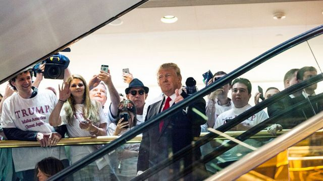
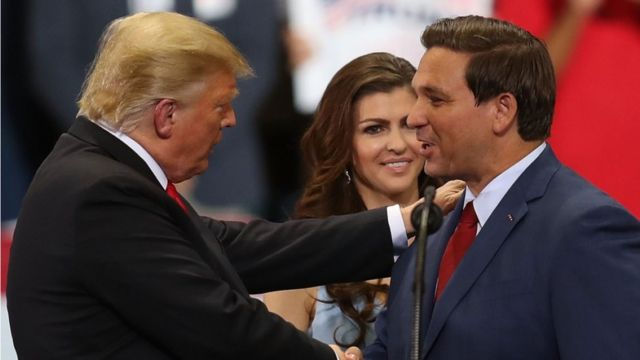

# [World] 美国2024年总统大选 特朗普再次竞选面临的六大不利因素

#  美国2024年总统大选 特朗普再次竞选面临的六大不利因素

  * 安东尼·祖彻尔（Anthony Zurcher) 
  * BBC 北美记者 

6 小时前

> 图像来源，  Getty Images

**美国前总统特朗普宣布再次竞选。这是他连续第三次参加总统选举，此前他在2020年大选中失败，而这次他力争重新入主白宫的行动可谓相当罕见。**

他宣布竞选总统的演讲时间超过一小时，主要是夸耀自己当总统时的政绩和对拜登总统过去两年执政的批评。

演讲的确展示了特朗普一直以来都保有的优势。他敏感地了解哪些是基层保守派最为关心的重要问题，如移民和犯罪。他的那种不可预测和很有煽动性的风格能主导新闻报道，让竞争对手无法获得媒体的注意。他有忠实支持者作为群众基础，也可以激励通常不参与政治的美国人投票。而在特朗普执政四年后，这些支持者中的许多人都在共和党内位高权重。

但特朗普的演讲也突出了他的一些关键弱点。

他掩盖了新冠疫情大流行期间的困难和失误，也完全不提他在选举之后的数月对选举结果的否定，而这种否定最终导致了2021年1月6日他的支持者对美国国会大厦发起袭击。

他试图为共和党在上周中期选举中不温不火的表现以及他对落选候选人的支持进行辩护。这些已经导致保守派阵营有越来越多的批评。

特朗普说，未来的任务不仅仅是“传统候选人”一个人的任务，而是一个由数百万人组成的运动，是他的运动、是他的人民和他的竞选。六年前，他借力这场运动登上了总统宝座，但有理由相信，他这次想要再次入主白宫所面临的困难将更加艰巨。

以下是六大原因：

##  1\. 四年执政记录

八年前，特朗普初登政治舞台就像是一块政治白板。由于他没有担任公职的记录，选民可以把他们的希望和愿望都寄托到他身上。他可以许下多方面的承诺，列举多方面的可胜之处，却没有批评人士可以指出他过去的失误和失败。

现在的情况已经不同。虽然特朗普在其四年任期内取得了一些明显的政策成就，包括减税和刑事司法改革，但他也有一些明显的失败。

共和党人会记得他无力废除民主党的医疗保健改革，以及他一再承诺的基础设施投资也从未实现。还有就是特朗普对新冠疫情的处理，这可能使他受到多方面的攻击。

民主党人长期以来一直批评他对疫情的反应不够积极，但也有一些右派人士认为他在支持政府授权的缓解疫情努力方面做得过分。

##  2\. 国会骚乱的阴影

特朗普本次竞选不仅要面对他在总统任期内所采取的政策，还必须为任期的结束方式以及他在2021年1月6日美国国会大厦受袭事件中所发挥的作用辩护。

> 图像来源，  Getty Images
>
> 图像加注文字，星移斗转，物是人非，2015年特朗普在公司大楼里下电梯宣布竞选总统.....

那天他的支持者在催泪瓦斯中挥舞着特朗普的旗帜，冲击国会大厦，让美国总统权力和平交接暂停。这些画面不会轻易被忘记。

中期选举表明，那天发生的事情，以及特朗普在骚乱之前几周的言行可能仍在影响选民的行为。

许多对特朗普拒绝接受2020年大选结果表示全力支持的共和党候选人在本次中期选举中都输了。他们中的很多人在其所在州也比那些没有公开否认选举结果的候选人表现得更差。

##  3\. 一脑门官司

特朗普如此急于发起另一次总统竞选的其中一个原因是，这将使他能够更有效地将他涉及的多项刑事和民事调查变成一个更大政治操作的一部分。

虽然这么做可能有助于公共形象问题，但特朗普在这些案件中所涉及的法律风险是非常真实的。

作为前总统的特朗普目前需要为自己辩护的案件包括：在佐治亚州进行的破坏选举的刑事调查、针对他在纽约的商业帝国的民事欺诈案、涉及性侵犯指控的诽谤诉讼，以及对他在国会大厦袭击案中的作用所展开的调查和他在担任总统后处理机密材料的联邦调查。

这些调查中的任何一项都可能导致全面深入的审判，将成为重磅头条新闻，至少会暂时破坏特朗普的竞选计划。

对他而言，最好的情况是，这将大大分散人们对选举的注意力，而最坏的情况将包括经济层面的重罚甚至可能刑罚。

##  4\. 对手更强硬

八年前共和党党内初举开始时，特朗普面对的是被认为最受欢迎的佛罗里达州州长杰布·布什，不过布什最后被证明不过是纸老虎。

在选举中光有庞大的竞选资金和出自名门是不够的。布什在移民和教育政策方面与共和党人的立场不一致。而且，布什的名字在共和党内也不像以前那样具有影响力。

这一次如果特朗普想在2024年获得党内提名，他可能不得不再次经历佛罗里达州长的考验。

然而，与布什不同的是，现任佛罗里达州州长罗恩·德桑蒂斯(RonDeSantis)刚刚以压倒性的胜利连任，这表明他与共和党的核心支持者保持一致。虽然他还没有在美国全国范围接受考验，但他作为政治明星正在冉冉升起。

目前还不清楚德桑蒂斯是否会参选总统，或者还有其他什么人会参加共和党总统竞选。

佛罗里达州州长可能会成为那些不愿意再给特朗普竞选机会的共和党效忠者们一致认同的总统候选人人选。果真如此，共和党选民可能只能做出二元选择，也就是在特朗普获得提名之前，增加阻止特朗普被提名的机会。

##  5\. 人气今不如昔

> 图像来源，  Getty Images
>
> 图像加注文字，特朗普与佛罗里达共和党州长罗恩·德桑蒂斯握手，他在本次的美国的中期选举中以大比分获胜。

在特朗普宣布竞选总统之前，一个保守派团体发布了一系列民调，显示在爱荷华州和新罕布什尔州选民中，特朗普的支持率比德桑蒂斯落后两位数。

这些州在共和党党内初选的提名过程中提前举行投票。

德桑蒂斯还在佛罗里达州领先26个百分点，在佐治亚州领先20个百分点，该州12月将举行参议院第二轮选举。在所有这些州，特朗普的支持率都远远低于之前的调查。

根据最近结束的中期选举的出口民调，特朗普根本不受欢迎，其中包括那些他需要在大选中获胜才能确保当选总统的关键州。

在新罕布什尔州，只有30%的选民表示他们希望特朗普再次竞选总统。即使在佛罗里达，这一数字也只上升到33%。

当然，特朗普先生在2015年也扭转了人们对他的候选资格完全不看好的局面。但在美国的政治舞台上活跃了八年后，这次他要再次改变民意可能性小了很多。

##  6\. 年龄因素

如果特朗普真能再次当选总统，等他宣誓就职时将已经78岁。虽然这与拜登入主白宫时的年龄相同，但这将使他成为美国历史上第二老的总统。

时间以不同的方式影响不同的人，但伴随年龄而来的负担却是谁也不可避免的。

不能保证特朗普能在现在的年纪经受住赢得共和党提名所必须展开的紧凑竞选活动的考验，尤其是他可能要面对的竞争对手比他年轻得多。

特朗普过去曾表现出非凡的耐力，但每个人都有自己的上限。

