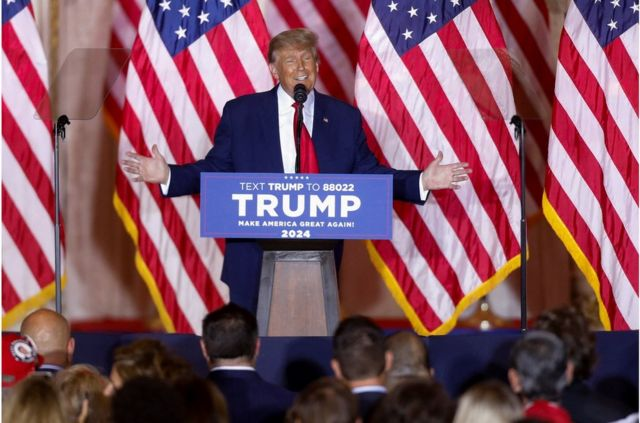
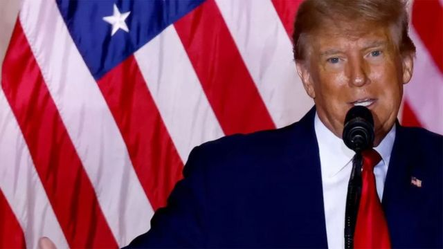

# [World] 特朗普宣布再次竞选美国总统：曾投票给他的选民是否仍会支持？

#  特朗普宣布再次竞选美国总统：曾投票给他的选民是否仍会支持？

**美国东部时间周二（11月15日）晚上，美国前总统特朗普（Donald Trump，又译川普）宣布他将第三次参与美国总统竞选。他是在美国中期选举之后发布这个消息，而中期选举并没有像外界预期的那样，在美国国会中为共和党人带来“红色浪潮”。**

BBC采访了曾投票给特朗普的美国选民，包含共和党人，问他们这一次是否还会支持特朗普。此外，随着更多的共和党人表态参选，包含该党的新明星——现任佛州州长罗纳德·迪翁·德桑蒂斯（Ronald Dion DeSantis），特朗普将面临一些竞争方能通过党内初选，进而再次角逐美国总统。

> 图像来源，  Reuters

**亚历克斯·海德（Alex Heide） 31岁 ，无党籍，乔治亚州**

_亚历克斯·海德（Alex Heide）告诉我们，他前两次投票都投给了特朗普，但现在他对这位前总统有很强烈的反感。_

我很生他的气：1月6日发生的事情是一个转折点。尽管我的父母是丹麦移民，但我在佛罗里达州的一个很小的乡村长大，因为我对政府还有关于我们“被枪支包围”的说法感到怀疑。

现在，我看到像我这样的人，认为我们当时都被执政的那个人操纵了：这是一个大梦初醒的时刻。这也粉碎了我对特朗普的看法。我现在真的讨厌这个人，我不会再投票给他。我也感觉特朗普正在摧毁共和党。如果他远离政治，我会很开心。我希望他不会赢得初选。罗纳德·迪翁·德桑蒂斯（Ronald Dion DeSantis）就像特朗普的替代者，但更睿智。

**克里丝朵·迈尔斯-巴伯（Crystal Myers-Barber）51岁** **，** **共和党籍，加州**

_多年来，克里丝朵一直公开表达她对特朗普的支持。 她在 2016年和2020年_ _都曾_ _投票给他。_

我对特朗普宣布参选感到十分兴奋。

我认为这是一件好事。 特朗普有一群粉丝过去和现在都仍支持他，他还是创造就业的人，也支持“生命权”（反堕胎）。没人会像特朗普一样崛起——德桑蒂斯或其他任何人都没法像他这样。我尊敬那些人，但我更钦佩特朗普。他是这份工作（总统）的合适人选。我绝不认为年龄会是是个不利因素。

我认为，那些对特朗普的竞选不感兴趣的前支持者，是对他的成就失去了信心。他们失去了希望。如果他没有潜在的机会角逐总统，我会很失望， 我也会很难过：我想知道谁能真的把事做好？ 在加州，汽油价格和通货膨胀率是全国最高的——我们正为现任政府的施政所苦。

**加布里埃尔·罗德里格斯（Gabriel Rodriguez ）48岁 共和党籍，德州**

_加布里埃尔很高兴特朗普赢得_ _了_ _2016年大选，但他在2020年投票给特朗普纯粹是“两害相权取其轻”。_

我现在对于特朗普出来参选很恼火，感到很委屈，我真的想“翻白眼”。

我只能希望特朗普很快变得无关紧要。我相信特朗普只需要在夜里悄悄地离开。他在白宫时已经达到他的目的，他当时成功地做出了许多创纪录的联邦法官任命，并在大选失败前任命了三名保守派大法官进入最高法院。他的这些任命将是他留下的遗产，我非常高兴他能做到这些。

但是，这次我不会在初选或大选中投票给他。在我看来，他对共和党的品牌没有好处，尽管我确信有些人会说他从来就对共和党没有好处，确实是这样。

但现在是共和党继续往前走的时候了：多一些温和，少一些来自左右两边的极端主义。

**布鲁克·** **瑞** **斯克（Brooke Riske ），37岁，共和党籍，维吉尼亚州**

_布鲁克在2020年投票给特朗普，因为他的经济政策。_

此次参选我认为是特朗普在为自己的政策主张做铺垫，我不希望因此其他候选人不敢参选。

我不认为特朗普是我们的未来，他曾经掌握大权，现在是他靠边站的时候了。让别人来领导吧。特朗普不是我喜欢的候选人，我很想看看还有谁会在初选中竞选并挑战他。对他来说，参选将是对金钱和精力的一种浪费。

不过，如果2024年是特朗普与拜登角逐总统，我倒还是会投给特朗普。但我认为德桑蒂斯是2024年挑战拜登的最佳候选人。

我也想到了克里斯蒂 **·** 诺姆（Kristi Noem）、图尔西 **·** 加巴德（Tulsi Gabbard）和格伦 **·** 扬金（Glenn Youngkin），但我更喜欢德桑蒂斯的年轻、有原则、愿意承受压力。我非常尊重他在佛州处理新冠大流行病的方式。他使佛州经济保持良好，并保护个人自由。他最近的连任证明他有能力团结各年龄阶层、各政党和各族裔的选民。

**维诺德·贾亚卡兰（Vinod Jeyakaran ）44岁，共和党籍，加州**

_维诺德在2020年中投给了特朗普，_ _当时_ _他认为最重要的议题_ _是_ _：反堕胎、经济和美墨边境安全。他在2016年还不能投票，直到2019年成为美国公民。_

对我来说，特朗普宣布参选表明，他是个战士，仍然希望帮国家找到最大的利益。我很高兴他继续宣布参选。这也推动了基本盘的发展。我也相当高兴。我希望他能更有节制，更注意用词。他不善于有效与人沟通，但他的政策都很棒。

我来自印度，有强烈的保守主义价值观。似乎如果你是有色人种，你就不该投票给特朗普，但我会在下次总统大选中再次投票给他。但我向我的妻子（她是独立派人士，但倾向于保守派）承诺，我不会在初选中先投票给他。

**罗姆·索林 （Rom Solene）61岁，共和党籍，亚利桑那州**

_过去罗姆一直是特朗普的坚定支持者。不过，这位前总统最近_ _拿_ _同党竞争者_ _、_ _佛州州长德桑蒂斯_ _（_ _Ronald Dion DeSantis_ _）的_ _名字做文章，讥笑他为“假圣人”的言论激怒了他。_

我非常欣赏特朗普将加入2024年竞选，因为就像特朗普所做的一切一样，他很擅于搅乱现状。这是我在2016年和2020年投票给他的要原因。但对我来说，这将取决于德桑蒂斯是参加初选还是大选。

自从特朗普在2015年第一次直接宣布竞选白宫大位以来，我一直是他坚定的粉丝。但是，现在我觉得德桑蒂斯州长在任何初选或总统大选中都是更好也更理想的候选人。

这是因为我顾虑“另一个特朗普总统任期”会带来的所有包袱及问题。在我看来，媒体和民主党人会对另一个特朗普总统任期变得紧张，所有关于特朗普的消息都会得非常消极。我并不是说德桑蒂斯担任总统就不会激起建制派的不满，但德桑蒂斯州长更善于表达沟通，而且我相信他更有逻辑性，是一个更好的领导者。

> 图像来源，  Getty Images
>
> 图像加注文字，中期选举并没有像外界预期的那样，在美国国会中为共和党人带来红色浪潮。

