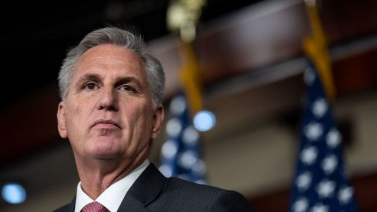
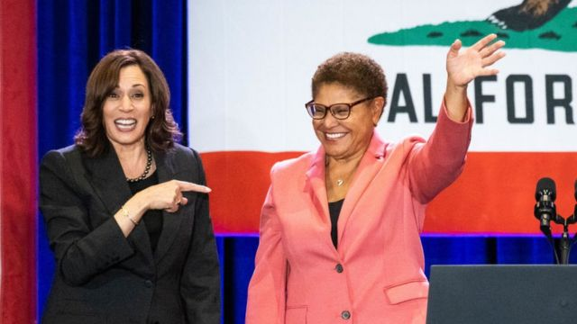

# [World] 美国中期选举：共和党以微弱优势赢回众议院

#  美国中期选举：共和党以微弱优势赢回众议院

> 图像来源，  Getty Images
>
> 图像加注文字，凯文·麦卡锡（Kevin McCarthy）

**BBC在美国的合作伙伴哥伦比亚广播公司预测，中期选举一周后，共和党已经在国会众议院获得了占多数所需的218个席位。**

尽管共和党在众议院的领先非常小，但这足以拖延拜登总统未来两年的议程。

民主党将在明年1月新一届国会聚集开会时继续控制参议院。

曾希望赢回参众两院控制权的共和党人，在上周的中期选举中表现不及预期。

但在周三的选举中，加利福尼亚州第27选区现任迈克·加西亚（Mike Garcia）胜选， 为共和党赢得了成为众议院多数党所需的一个席位。

据哥伦比亚广播公司报道，共和党目前预计将最多赢得众议院435个席位中的223个。

但因为有悬念的选区计票仍在进行中，他们的多数地位可能在几天甚至几周内都无法确定。

周二，基层共和党人提名凯文·麦卡锡（Kevin McCarthy）取代民主党人佩洛西（Nancy Pelosi）成为下一任众议院议长，他庆祝自己"正式翻盘"众议院。

“美国人已经准备好迎接一个新方向，众议院的共和党人也准备好去实现，”这位加州国会议员周三晚上在推特上写道。

为了当选众议院议长，众议院少数党领袖共和党人必须赢得众议院全体435名成员的多数支持。

但佩洛西暗示，她不会悄悄放弃众议院议长之位。她在周三晚间的一份声明中誓言，她的政党将"对占微弱多数的共和党施加强大的影响力"。

作为首位女议长，82岁的佩洛西在新闻稿中没有提到她是否打算继续担任少数党领袖，而华盛顿对她的未来却有各种猜测。

美国总统拜登向麦卡锡表示祝贺，并表示愿意与共和党人合作，为美国人民交付成果。

“正如我上星期所说，未来非常有希望，不能被困在政治斗争中，”拜登说。

“美国人民希望我们有所作为。他们希望我们关注对他们重要的问题，让他们的生活更美好。”

共和党曾希望总统相对较低的支持率、难解决的通货膨胀，以及共和党领导的立法机构重新绘制国会地图，能够为他们赢得中期选举的胜利。

该党上周表现不佳的责任主要落在两名领袖身上：前总统特朗普和参议院少数党领袖米奇·麦康奈尔（Mitch McConnell）。

周二晚上，特朗普在佛罗里达州海湖庄园正式宣布第三次竞选2024年总统。

周三在华盛顿，麦康奈尔再次当选参议院少数党领袖，击退了佛罗里达州共和党人里克`斯科特（Rick Scott）的挑战。

> 图像来源，  Getty Images
>
> 图像加注文字，凯伦·巴斯（右）在洛杉矶市长选举中获胜。

非国会选举的结果在选举日过去一周多后仍在慢慢显现。

周三，国会女议员凯伦·巴斯（Karen Bass）击败亿万富翁商人瑞克·卡罗素（Rick Caruso），预计会成为美国第二大城市洛杉矶的下一任市长。

这位民主党人将成为洛杉矶首名女市长，也是该城市历史上第二位黑人市长。

##  易怒的共和党能否团结一致?

**安东尼·祖彻尔（Anthony Zurcher)**

**BBC 北美记者**

南希·佩洛西（Nancy Pelosi）以仅9个席位的优势取得了相当大的成就，事实证明，她在与顽固的民主党人争论方面具有非凡的天赋。但谁也不能保证共和党人，从郊区竞争激烈选区的温和派到自由党团（Freedom Caucus）的保守强硬派，会同样与党内领导层合作。

不过，多数就是多数，假设共和党人能在明年1月全体众议院投票时团结一致选出议长，他们将收获中期胜利的回报。根据众议院的规定，多数党有权决定哪项立法能获得投票，哪项立法会悬而不决。共和党人还将掌管所有众议院委员会，拥有全面的监督和传唤权。

虽然易怒的共和党党团可能不会在很多问题上达成一致，但他们将能够阻止拜登的议程，迫使他们在联邦预算优先事项上进行较量。

对于一个见证了民主党在过去两年里取得一系列立法成功的政党来说，这本身就是一项重大成就。

