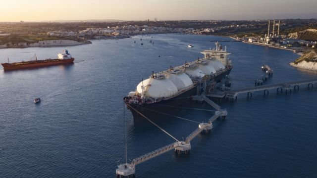
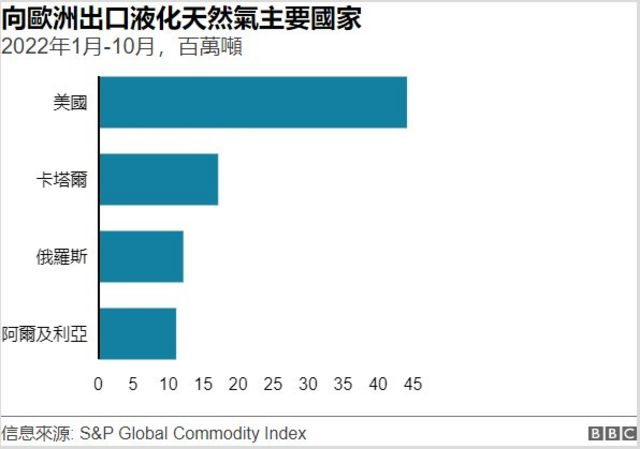
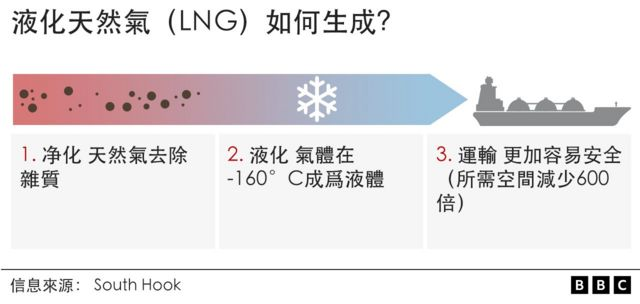
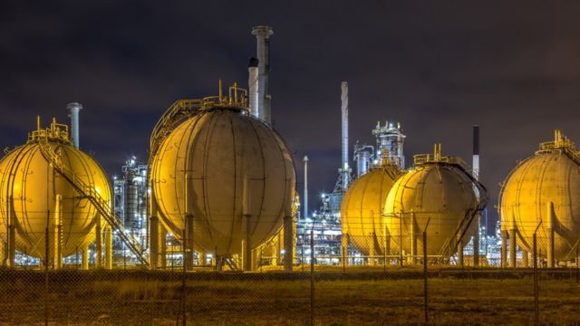

# [World] 俄乌战争与能源危机 液化天然气为什么变得如此重要？

#  俄乌战争与能源危机 液化天然气为什么变得如此重要？

7 小时前

> 图像来源，  Getty Images
>
> 图像加注文字，停泊在港口的液化天然气运输船

**俄罗斯削减了对欧洲的天然气供应，迫使各国寻找替代能源。**

填补这一空白的燃料主要是液化天然气（LNG），但由于运输量太大，油轮在港口排起了长队。

##  什么是液化天然气？

液化天然气是甲烷，或与乙烷混合的甲烷，是清除了杂质的天然气，在冷却到大约零下160℃后成为液体。

液化天然气不仅更加清洁，所占空间也比天然气减少600倍。

它像原油一样被装入油轮运输。

在送达目的地后，液化天然气再次被转化为气体，像其他天然气一样，用于供暖、烹饪和发电。

能源分析公司Crystol Energy的卡萝·纳克尔（Carole Nakhle）说：“在液化天然气之前，天然气只能通过管道输送，这限制了它的销售地。”

##  哪些国家供应液化天然气？

世界上最大的液化天然气出口国是澳大利亚、卡塔尔和美国。

美国对欧洲的出口量增加了一倍多，仅在2022年前9个月就达到4600万吨。美国已经成为欧洲大陆最大的液化天然气供应商。

澳大利亚几乎将其所有的液化天然气运往亚洲的买家。

卡塔尔将其部分液化天然气运往亚洲国家，部分运往欧洲国家，如英国、比利时和意大利。

2022年1月至10月，卡塔尔向欧洲供应了1300万吨液化天然气，但它几乎所有的产品都是按长线合同出售的，因此想在短时间内增加从卡塔尔购买液化天然气比较困难。

阿尔及利亚等国家也向欧洲出口液化天然气。俄罗斯也供应液化天然气，虽然它已经削减了通过管道向欧洲提供天然气。

##  液化天然气如何帮助欧洲继续有照明用电？

俄罗斯2022年2月入侵乌克兰受到了欧洲国家的谴责。作为回应，俄罗斯将对欧洲的天然气出口减少了约80%。

国际天然气价格因此上涨超过四倍，家庭能源开销大幅飙升。

由于担心断电，欧盟与美国签署了一项协议，进口更多的液化天然气。

据欧盟委员会称，现在液化天然气占欧盟国家使用的所有天然气的40%。

液化天然气也占英国进口天然气总量的一半，其中主要来自美国。

这些额外增加的液态天然气供应有助于阻止天然气价格攀升至更高水平。

##  为什么欧洲不能接受更多的液化天然气？

能源研究所（Energy Institute）的凯特·杜丽安（Kate Dourian）说：“美国的液化天然气帮助欧洲摆脱了困境。”

“但是现在市场已经饱和了，因为欧洲已经达到了所能接受的液化天然气极限。”

> 图像来源，  Getty Images
>
> 图像加注文字，欧洲缺乏仓库将液化天然气转化为天然气后储存

想要进口液化天然气的国家需要有工厂来卸装液化天然气，并转变成天然气。

法国、英国、意大利和西班牙已经建立了此类储存仓库，但其他国家，如欧洲最大的天然气进口国德国还没有。

欧洲缺乏液化天然气存储能力已经造成了瓶颈。

10月底，有报道称欧洲水域有51艘液化天然气油轮，其中很多都在等待进入港口。

德国和荷兰等国家已经试图通过雇用浮动仓库来存储和转换天然气来解决仓库短缺问题。

然而，即使有这些浮动仓库，这些国家也无法处理所有被运送来的液化天然气。

能源分析公司（Crystol Energy）的卡萝·纳克尔（Carole Nakhle）说这些浮动仓库规模很小，他们不能快速处理大量的液化天然气， “正因为如此，运输油轮排队的情况越来越多。”

欧洲不能接受所有被送来的液化天然气还有其他原因。

凯特·杜丽安（Kate Dourian）说：“各国无法接受更多的液化天然气，因为它们的大部分储存设施已经满了。”

她说，欧洲国家都在储存天然气，以便在天气变冷时供暖使用，但今年秋天的天气相对温和。

欧洲国家正计划再建17个液化天然气仓库。这可以使产能增加40%以上。

然而，大多数将在2026年才投入使用。

