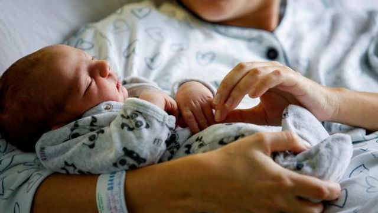
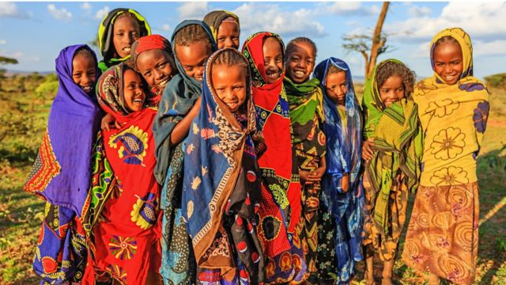

# [World] 全球人口增长与气候变化和女性权益的关系

#  全球人口增长与气候变化和女性权益的关系

5 小时前

> 图像来源，  Reuters
>
> 图像加注文字，人口增长是一个涉及女性权益、气候变化和可持续资源开发的多方面问题。

**联合国统计世界人口已达到80亿。人口暴增与气候变化和女性权益与有什么样的关系？**

当气候变化成为人类面临的最严峻挑战之际，人口问题也成为人类必须面对的问题：地球最终能承受多少人口？

1789年，英国的一位叫马尔萨斯（Thomas Robert Malthus）的经济学家根据百余年的人口统计资料，匿名发表了《人口论》，当时就引起了极大的轰动，各界支持者和反对者都很多。

马尔萨斯表示，在资源丰富的时期，人口可以在25年内翻一番。然而，随着人口的增长，最终资源无法维持，导致对人口增长的制约。马尔萨斯提出：人口增长是按照几何级数增长的，而生存资料按照算术级数增长。这一理论被称作“马尔萨斯陷阱”。

马尔萨斯因时代和他本人的知识局限，他的理论受到了各国人士的批评、争议、改进和发展。在之后的200年里，英国通过开拓殖民地、推进工业与技术革命以及开展对外贸易，英国本土安全绕过了“马尔萨斯陷阱”。不过，马尔萨斯理论成为人口学重要的学术讨论议题。

马尔萨斯的文章发表时，地球上只有大约8亿人。两百多年后，这个数字翻了10倍。而根据联合国的统计，世界人口从70亿里程碑到达80亿仅用了11年。现代医学和知识已经让人类将新生儿死亡率大幅降低。

随着全球人口大幅增长，人类是否会遇到“马尔萨斯陷阱”？

##  气候变化与人口

地球之所以适应人类生存，最基本的条件是有着适合人类生存所需要的气候资源，水，含足够比例氧气的大气以及可以循环制造维持这种资源的环境。

今天，科学家们达成的共识是：地球的变暖与人类传统的工业化密切联系。

气候变化，地球变暖威胁着粮食安全、淡水供应和人类健康。如果不采取行动大幅减少向大气中排放温室气体，气候变化的影响，包括海平面上升，干旱，洪水和极端天气，将更加严重。

联合国政府间气候变化专门委员会（IPCC）估计，人类排放的温室气体，包括二氧化碳，甲烷和一氧化二氮，使全球平均温度比工业化前水平升高了近1°C。

为了限制气候变化带来的风险，世界各国同意将平均气温上升幅度控制在2°C以下，目标是1.5°C。

虽然在经历了20世纪中叶的大幅增长之后，人口增长已经放缓。但达到90亿可能仅需要15年时间，联合国预计要到2080年即可能达到100亿。这些都比过去的预测时间提前。

人类继续以传统使用地球资源的发展模式已经不可持续。森林砍伐，煤炭等石化资源的开采和使用等已经在世界各地造成了严重的环境危机。

人口趋势和变量在理解和应对世界气候危机方面发挥着重要作用。人口增长，加上资源消费的增加，往往会增加气候变化温室气体的排放。人口的快速增长加剧了气候变化的影响，使资源紧张，使更多人面临与气候相关的风险，特别是在资源匮乏的地区。

非洲10个最易受气候影响的国家中有9个位于撒哈拉以南非洲，预计到2050年，该地区的人口将翻一番，占世界人口增长的一半。索马里、布隆迪和刚果民主共和国在人口快速增长的情况下，经常面临干旱、严重洪涝、极端高温和水土流失。

研究不同人口预测对未来经济增长和能源使用的影响表明，减缓人口增长可以显著减少未来的温室气体排放。

##  教育与气候变化

人们通常不太愿意将人口问题的讨论纳入气候教育和宣传。然而，气候变化与人口增长密切相关。正如总部位于英国的慈善机构“人口问题”所总结的那样：每增加一个人，碳排放量就会增加：富人远远超过穷人；人口增加还增加气候变化受害者的数量，受害的穷人远远超过富人。

在国家层面，收入与人均二氧化碳排放量之间存在明显的关系，生活在工业化国家和主要石油生产国的人们的平均排放量位居前列。

高收入国家的高消费生活方式和生产实践导致排放率远高于世界上大多数人口居住的中等和低收入国家。比如，根据美国官方能源网站公布的 数据  **，** 2019年，美国仅占全球人口的4%，但占世界能源使用的17%。

温室气体排放研究组织对比了生活在美国、澳大利亚和加拿大的人们的碳足迹和撒哈拉以南非洲一些最贫穷、增长最快的国家（如乍得、尼日尔和中非共和国）的人口排放数据，发现前者比后者高出100多倍。

但处于中间的中等收入经济体占世界人口的75%。在这些地方，工业化将在未来几十年内提高生活水平和消费模式。但如果不改变经济增长模式，全球碳排放量就会剧烈上升。

##  女性权益与气候变化

应对气候变化必需采取多种选择。综合方法包括教育女孩和赋予妇女权力，使其能够自己决定生育。

在全球范围提高人们的受教育率似乎不需要再多说，但是提高女孩子的教育普及率却不只能带来社会和经济的好处，而且还能协助对抗气候变化。

部分原因是女孩子在学校接受教育越久，她们就越晚才会生孩子，如果能在2050年以前让全球的所有女孩子能能接受完中等教育，那么世界上将比现在所预测的要减少8.4亿人口。

生活在世界上一些最贫困地区的人们首当其冲地承受着气候变化最灾难性的影响。他们对总排放量的贡献很小，但高贫困率和社会不平等使许多低收入人群容易受到极端天气、水资源压力和与气候变暖相关的粮食生产挑战的影响。

但在很多低收入地区，生育率却很高。

> 图像来源，  Getty Images
>
> 图像加注文字，联合国估计，非洲人口2022年已经超过14亿人。这一数字还预计会持续增加。可持续发展是非洲面临的大问题。

非洲是世界人口增长率最高的地区，10个最易受气候影响的国家中有9个位于撒哈拉以南非洲，预计到2050年，该地区的人口将翻一番，占世界人口增长的一半。那些地区的人民在人口快速增长的情况下，经常面临干旱、严重洪涝、极端高温和水土流失。

研究表示，仅在低收入地区，全球就有2.14亿妇女希望避免怀孕，但没有使用任何形式的现代避孕措施。

联合国经济与社会发展计划强调，妇女应有权选择是否生孩子，何时生育孩子，将生育多少个孩子，这是一项基本人权。它也赋予妇女减少贫穷，促进可持续发展的权力。

