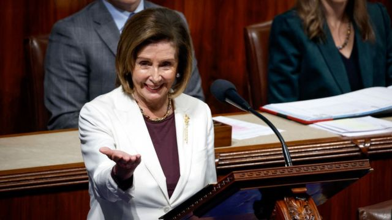
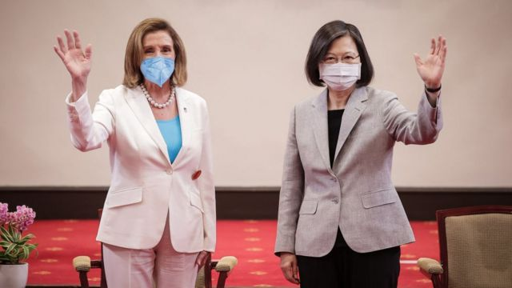
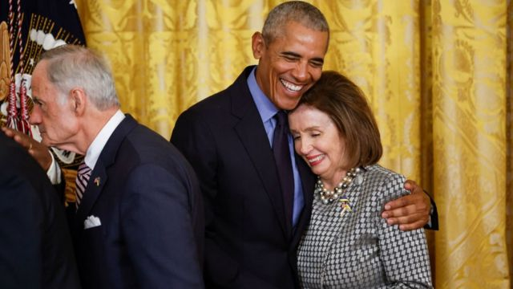

# [World] 美国中期选举：佩洛西不再担任众议院民主党领袖

#  美国中期选举：佩洛西不再担任众议院民主党领袖

> 图像来源，  Getty Images
>
> 图像加注文字，南希·佩洛西

**在美国众议院领导民主党近20年的南希·佩洛西（Nancy Pelosi）宣布，不再担任众议院民主党领袖。**

82岁的她是国会中最有权力的民主党人，也是第一位担任众议院议长的女性。

佩洛西将继续在众议院代表她所在的加州选区。

目前，共和党人预计将在中期选举后夺回对众议院的控制权。

共和党人凯文·麦卡锡（Kevin McCarthy）赢得了新一届众议院议长提名，很可能接替佩洛西。

“我从未想过有一天我会从家庭主妇变成众议院议长，”佩洛西周四（11月17日）在众议院发表声明称。

“在下一届国会中，我不会寻求连任民主党领袖。现在是新一代领导民主党全体成员的时候了，”她说。

佩洛西将继续担任议长，直到明年1月新一届国会接管。她将继续担任众议院议员，直到2025年1月。她在1987年首次担任众议院议员。

人们普遍预计，纽约州众议员哈基姆·杰弗里斯（Hakeem Jeffries）将出任众议院民主党领袖，这将使他成为美国历史上首位黑人国会领袖。

众议院议长是美国宪法中详述的国会职位。它位于副总统之后，是仅次于总统和副总统的职位。

议长和委员会主席决定哪些法案会被讨论和投票。他们制定议程并决定指导辩论的规则。

佩洛西在2003年成为众议院少数党领袖，众议院少数党领袖领导众议院反对党。2006年，民主党十多年来首次控制了众议院，她成为国会参众两院中首位领导主要政党的女性。

4年后，佩洛西再次成为少数党领袖，但在2019年重新担任议长。

作为议长，佩洛西在推进或阻挠多位总统的议程方面发挥了关键作用。

> 图像来源，  Getty Images
>
> 图像加注文字，佩洛西今年8月曾访问台湾。

人们普遍认为，她引领美国前总统奥巴马标志性的医疗改革法案通过，以及在现任总统拜登治下，促成解决基础设施和气候变化问题的法案通过。

佩洛西还在特朗普的总统任期内直接挑战他，最有名的是在他背后撕毁了他的国情咨文讲稿。

上个月，她的家被暴力闯入，导致她82岁的丈夫保罗需要做颅骨手术，此后关于她未来的流言四起。

周四，议员们为她起立鼓掌，她感谢他们的祷告，并谈到她“生命中深爱的伴侣和我的支柱”。

据《华盛顿邮报》报道，她后来表示，自袭击发生以来，她一直在“幸存者的负罪感”中挣扎，因为她的丈夫受伤“是因为他们在找我”。

佩洛西的前幕僚长约翰·劳伦斯（John Lawrence）告诉BBC，他希望佩洛西在为国会新成员提供建议和与白宫合作方面发挥重要作用，现在民主党再次成为少数党。

“从来没有离开的真正好时机，”他说。“当你处于优势时，你会想要取得很大成就，而当情况对你不利时，你会想要反击。”

在周四的一份声明中，拜登总统称佩洛西是“我们历史上最重要的众议院议长”。

##  无价的资产和避雷针

**安东尼·祖彻尔（Anthony Zurcher)**

**BBC 北美记者**

佩洛西将会被载入史册，她是最有影响的美国国会领袖之一。她是民主党的宝贵财富，也是共和党的可怕对手。

她在立法方面敏锐，对立法时机的把握没有瑕疵，以及她在政治舞台上的本能，使她成为国会山的一股力量，同时也成为批评的焦点。

> 图像来源，  Getty Images
>
> 图像加注文字，佩洛西与奥巴马

她的演讲和新闻发布会并不鼓舞人心， 但她在重要投票上保持自己在议院中难以驾驭且往往微弱多数的优势，这方面的能力几乎没有对手。

但是她的实力是有代价的。在某种程度上，正是因为这些能力，她成为了右翼的坏蛋。

她深深掌控众议院民主党势力长达20多年，也阻碍了众议院中年轻领袖的成长。

现在，他们终于有机会了。但佩洛西做得太好了，他们将有很多工作要做。

