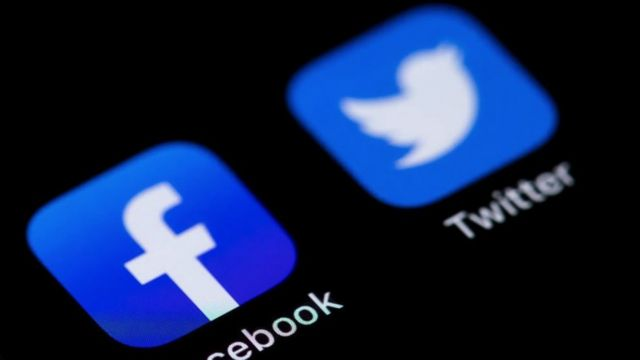
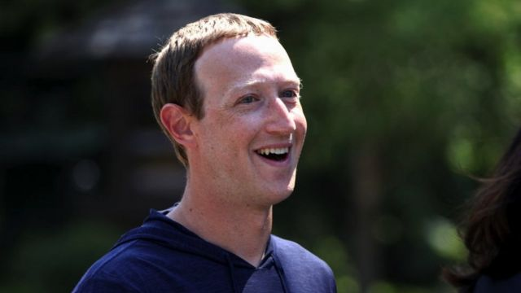
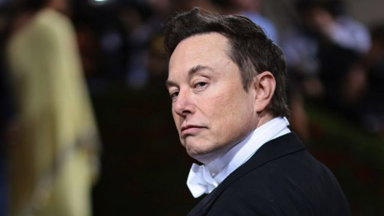
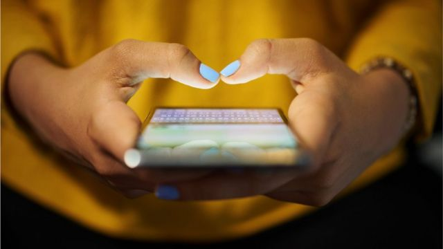
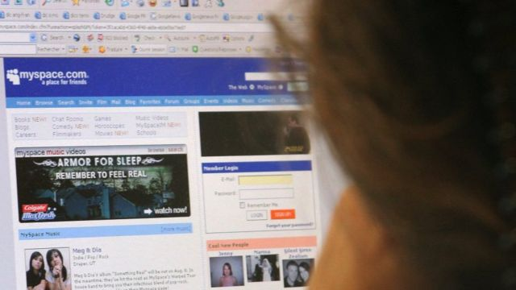

# [World] Facebook和Twitter：两大社交媒体巨头的生存期限快到了吗？

#  Facebook和Twitter：两大社交媒体巨头的生存期限快到了吗？

  * 费尔南多·杜阿特（Fernando Duarte） 
  * BBC国际部记者 

> 图像来源，  Getty Images
>
> 图像加注文字，Facebook和Twitter在最近数周一直在大规模裁员。

**除非你最近几个星期过的是断网的日子，不然你很可能已经对世界科技巨头所经历的大地震有所耳闻。**

上月有消息指，这个行业一些最大的巨头——苹果（Apple）、网飞（Netflix）、亚马逊（Amazon）、微软（Microsoft）、Meta（脸书的母公司）和字母控股（Alphabet，谷歌的母公司）——在过去12个月的美国证券市场上损失超过3万亿美元市值，令人咋舌。

11月，它们当中的数家企业，包括电商巨头亚马逊，宣布在全世界范围内进行大规模裁员。根据追踪科技公司裁员的网站Layoffs.fyi指，至11月21日，这一波裁员已经达到13.6万个职位。

脸书（Facebook）的母公司Meta裁员力量较大，已经解雇了1.1万名员工，而推特（Twitter）至今则遣散了3700人（这大约是其全体员工的一半）。

这令人对这两家世界最受欢迎的社交媒体平台的未来产生了疑问：我们是不是太将这些巨头企业的生命力视作理所当然了？

##  Facebook和Twitter的麻烦有多大？

如上述所提的数字显示，这些平台与其他行业一样，面对着全球经济的放缓。

> 图像来源，  Getty Images
>
> 图像加注文字，马克·扎克伯格的Facebook，在今年较早前追踪者数量下降——是该平台18年历史当中的首次“掉粉”。

这意味着注入企业的资金会变少——在社交媒体平台领域，就主要是广告营收。

“现在这个时候谁都要尝试在科技产业筹钱，都会觉得非常困难，”纽约哥伦比亚商学院（Columbia Business School）的媒体与科技专家乔纳森·尼伊教授（Professor onathan Knee）说。

尼伊教授说，社交媒体平台已经“基本上变成了广告企业”。

“当你依赖那样的营收，经济衰退就会令环境对你非常不利，”他说。

Meta最新的一份财政报告在10月底发表，当中提到广告营收的下降是该公司困难的一部分，但同时也提到像TikTok这样的对手越来越具竞争性。

在被亿万富豪伊隆·马斯克（Elon Musk）收购之后从交易所下市的推特同样受到巨大冲击，而且可能面临其他额外挑战，后者与马斯克粗暴的领导风格和充满争议的决策有关。

马斯克最近在进行了用户投票之后，解封了美国前总统特朗普（Donald Trump）的帐户。特朗普从今年1月8日开始被平台禁言，因为之前两天曾发布过关于美国国会骚乱的帖文。

> 图像来源，  Getty Images
>
> 图像加注文字，在新老板马斯克上任之前，推特的麻烦就已经开始了。

但是警号甚至在马斯克到来之前就已经出现：路透社在10月获取的内部文件显示，该平台的“高活跃度用户”——指每周上线六，七天且每周发三，四次推文的用户——自2019冠状病毒病（Covid-19）全球大流行开始以来已经急剧下降。

路透社引述一名推特研究者指，“高活跃度用户”帐户只占总体用户不到10%，但是他们却发布了全部推文的90%，带来平台全球营收的一半。

但是，马斯克的到来似乎制造了另一场大逃亡：发表于11月3日，也就是完成收购后一星期的一项研究当中，麻省理工学院（MIT）研究人员分析估算，推特在这一个时段内流失了100万用户。

##  生命周期

但是目前的惨象，会不会像一些专家所认为的，只不过是一个社交媒体平台的自然生命周期？

“每一个平台都有它自己的成长和成熟/衰退轨迹。它们大多是因为新平台取代它们而衰退，”新加坡国立大学的传播学与新媒体专家彭丽珊博士（Dr Natalie Pang）说。

彭博士认为，脸书和推特已经在新冠全球大流行较严重的阶段“成长到超出它们的市场体量”，全世界千百万人在这段时间经历封锁和其他出行限制。

> 图像来源，  Getty Images
>
> 图像加注文字，我们将社交媒体平台的长存不灭视作理所当然了吗？

“在大流行期间，科技公司迅速成长，因为数字化成为了一种适应机制。”

她说，现在是时候作重新调整了。

另一名看出脸书和推特衰落端倪的专家是英国谢菲尔德大学的数字媒体专家贾莲瑞博士（Dr Lianrui Jia，音）。

“我们或许将这些平台的生命力看作理所当然了，”贾博士说。

“用户现在可能开始看出这些平台的一些问题，然后开始撤离了。”

不过，两大巨头仍然有强大的基础：据Meta数据，脸书至2022年第三季度的每月活跃用户仍然有近30亿，是全世界最受欢迎的社交媒体平台。

但是在2月，Meta宣布脸书在它的18年历史中用户量第一次下降，消息令股份下挫。

从2019年起，推特采取了一种运算机制，只考虑能够看到广告的每日用户，而不是全体用户。在10月公布的最新数字是2.38亿，据平台称是在上升的。

但是，有人担心，人们使用这些平台的目的正在改变，而且正在逐渐远离新闻和时事资讯，转向更多成人内容和虚拟货币。

这可能会让它对广告商的吸引力降低，后者往往倾向于回避争议内容。

> 图像来源，  Getty Images
>
> 图像加注文字，TikTok的冒起令老一代的社交媒体平台面临更激烈的竞争。

英国兰卡斯特大学的经济资深讲师雷诺·富卡尔（Renaud Foucard）指出，各国政府越来越多的监管也成了企业公司的障碍，因为这使得对用户的争夺变得更加激烈。

“近年，美国和欧盟都令科技公司收购竞争对手变得更难，不像脸书过去收购Instagram和WhatsApp那样了，”富卡尔说。

“现在有更多公司争夺用户和营收了。”

##  健忘的时代

有时候，平台会消失，或者逐渐变得无关紧要。

当中最著名的案例之一就是MySpace.com：这个在2000年代第一个面向全球受众的社交平台，在2007年有3亿用户。

但是它在与脸书的竞争中落败，现在只作为某种线上社区和音乐串流服务的混合体存在，全世界只有600万用户。

在同样的10年，谷歌（Google）推出的Orkut也曾短暂成为全世界最受欢迎的社交媒体平台，之后被马克·扎克伯格（Mark Zuckerberg）始创的脸书甩在身后——它在2014年关站。

> 图像来源，  Getty Images
>
> 图像加注文字，MySpace是社交媒体巨头由盛而衰的最佳例子。

这些算不算是如今这些社交平台的警世寓言？并非所有专家都对它们的未来感到悲观。

##  网络事务记者乔·泰迪（Joe Tidy）分析

说我们正在见证着社交网络自然生命周期的终结，这种想法仿佛很合理。

你只要看看那些死掉的社交网络平台，它们就是这种现象的证据。

Bebo、MySpace、Vine全都来了又走了。

但是，这些年来，科技领域已经有所演变，不再局限于它们所运营的平台。

脸书就是当中的绝佳例子。

这家公司在多年前已经通过收购Instagram和WhatsApp，来成功地为自己的未来买好保险，确保自己能与时俱进。

虽然脸书的成长和流行或许已经到顶了，但是人们对该公司其他产品服务的兴趣并没有衰减的迹象。

推特也似乎摇摇欲坠，处在要么下线，要么迫使用户转移到其他平台的边缘。

但是人们真的会离开推特吗？我怀疑不会。

这些平台的好坏本来就是与它的用户挂钩的，而最近五年，权力和影响力在这些网站上的结合，很难被复制，也很难嫁接到其他平台。

是的，你偶尔会遇到像TikTok这样的搅局新星，能冒起挑战巨头，但即使在去年，我们也见过其他“陪跑者”来了又走，比如Club House和BeReal。

##  竞争是好事

这对于脸书和推特来说，无论是前进路上的偶尔颠簸，还是真的时限已到，有些人还是相信，受欢迎的平台经历困境，是一种健康的迹象。

“这些平台遇到麻烦，是因为越来越激烈的竞争，这是一件好事，”雷诺·富卡尔说。

“有较公平的市场，新公司能给用户提供更多选择和更多机会，从而给他们更好的用户体验。”

