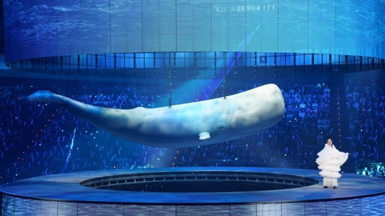

# [World] 台湾艺人刘若英专访：“疫情令人更珍惜当下”

#  台湾艺人刘若英专访：“疫情令人更珍惜当下”

  * 子川 
  * BBC News中文 特约记者 

7 小时前

> 图像来源，  相信音乐
>
> 图像加注文字，刘若英“飞行日”巡演台北场

**台湾艺人刘若英将成为新冠疫情以来首个“登陆”欧洲的华语圈艺人。她向BBC News 中文回顾了疫情中自己感受的得与失，讲述了疫情后首度欧洲巡演的心境。**

“以前总觉得出门在外，现在的飞机这么快、科技这么发达，好像随时要回家都是可以回家的；”

“现在就更觉得，可能隔壁的城市到这个城市的移动都没有那么容易了，所以能回家看看的时候，我觉得就要抓紧，能够飞出去的时候就要立即出发。”

被粉丝昵称为“奶茶”的台湾艺人刘若英近日在接受BBC News 中文访问时讲述了她疫情后首度欧洲巡演的心境。

据悉，刘若英此次欧洲行使她成为新冠疫情大流行以来首位“登陆”的华语艺人——当然，这个“陆”指的是欧洲大陆。

适逢全球各国球迷和游人无口罩、零距离狂欢聚会卡塔尔（卡达）世界杯之际，继续“动态清零”和封城政策也使中国高调成为世界上的唯一。目前在全球绝大多数国家，除体育赛事之外，日常文娱活动也早已恢复正常。

> 图像来源，  相信音乐
>
> 图像加注文字，刘若英“飞行日”巡演台北场

##  疫情后再见粉丝“非常激动”

新冠疫情肆虐全球近三年，曾有大量演出受到严重影响，纷纷取消或延期。如今“奶茶”René刘若英的“飞行日”巡演即将来到英国伦敦和法国巴黎，受到不少欧洲华人粉丝的关注。

刘若英2016年曾在伦敦和巴黎举办过演出，并在位于英国伦敦威斯敏斯特大学举行过分享会，也曾接受过BBC中文访问。

一别经年，此次故地重游，刘若英说她“非常期待也非常开心，因为真的很久没去欧洲了。”

“飞行日”演唱会台北站演出日前已经在小巨蛋举行，由“寻找、成长、勇敢、陪伴”四大篇章组成。

刘若英对BBC中文透露说：“欧洲这两场演出由于场地限制无法做到四面台，这一点我非常的遗憾，但是我们会尽可能在三面台上做到不同的装置设计，甚至在歌曲上也有一点点不同，会针对欧洲的歌迷做一些调整；”

“我想让每一场演唱会都是独一无二的，会因为不同的观众、不同的场地、不同的地区甚至不同的天气，当天你出家门、我出饭店不同的心情，它会有一个不一样的呈现方式。”

尽管“奶茶”在去年推出了新专辑《各自安好》，但“飞行日”巡演推迟到了超过一千天的现在才得以举办。

不过疫情期间，刘若英她还举办过“陪你”线上演唱会。她说，当时看到很多欧洲朋友的留言以及隔空的支持与陪伴，令她非常感动。

对于这次终于能够面对粉丝唱歌，“我相信当天应该会很激动，”她说。

> 图像来源，  相信音乐
>
> 图像加注文字，刘若英“飞行日”巡演台北场

##  疫情中感悟“过好今天”

很多国际权威媒体近来都报导过疫情、中国大陆坚持的“清零政策”对包括中港台等地带来的经济影响，而这其中，演艺娱乐行业也深受打击。

对这一点，刘若英也深有体会。但是，在她看来，虽然事业、演出受到了影响，但是也有一些意外的收获。

她说：“我们曾经有过五十天都没有出家门，就是紧密地待在家、陪伴老人；我也试做了很多新菜，增加厨艺技巧—我想很多人都在这段时间厨艺大增，因为不能出去吃饭，所以就有更多的时间去尝试做一些不同的料理。”

“奶茶”表示，疫情给她带来的最大改变就是更加“珍惜当下”——能飞的时候、能玩的时候、能跟朋友相聚的时候，都会更加的珍惜。

她说：“其实我常常觉得，我并不知道明天会发生什么事情，有时候天气预报说明天会下雨，却突然晴天了，也许说明天会晴天，它又突然下雨了；这次疫情让我更加觉得计划是赶不上变化的，所以我想我对未来还是抱以就是过好今天的态度，对，过好今天。”

_刘若英_ _“_ _飞行_ _日”_ _欧洲巡演伦敦站将于11月23日在守护神剧剧院（The London Palladium）举行，巴黎站将于11月26日在巴黎大会堂（Le Palais des Congrès de Paris）举行。_

