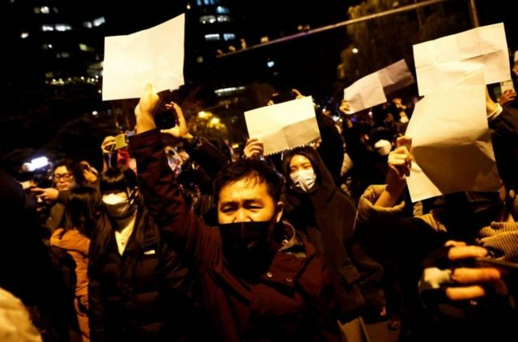
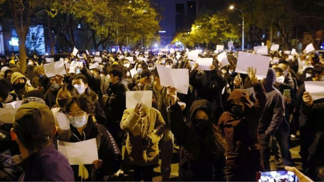
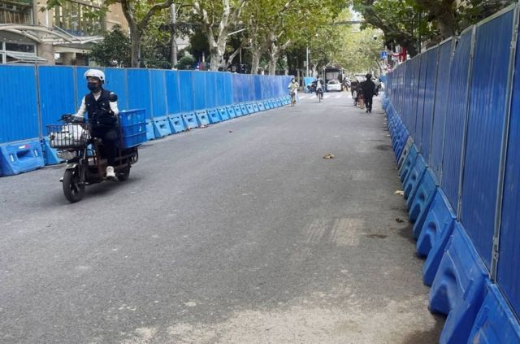
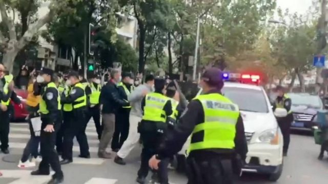
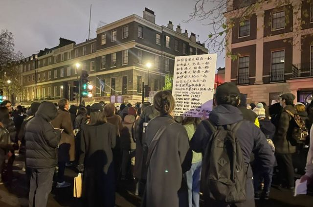
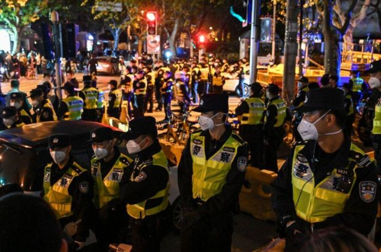
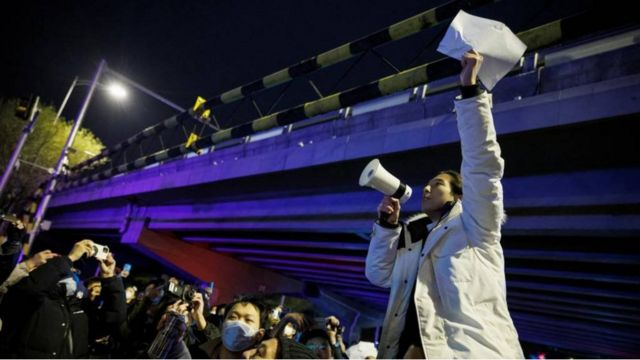
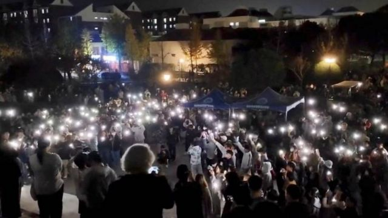

# [World] 中国新冠“清零”政策抗议蔓延到多个城市 出现更广泛的政治诉求

#  中国新冠“清零”政策抗议蔓延到多个城市 出现更广泛的政治诉求

> 图像来源，  Reuters
>
> 图像加注文字，在北京，抗议者举着白纸表达他们的不满。

**中国上海周六（11月26日）爆发了反对严格新冠“清零”措施的抗议活动，一直持续到第二天晚上，并蔓延到其他各大城市。**

在一些城市，抗议逐渐演变成更广泛的政治诉求。社交媒体上发布的视频显示，有人高呼“习近平下台”“我们要自由、平等、民主、法治”等口号。

##  抗议发生在哪里?

> 图像来源，  EPA

在首都北京和金融中心上海，抗议活动持续到深夜。

在中国西南城市成都、中部城市西安，以及三年前新冠疫情爆发的地方武汉，白天也发生了抗议活动。

发布在社交媒体上的视频显示，数百名武汉居民走上街头，一些抗议者被拍到推倒路障，并砸碎铁门。

周六晚，在上海的抗议活动中，有人公开喊出了“习近平下台”和“共产党，下台”等口号。

##  上海警方在抗议现场拘留民众

> 图像来源，  BBC News
>
> 图像加注文字，周一早上，在周末曾发生大规模抗议活动的地点，一名警察站在一名妇女身边，而她正在从手机中删除现场照片。

在上海一条主要抗议道路上，警察拘留了经过这里并拍照的人。

警方强迫人们删除照片，警告他们如果不这样做，将面临逮捕。到目前为止，至少有两人被拘留。

在过去几天发生抗议的乌鲁木齐中路，蓝色屏障将这里围住。目前这里很安静，不过有大量警察徘徊。

在社交媒体微信上，一则帖子传播开来，写着一位名叫魏海的人失联，他是首批在乌鲁木齐路放置鲜花的人。

一位自称他朋友的人表示，他的行为是自发，“完全是处于单纯对于逝者的哀悼”，后来现场人数越来越多，“或许偏离了最初只是希望逝者安息的初衷”。

##  官方媒体保持沉默

> 图像来源，  Reuters
>
> 图像加注文字，周一早上，上海当局在周末发生大规模抗议活动地点的道路上设置了蓝色路障。

中国官方媒体普遍对抗议活动保持沉默。

不过，小报《环球时报》英文版发表了一篇文章，指责西方媒体煽动对中国“清零”政策的不满情绪。

文章援引复旦大学一位学者的话写道：“由于意识形态的差异，西方国家和媒体批评共产主义政府几乎成为一种本能，目的是用颜色革命颠覆政府。”

这篇文章还写道，国家对新冠疫情的防御措施“从来都不是一成不变的”，“正在不断调整中”。

新华社也强调，在执行新冠政策时，需要优先考虑人民的福利。官方英文报纸《中国日报》则说，正在敦促地方行政部门“纠正控制新冠的不利做法”。

##  台北举行烛光活动支援

周日晚上，台北自由广场举行了一场烛光活动，以表示对中国抗议活动的支持，反对当局执行严格的“清零”政策。

根据中央社报道，许多台湾人、香港人和移居台湾的中国大陆居民，当晚在自由广场手持蜡烛和白纸。一些人高呼“中国需要自由”等口号。他们的前方摆着一张写有“悼”字的大型标语。

还有其他标语上写着，“愿逝者安息，愿生者反抗，愿‘静默’中的呐喊都能被听见”。

在台北参加地方政府选举论坛的中国民运人士王丹和周锋锁也参加了这场烛光活动。

##  空白的横幅和白纸代表什么

在周末的抗议活动中，有许多抗议者举着空白的横幅，或仅仅是一张A4纸，来表达不满。

空白横幅象征这个国家的审查制度。有人因此将这场抗议称作“A4白纸革命”。

中国社会对言论高度审查，针对政府及其领导人的批评会导致严重的惩罚。

目前尚不清楚中国政府会如何处理这场危机。

##  北京抗议活动持续到周日深夜

> 图像来源，  Reuters
>
> 图像加注文字，随着抗议活动的升级，警方拉起了警戒线。

社交媒体上发布的视频显示，该市的一条主要环路上聚集着大量人群。

视频显示，有人高呼口号，谴责中国严格的“清零”政策，并呼吁获得自由。路过的汽车按着喇叭。

还有视频显示，一些抗议者在天桥上站成一排，手持白纸。大批警察基本平静地站在那里。

但几小时后，视频显示增援部队进入驱散人群。

##  BBC记者被捕：BBC表示极为关注

周日晚间，报道上海抗议活动的BBC记者爱德华·劳伦斯（Ed Lawrence）被中国当局逮捕并拘留。

BBC表示对他的遭遇极为关注。

根据BBC声明，劳伦斯在被捕时遭到踢打。后来他被戴上手铐，关押了几个小时才获释放。

一位发言人说，劳伦斯在履行其特派记者的职责时遭到攻击，非常令人担忧。

发言人还说，中国当局没有对他的拘留作出可信的解释或道歉。

##  这一系列抗议对中国领导者而言是巨大挑战

—— **BBC驻北京记者麦笛文（Stephen McDonell）分析**

> 图像加注文字，身穿荧光夹克的警察在上海一辆汽车旁与抗议者对峙。

异见表达在中国其实不罕见。

多年来，忽然爆发的反抗来源于各种议题——从有毒的污染到非法占地，再到警察对社区民众的不当对待等等。

但是，这一次不一样。

这一次中国人心里最迫切的是同一个问题，而且很多人对此已经受够了——这导致了人们对政府新冠“清零”防疫政策的广泛反弹。

反抗行动包括推倒那些用来执行社区距离的路障，还有如今在全国各城市和大学出现的这些大规模街头示威。

在某种意义上，很难解释在上海听到人群高呼要求习近平下台，是多么令人震撼。

在这里，公开批评共产党总书记是极度危险的行为。你可能会因此而坐牢。

##  在中国大陆，矛头直指习近平的抗议实属罕见

**——BBC记者黄晓恩（Tessa Wong）** **发自新加坡**

这最新一轮抗议的导火线是10个人的丧生，他们于上周四在中国西北部乌鲁木齐市一个住宅区大火中遇难。

对于很多在最近几个月都受到大面积封控影响的中国人来说，乌鲁木齐的火灾是一个噩梦般的景象——根据一些说法，遇难者被困在自己的寓所里，无路可逃。

当局反驳这一说法，但是这并未能阻止愤怒和焦虑在公众中间蔓延。

这成了日积月累的不满到达的一个新临界点。数以百万计的人对于三年来的活动限制和日复一日的新冠病毒检测感到厌倦。

这种愤怒蔓延到了中国的各个角落，从大城市到新疆、西藏这样的偏远地区，触动到了从年轻学生、工厂工人到普通市民的社会各界。

随着愤怒情绪升温，反对新冠防疫政策的抗议变得越来越常见。

但是，过去这个周末的抗议里，对于国家主席习近平如此众多和直接的批评，在这样的新常态中仍属不寻常。

##  来自其他国家的声援

> 图像来源，  Kerry Alexandra/BBC
>
> 图像加注文字，在伦敦，数百人周日晚间在中国大使馆外举行抗议。

周日晚，其他国家也发生了声援中国人民的抗议活动，包括伦敦、墨尔本等地。

在伦敦，有几百人在中国大使馆外抗议。现场可见，很多人举起白纸，还有抗议者举起“不要文革要改革”、“乌鲁木齐中路”、用英文写的“停止迫害自己的人民”等标语。

一些人献上鲜花，点燃蜡烛，纪念本周早些时候在西部城市乌鲁木齐火灾中死亡的人。

许多中国人将他们的死亡归咎于严格的新冠“清零”政策，不过中国当局对此否认。

##  专家：当前的限制看不到明显的终点

> 图像来源，  AFP
>
> 图像加注文字，在刚过去的周日，上海警方曾封锁乌鲁木齐路。

这个国家的最高领导层或许并没有意识到人们对于持续的新冠防疫限制有多么不满，英国牛津大学中国中心主任拉纳·米特（Rana Mitter）认为，这是因为媒体和言论自由一直被压制。

在接受BBC访问时，他表示，即处于（这些）级别的人或许“尚未意识到人们有多么不满，或者搞不清楚什么是最好的解脱办法，是必须放开还是采用不一样的疫苗策略”。

他表示，中国面对的另一个问题是，对于限制怎样才会被放宽，生活回归正常，并没有“明显的终点”——原因之一是未能进口或者批准大多数西方国家已经使用的信使核糖核酸（mRNA）疫苗。

“他们现有的疫苗作用尚可，但并不是非常有效，这一切就意味着新冠防疫政策的出路并不能清晰地界定。”

##  对新冠防疫政策的反抗已到达“临界点”

> 图像来源，  Reuters
>
> 图像加注文字，11月28日，在北京，在为乌鲁木齐火灾受害者守夜后，一名男子拿着白纸抗议当局的疫情封控措施。

美国智库外交关系协会（The Council on Foreign Relation）的中国卫生政策专家黄严忠表示，在中国大陆的抗议代表着这个国家对新冠政策相关的异见已经到达“临界点”。

黄严忠在接受BBC访问时说，虽然没有迹象显示中国政府已经准备好放弃新冠“清零”政策，但是在周五发生抗议的乌鲁木齐，新冠防疫限制已经有所放松。

但是黄严忠表示，即使地方政府因应别处的抗议而决定改变政策路线，也仍然必须应对全国新冠感染病例迅速上升的问题。

##  抗议活动是如何开始的?

> 图像来源，  Reuters
>
> 图像加注文字，在南京，人们周六在当地的传媒学院集会。

最近的抗议活动由一件具体事情引发——上周四，新疆乌鲁木齐市的一栋公寓楼起火，造成10人死亡。

这一事件在网络上激怒了人们，许多人称乌鲁木齐自8月初以来一直处于严格的新冠限制之下。

一名居民告诉BBC，住在大院里的人基本上被禁止离开家。

当局现在承诺逐步取消新冠限制措施，但否认曾阻止人们逃离火灾。

