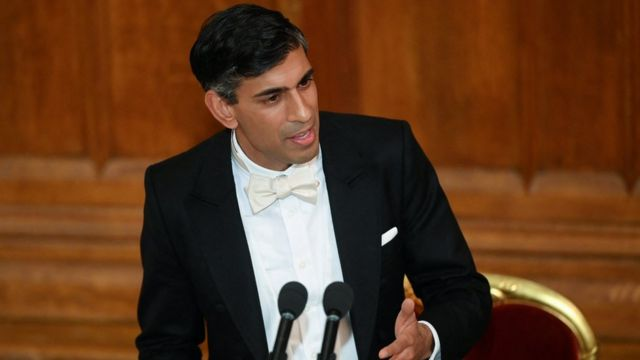
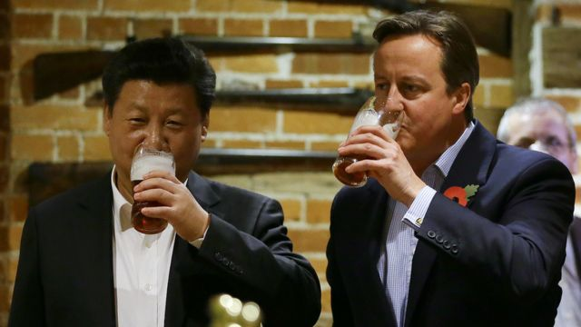
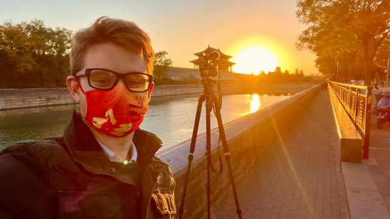
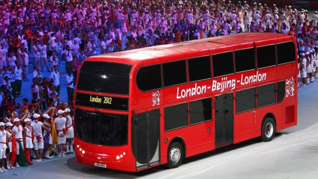
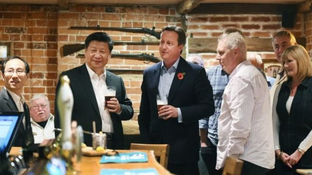
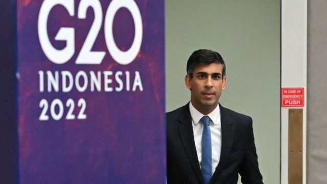

# [World] 中英关系：苏纳克为何说“黄金时代”已经结束

#  中英关系：苏纳克为何说“黄金时代”已经结束

> 图像来源，  Reuters

**英国首相苏纳克（Rishi Sunak，辛伟诚）表示，英中关系过往的“黄金时代”（Golden Era）已经终结。**

苏纳克发表上任后首次外交政策演说强调，前十年英中两国所谓的密切经济关系是“天真的”。

苏纳克说，英国现在面对对竞争对手，需要用“稳健的实用主义”（​​robust pragmatism）取代过往一厢情愿的战略。但他亦警示说无须使用 “冷战言论”，并补充说中国对全球的意义不容忽视。

自上个月接任保守党领袖和英国首相以来，苏纳克一直面临着来自保守党后座议员之压力，要求他对中国采取更强硬的立场。

事实上，自苏纳克上台以来，他的中国立场，一直受到关注。在英国的华人社群，也十分关注他的中国政策，尤其是移居英国的香港示威者。

2019年，曾在中国大陆被拘留的前英国驻香港领事馆员工郑文杰，与香港国际关系学者沈旭晖对谈时说，英国政坛一向是“屁股决定脑袋”，过去，苏纳克担任财相时，“中英关系尚可，自然会争取对方投资”。

但他表示，苏纳克之前竞选保守党党魁期间已经抛出震撼弹，承诺关闭全英所有孔子学院，“是个明确的觉醒讯号，应该给予时间，让他证明自己能回应新时代。”

> 图像来源，  Getty Images
>
> 图像加注文字，中英关系“黄金十年”的说法源于前首相卡梅伦（右）执政时期。

##  首次外交演说

在周末中国发生了反清零的示威活动后，苏纳克在伦敦市长宴会发表上述谈话，

一名BBC摄影记者在上海报道此次抗议活动时被拘留。他在被捕时遭到警察的暴力相向，被关押了几个小时才被释放。

> 图像加注文字，埃德·劳伦斯（Ed Lawrence）是BBC在中国的记者。

苏纳克在这场有英国商界领袖和外交政策专家参与的宴会上说，面对国内示威，北京“选择进一步镇压，包括袭击一名BBC记者”。

他说：“我们认知到中国对我们的价值观和利益构成了系统性的挑战，随着中国走向更加独裁，这一挑战变得更加严峻。”

他又表示英中关系的“黄金时代”已经结束，还有那种认为与西方的更多贸易会导致中国政治改革的 “天真想法”也结束了。

##  “黄金时代”

“黄金时代”这一说法是与前保守党首相卡梅伦（David Cameron）过去领导下，希望与北京形成更紧密的经济关系有关。但此后英中关系每况愈下。

> 图像来源，  PA Media
>
> 图像加注文字，2008年8月，伦敦双层巴士作为2012年奥运会主办地的标志出现在北京奥运会闭幕式上，象征着英国和中国关系密切的开始。

苏纳克也强调，“我们不能简单地忽视中国在世界事务中的重要性，包含对全球经济稳定或气候变化等问题。”

他又解释，英国将与包括美国、加拿大、澳洲和日本在内的盟友合作，“管理这种激烈的竞争，包括通过外交和各种接触。这意味着我们要站出来对抗我们的竞争对手，不是用华丽的辞藻，而是用强有力的实用主义。”

据报道，前任首相特拉斯（Liz Truss）原本计划将中国重新归类为对英国的“威胁”，作为其外交政策检讨的一部分。

苏纳克在演讲中呼应了这个词汇，亦即中国是一个 “系统性的挑战”。他说，在新的一年里会有更多检讨的细节出炉。

但他的演讲中所谓的“稳健实用主义”路线，受到了前保守党领袖伊恩·邓肯·史密斯（​​Iain Duncan Smith）批评，他是推动采取对中更强硬路线的后座议员之一。他在《每日快报》上针对这场演讲称，北京已经成为“对我们英国和盟友的一个明确和现实的威胁”。

他又补充说：“我想知道，首相所谓的稳健的务实主义听起来是否越来越像绥靖主义。”

工党影子外交大臣雷米（David Lammy）则称苏纳克的这次演讲“像稀粥一样薄”。他指责首相在中国问题上“颠三倒四”。

**分析** **：苏纳克的对华关系定位到底是什么？**

**BBC政治** **事务** **编辑** **克里斯·梅森 （Chris Mason）**

中国是一个成长中的超级大国，与英国有着截然不同的世界观和价值观。

那么唐宁街应该如何处理与北京的关系呢？

苏纳克作为首相就外交政策发表的首次重要演讲中，表示他的做法不会是“宏大的修辞”，而是“稳健的实用主义”。

这到底是什么意思？

苏纳克承认北京正在使用国家权力的所有杠杆，明确地在争夺全球影响力，又表示，认为贸易会导致社会和政治改革的想法是“天真”的。

> 图像来源，  EPA
>
> 图像加注文字，2015年，中英关系“黄金时代”，卡梅伦和习近平在酒吧品尝英国传统美食炸鱼和薯条，一人喝了一大杯黑啤酒。

谈到所谓温和作法，如果不特别指代任何人，那您可能还记得七年前，也就是四任英国首相之前，时任英国领袖卡梅伦在白金汉郡的一家酒吧接待中国国家主席习近平，双方喝了一品脱啤酒。

当时，英国认为在经济和外交上与北京接触的最佳方式就是扩大两国贸易关系。彼时财政大臣乔治·奥斯本（George Osborne）甚至提到两国关系正在进入一个黄金时代——但现在，苏纳克直接而明确地说这个时代业已终结。

但与现实相比，苏纳克其实仍然希望让这一关系升温。

当苏纳克团队计划与习近平在今年G20峰会会面时，我们被提醒，英国首相甚至已经18个月没有与中国国家主席通电话了。

但碰巧的是，苏纳克与习近平在今年G20会议中，原定的正式会晤被取消了。因为两位领导人的行程都被落在波兰的国境内的导弹所颠覆。取而代之的是，双方快速的打了个招呼——但首相其实非常希望进行一次适当的会面。

> 图像来源，  PA Media

苏纳克的论点是，英国根本没办法忽视中国在全球事务中的重要性：“因为它与经济稳定、气候变化和粮食安全有关。”

简而言之，他认为，除非与北京建立关系否则这些问题无法得到实质性解决。

此外，对手工党将近几任首相的这些与北京有高有低的互动关系，描述为政府“对中国的言论反复无常”。

而这种新关系实际上会是什么样子呢？

首相党内的批评者很快提出了自己的观点。

苏纳克一位前任保守党领袖伊恩·邓肯·史密斯爵士便直接提出批判。他也是因批评中国对待维吾尔人的方式而被禁止进入中国的少数英国议员之一。

他认为首相在北京问题上变得更软弱。

苏纳克承诺新的一年会在系统性检讨中对此给出更多细节，我们目前能够知道的只是他对中国的描述：系统性挑战。

但事实上，就目前而言，我们并不知道这种新外交战略将带来什么实际效果。英国政府希望人们明白，国际关系就像任何人际关系一样，是复杂而微妙的；在他们看来，二元方法不符合英国的利益。

但对批评者而言，未能将北京描述为“威胁”就是一个大错误。

