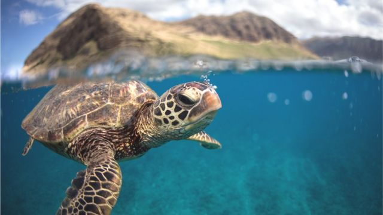
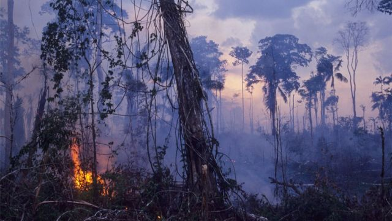

# [World] COP15：加拿大联合国生物多样性大会有多重要？为什么主席国是中国？

#  COP15：加拿大联合国生物多样性大会有多重要？为什么主席国是中国？

8 小时前

> 图像来源，  Getty Images
>
> 图像加注文字，科学家们正在制定计划希望能修复1/5正在衰退的海洋生态系统。

**即将于12月份召开的联合国生物多样性大会COP15对拯救我们的大自然有多重要？为什么这次会议在加拿大举办但主席国是中国？它和气候变化会议COP27有什么关联和区别？**

12月7日至19日，约195个国家将在加拿大蒙特利尔举行会议，希望达成一项具有里程碑意义的国际保护自然协议。

英国政府资助的自然保护机构“自然英格兰”的主席表示，各国必须共同努力，商定一个雄心勃勃的计划。

托尼·朱尼柏说：“这不仅仅是为了拯救稀有物种。这是关于维持人类最终依赖的生命网络，包括食物，水，健康和气候调节。”

他说，COP15会议是阻止和扭转自然衰退的“最佳和最后机会”。

在姗姗来迟的这次国际谈判之前，自然英格兰和英国其他政府机构在伦敦皇家学会的一次活动中提出了他们修复大自然的愿景。

英国国际自然事务部长本仰勋爵说，健康的自然环境是“健康的气候，安全和清洁的水供应，以及有适应性的粮食供应的基石”。

##  生物多样性公约

最早的《联合国生物多样性》是1995年在巴西的地球峰会上达成的。已有195个国家和欧盟已经加入了《公约》，而美国是唯一一个尚未批准它的联合国成员国。

生物多样性是指地球上所有不同的生物，以及它们如何在微妙的生命网络中适应共存。新的《全球生物多样性框架协议》被视为相当于自然领域中的《巴黎气候协议》。《巴黎气候协议》是一项国际条约，各国承诺限制全球气温上升。

> 图像来源，  Victoria Gill/BBC
>
> 图像加注文字，人类需要昆虫传播花粉来维持自然农业生态和粮食生产。

生物多样性峰会的一些主要目标包括：

  * 到2030年将地球上30%的土地和海洋转变为保护区； 
  * 确保到2050年实现"与自然和谐相处的共同愿景"； 
  * 取消数十亿美元破坏环境的政府补贴，恢复退化的生态系统。 

##  对蒙特利尔会议的期待

此次峰会是在埃及举行的联合国气候大会COP27被视为结果令人失望之后举行的。

虽然野生动物慈善机构世界自然基金会（WWF）欢迎在COP27的最终协议中建立的气候变化造成的损失和损害基金，但它表示，未能同意采取更雄心勃勃的减排行动意味着“将全球变暖限制在1.5°C的目标正在悄悄丧失，将给世界带来灾难性后果”。

世界自然基金会气候政策负责人费尔南达·卡瓦洛博士在气候会议上对英国广播公司说：“我们必须记住，气候危机和生物多样性危机是我们这个时代的决定性危机。”

她补充说，如果不解决这些问题，“我们未来可能没有一个星球可以生存”。

##  迟到的全球自然保护

英国政府已承诺到2030年保护30%的陆地和海洋。

而根据野生动物信托基金会的数据，迄今为止进展甚微。到2022年，只有3%的陆地和8%的海洋得到有效保护。

英国政府还面临自然活动家的批评，因为他们错过了根据英国环境法的要求设定自然保护目标的最后期限。

由于新冠疫情造成了一再延误，在蒙特利尔举行的 COP15会议比原计划晚了3年。

这使得整个世界在未来10年中难以制定目标来阻止物种灭绝和扭转全球自然环境的丧失。

> 图像来源，  Getty Images
>
> 图像加注文字，物种栖息地丧失是对自然的最大威胁之一

##  中国的防疫限制

COP15原计划于2020年10月在中国昆明举行，但由于2020年新冠疫情爆发和中国严格的防疫限制，导致无法举行线下会议，这次会议被迫推迟了4次。

为了维持COP15的势头，2021年10月第一阶段会议以线上会议为主的形式在中国昆明正式召开，并且各方在此次会议上通过了不具约束力的《昆明宣言》。

由于中国仍在实行新冠疫情防控措施，《生物多样性公约》秘书处于2022年6月宣布，COP15的主要部分将于2022年12月转往加拿大蒙特利尔举行，但中国仍将是这次会议的正式主席国。

中国生态环境部部长黄润秋将主持这次大会。

这将是中国首次主导有关环境的联合国重大政府间谈判，中国政府是否能够以主席国的地位创造性地将其他国家团结在一起，共同达成一项雄心勃勃的协议，值得关注。

##  COP15与COP27的联系和区别

虽然生物多样性和气候变化有着千丝万缕的联系，需要共同解决，但COP15将侧重于阻止生物多样性丧失的战略，而COP27则侧重于提高将全球变暖限制在2度以下和减缓气候变化的雄心。

联合国气候变化谈判的明确目标使其更容易为公众所关注。世界各国都需要提高对生物多样性危机的认识，使其具有类似的关注度。

大自然是实现净零排放的关键，它将为我们提供解决方案，以应对气候变化带来的挑战，包括干旱、土地使用、粮食安全等等。

在保护生态环境问题上，COP15同样存在着全球南北差距和重大分歧。许多发展中国家希望富裕的发达国家提供更多资金来促进这方面的保护。

制定和报告各个国家的目标，以及如何监测实施都是需要谈判确定的重重挑战。

