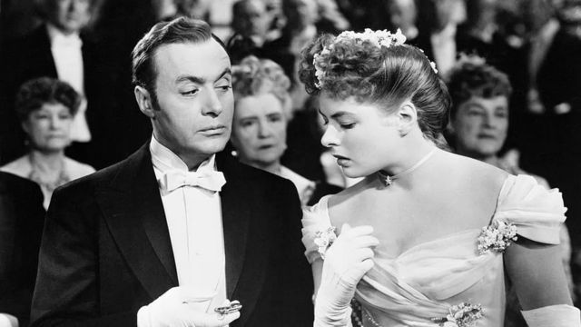
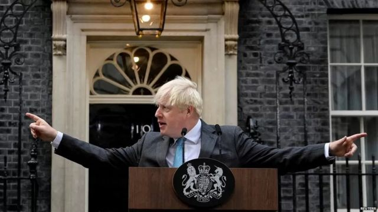

# [World] 2022韦氏和柯林斯年度热词：“煤气灯效应”和“持续危机”的背后

#  2022韦氏和柯林斯年度热词：“煤气灯效应”和“持续危机”的背后

  * 山姆·卡布拉尔 Sam Cabral 
  * BBC驻华盛顿记者 

9 小时前

> 图像来源，  Getty Images
>
> 图像加注文字，《煤气灯下》曾两度被改编成电影搬上屏幕。

**当英国剧作家帕特里克·汉密尔顿（Patrick Hamilton）在1938年写作《煤气灯下》这一剧本时，他可能没有想到这一词在21世纪将被使用的频率。**

美国历史最悠久的字典出版商梅里厄姆-韦伯斯特公司（简称韦氏词典，Merriam- Webster）把“gaslighting”（煤气灯效应）评选为2022年的年度热词。

韦氏字典表示，2022年人们在其网站搜索这一词的次数激增了1740%。

##  什么是“煤气灯效应”？

Gaslighting这一英文词的字面翻译是煤气灯效应。它通常指为了自己的利益而故意严重误导他人的行为或做法。

它通过心理操控形式，使受害人逐渐开始怀疑自己，使其质疑自己的记忆力、感知力或判断力，其结果导致受害者的认知失调和其他变化。

韦氏词典在最近发表的一份声明中说，“在这个‘假新闻’、阴谋论、推特喷子以及深度造假满天飞的错误和虚假信息时代，煤气灯效应脱颖而出，成为我们时代的热搜词。”

该公司特约编辑对美联社表示，奇怪的是，人们对这一词的搜索兴趣并非受到任何单一事件的驱动。

索科罗斯基告诉美联社，2022年的每一天都有人会上网查阅这一词汇。

##  “煤气灯效应”为什么上榜？

“煤气灯效应”一词来自于汉密尔顿创作的维多利亚时代的一部剧，讲述的是伦敦一对中产夫妇基于谎言和欺骗的婚姻生活。

故事主角杰克·曼宁汉（Jack Manningham）试图让妻子宝拉（Bella）相信自己疯子，包括称她凭空想象家中的煤气灯忽明忽暗。

该剧曾先后两次被搬上银幕，分别是1940年在英国，以及1944年在美国。

其中，美国版本由著名影星英格丽·褒曼（Ingrid Bergman）主演，她为此也夺得了两项奥斯卡金像奖。

该影片也被列入美国国家影片登记表（US National Film Registry）中保存，作为一部具有“文化、历史，或是美学重要意义”的作品。

正如韦氏词典所指出的那样，虽然这一词在20世纪主要用于指心理操控手段，但其现代用法主要受到“用于误导人们的渠道和技术大量增加”而驱动的，特别是在个人层面及政治背景中。

**韦氏词典** **本年度前十名热词还包括：**

  * 寡头（oligarch）; 
  * 奥密克戎（omicron）； 
  * 编纂（codify） 
  * 性少数群体（LGBTQIA），是女同性恋（Lesbian）、男同性恋（Gay）、双性恋（Bisexual）、跨性别（Transgender）、酷儿（Queer 或Questioning）、间性人（Intersex）、无性恋（Asexual）的英文首字母缩略字。 
  * 先知先觉（sentient） 
  * 肥沃的（loamy） 
  * 突袭或打劫（raid） 
  * 王后 (queenconsort) 

##  英国年度热词“持续危机”

> 图像来源，  Reuters
>
> 图像加注文字，英国前首相约翰逊曾陷入派对门丑闻

2022年度，占据英国《柯林斯词典》（Collins Dictionary）本年度热搜词榜首的是permacrisis（持续危机，或长久危机）。

记者说，这个词用来描述生活在充斥着战争、通胀和政治动荡年代的人们的心情和感受。

柯林斯学习部负责人比尔克罗夫特（Alex Beercroft）说，“持续危机”一词概括了对许多人来说，2022年这一年究竟有多么糟糕。

**其他上榜的热词还包括：**

  * Carolean：这里指英国查尔斯统治的新时代 
  * Kyiv：乌克兰首都基辅 
  * Lawfare: 法律战 
  * Partygate: 派对门 
  * Quiet quitting: 职场躺平 
  * Splooting: 指腹部平躺，双腿伸直的动作 
  * Sportswashing:体育洗白 
  * Vibe shift: 氛围转变 
  * Warm bank: 取暖银行 

##  为什么是“持续危机”？

登上柯林斯热搜榜的另外一个词是“职场躺平” Quiet quitting，又被译作“静默辞职”。

这个词的意思是形容人们为了表示抗议或为了改善工作/生活平衡、只完成工作范围内内的基本职责。

比尔克罗夫特说：“语言是社会和更广阔的世界正在发生的事情的一面镜子，今年面临着一个又一个挑战。”

他说，“经历了英国脱欧、疫情大流行、恶劣天气、乌克兰战争、政治动荡、能源紧缩和生活成本上涨危机”，不难理解人们为什么会感觉自己“持续处于一种充满不稳定和担忧的状态”。

柯林斯词典编纂者说，榜单上还有几个词与这些危机有关。

