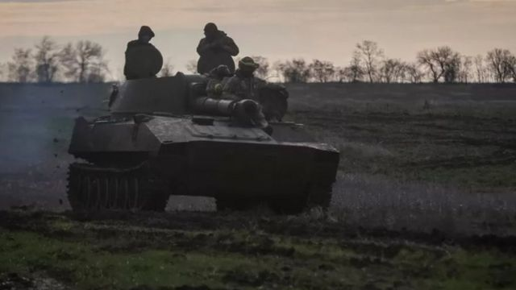
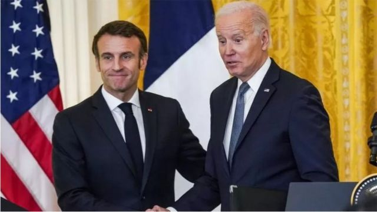

# [World] 乌克兰战争：和平谈判的时机来到了吗？

#  乌克兰战争：和平谈判的时机来到了吗？

  * 保罗·亚当斯（Paul Adams） 
  * BBC外交事务记者 

> 图像来源，  REUTERS
>
> 图像加注文字，西方官员则坚信谈判的时机还没有到来。他们认为，莫斯科并没有表示进行有意义谈判的认真意愿。

**美国拜登（Joe Biden）说他愿意与普京 （Vladimir Putin）坐下来“看看他有什么想法”; 而德国总理肖尔茨（萧兹 Olaf Scholz ）与这位俄罗斯领导人在电话中长谈了一小时，这些举动意味着什么？**

这当然不意味着高级别的和平谈判即将开始。

正如拜登自己说的，唯有当莫斯科表明愿意结束在乌克兰的战争，这个和谈才有可能，而这当然还没有发生。

克里姆林宫抱怨，白宫不承认俄罗斯9月底吞并乌克兰部分地区后， 对这些地方拥有的主权，也怨西方向乌克兰提供的武装支援，并认为他们要对基辅的“坚决不妥协”负责。这些都不表明战争已经处于突破的边缘。

但是，随着战争拖入第9个月，乌克兰的寒冬将至， 日后可能会有更多死亡、破坏和痛苦。

因此，何时该开启和平谈判的问题不断出现。

美国参谋长联席会议主席米利将军（Gen Mark Milley）最近的发言表明，各方该抓住与俄国谈判的时机，这引起外界对于美国政府内部可能出现分歧的猜测。此后，美国官员和西方领导人普遍坚信，该由乌克兰自己决定何时及如何与莫斯科谈判。

法国总统马克龙(EmmanuelMacron)近日在白宫与拜登会面时说：“我们须尊重乌克兰人，由他们决定就其领土进行谈判的时间和条件。”

私下里西方官员则坚信，谈判的时机还没有到来。他们认为，莫斯科并没有认真表达开展有意义谈判的意愿。

> 图像来源，  EPA
>
> 图像加注文字，法国总统马克龙近日在白宫与拜登站在一起发言说须尊重乌克兰人决定他们就其领土进行谈判的时间和条件。

此外，在战场上，因为乌克兰在军事上处于领先地位，而俄罗斯正面临着多重挑战。人们隐隐约约地感觉到，西方觉得俄军在未来几个月中的地位将比现在更脆弱。

一位西方高级外交官最近说：“会有一个谈判的时刻，但我感觉现在不是合适时候。”

他又说，目前西方的工作是继续在军援乌克兰， “使他们处于最佳状态，无论何时都是如此”。

官员们都极不愿意谈及将何时进行谈判。

但是，如果乌克兰在未来几个月继续赢回领土，相关辩论将变得更加激烈：乌克兰的西方盟友准备在多大程度上继续支持基辅的战争目标呢？

因为，回到今年2月24日普京发动全面入侵，保住当时两国的线界是一回事；而鼓励乌克兰人越过2月24日的界线，夺回俄罗斯在2014年并吞的领土，亦即克里米亚和顿巴斯（Donbas）的大部分地区则是另一回事。

无论如何，低调的沟通渠道确实在继续。包括五角大楼和俄罗斯国防部，或中情局局长伯恩斯（William Burns）和他在莫斯科的对口纳里什金（Sergei Naryshkin）。

就这场战争而言，为所有关于何时，以及如何开启和平谈判找到一个外交解决方案，似乎还有很长的路要走。

