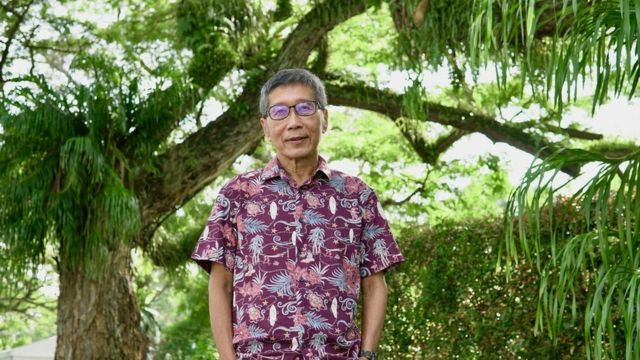
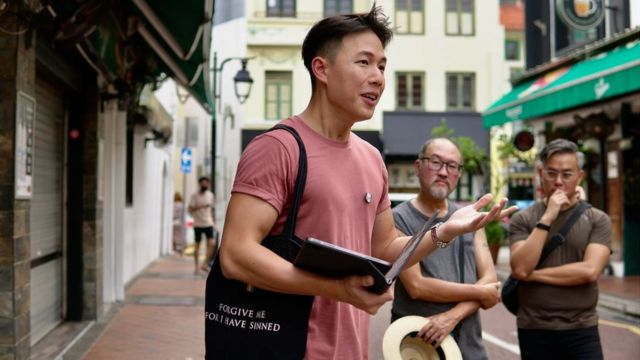
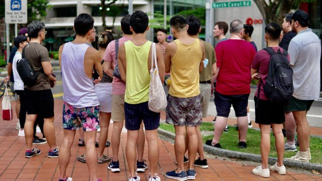

# [World] 新加坡废除同性性行为禁令 同志团体回忆过往黑暗历史

#  新加坡废除同性性行为禁令 同志团体回忆过往黑暗历史

  * 黄晓恩（Tessa Wong） 
  * BBC记者 

> 图像来源，  BBC/Tessa Wong
>
> 图像加注文字，新加坡海滨公园（Esplanade Park），王贤勤曾经被警察抓住的地方。

**站在新加坡静谧的海滨公园（Esplanade Park）里，王贤勤 （Russel Heng）指着他曾经被警察抓住的地方--原因只有一个： 他是同性恋。**

这里看起来与任何其他绿树成荫的角落一样。但是，在1980年代，在互联网和交友软体Grindr出现之前，在这个视同性恋为罪犯的国家，这地方是个受欢迎的同性恋者聚集点。

身为剧作家和活动家的王贤勤回忆说，此地被称为 “五棵树脚”（the Feet of Five Trees），高耸入天的热带树林提供了掩护和隐秘性。

“当晚我们正在四处走来走去。突然有人发出很大的声音。是一个便衣警察，正向我们咆哮。”

我们被迫排成一排，警察严厉地喝斥我们说：“你们应该为自己感到丢脸。”

“当时我们只是在公园里散步，但这让我们在心理上感觉到，也许你做错了什么......这基本上就是霸凌，”王贤勤说。

##  黑暗历史

事实上，数十年来，新加坡承袭了英国殖民时期的一条有争议法条377A。该法禁止两个男人之间的性行为。

当局辩称，法令反映新加坡公众对同性恋并不接受的看法。

但上周，议会就废除了该法律

随着该国《刑事法典》377A法条的废除，新加坡也告别了现在鲜有人提及的一段该国的黑暗历史。

当时，男同性恋者不仅面临强烈的社会污名，甚至还被当局主动列为整肃目标。当晚，在海滨公园，王先生和其他男子只受到了警告就被释放了。但是，其他人就没有这么幸运了。

因为，几十年来，新加坡警员时常针对同性恋者夜店，海滩和公园等据点进行所谓的 “反同性恋 ”突击检查。

这通常包括使用有争议的“诱捕手段”，即让冒充同性恋的警察光顾这样的场所，并迅速逮捕与他们“接触”的任何人。

被捕者通常会被指控为性交易、猥亵或不雅行为。新加坡的大报纸会刊登这些人被捕的细节，列出他们的姓名、年龄和职业。

多数人被罚款或在监狱服刑几个月。

但在1993年的一次特殊逮补中，因为其地点被称为 “堡垒路突袭”（the Fort Road Raid）的执法行动中有数名男子被捕，后被判处接受该国恶名昭彰的严厉惩罚：鞭刑（caning）。

后来， 相关指控上诉时被法院推翻。审理案件的法官当时指出，这些男子被逮捕和指控的方式 “令人不安”。

不过，对许多新加坡男同性恋者来说，这些突袭行动都发出了一个明确的信息：他们的存在是不被允许的。

虽然在国家严格控制的新加坡，反同暴力并不常见，但社区中的许多人害怕向亲友和更广泛的社会公开出柜。

“你总是不得不偷偷摸摸的，你总是害怕被人盯着看，”现年71岁的王先生告诉BBC。 “那是当时我们作为同性恋者生活的一部分。”

> 图像来源，  BBC/Tessa Wong
>
> 图像加注文字，一群游客在一名34岁的导览者唐文豪的带领下，在新加坡市中心的街道上进行了一次独特的旅行。

##  逐渐开放

到了2000年代，警方突击检查有所减少。曾经是禁忌话题的同性恋在社会变得越来越公开。

2007年，在一次有里程碑意义的关于377A的议会辩论中，新加坡政府承诺，虽然它将保留该法条但不会执行它。 这是在新加坡人慢慢变得更加接受性少数（LGBTQ）族群时采取的举措。

最近的一项调查显示，虽然该国仍有相当多的人认为同性恋是 “错误的”，但对同性恋权利的支持亦在攀升。

现在， 这个城市国家有了一个繁荣的LGBT氛围，有越来越多的LGBT友好组织在这里成立。

譬如，尽管新加坡大规模集会和示威活动仍然极为罕见，但却有粉红点（Pink Dot）这样一个该国有关性少数权益的最大的民间集会，每年都吸引了成千上万的支持者到来。

随着更多的游说团体和支持社群的出现，在新加坡有关性少数权益的倡议已经变得越来越常见，这与同性恋权利组织甚至难以存在的过去十分不同。

王贤群是该国最古老的同志团体之一 “我等之辈 ”（People Like Us）的创始成员。该组织在1990年代曾两次被该国政府拒绝注册为公民社团。

王先生回忆称，在早期，他们受到新加坡政府的严密监控，便衣警察旁听他们的公开谈话和会议，并在事后确认发言者的身份。

“现在一些年轻人，他们出生在“粉红点”成为既定事实的年代。他们会把它当作一个社会景观，认为同性恋一直以来都没有遇过问题。他们不知道以前的这个时代，”王先生告诉记者。

##  历史导览

而最近有些人想改变这种状况。

最近，一群游客在一名34岁的导览者唐文豪(IsaacTng)的带领下，在新加坡市中心的街道上进行了一次独特的旅行。

站在新加坡河畔，他向这些游客介绍19世纪的中国男性移民卖淫的历史。下一站是栋不起眼的办公楼，里面曾有是新加坡的第一个同性恋桑拿房（三温暖）。后来，他们被带到一家高档的山顶餐厅，那里亦是过去受欢迎的同性恋社交地点。

唐先生的导览吸引了异性恋和同性恋者参与。他向记者解释，缺乏对377A法令的认识，造成其中一个后果是有些人并不真正关心：“因为他们从来没有受到过这种影响。”

唐文豪补充说，随着近年来人们对377A法案的关注，包括推翻它的法律尝试，“人们现在对LGBT的历史有了更大的兴趣和更多的好奇心”， 尽管相关 “资源仍然很少”。

> 图像来源，  BBC/Tessa Wong
>
> 图像加注文字，随着377A法令的废除，该法令正式成为过去。但许多LGBT人士在庆祝时也仍然很谨慎。

随着377A法令的废除，该法令正式成为过去。但是，许多LGBT人士即使在庆祝时也仍然很谨慎。

因为在废除法律的同时，立法者投票修改了宪法，暂时排除了同性恋婚姻的可能性。

在投票中，新加坡国会议员们还表达了对 “好战的同性恋者 ”和宗教自由受到侵蚀之担忧。但该国LGBT权利团体则称这些指控为 “毫无根据的言论和恐惧”。

“其中一些领袖们对废除377A是不情愿的。我认为这意味着将来有关同性恋权利将变得更加敏感。因此我感觉更像是一种妥协，而非一个巨大的里程碑，”唐文豪告诉BBC。

王贤勤说： “我很开心它发生了。但我也没有感到特别高兴，因为毕竟花了这么长时间。” 他又说， 一位同性恋友人将这情况形容得甚好：“这就像一杯美味的热咖啡被留在桌上。”

“你现在才喝到，它仍然是咖啡，它的味道也还是咖啡。但咖啡已经凉了，”王先生说。

