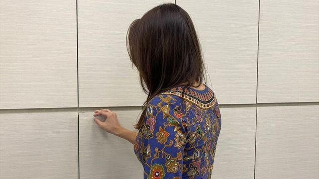
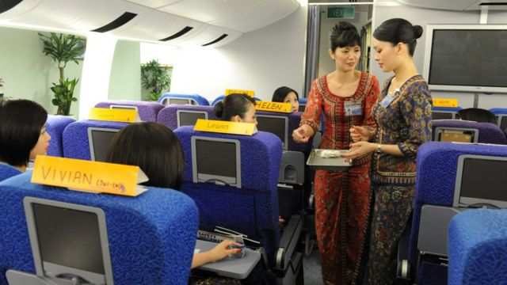
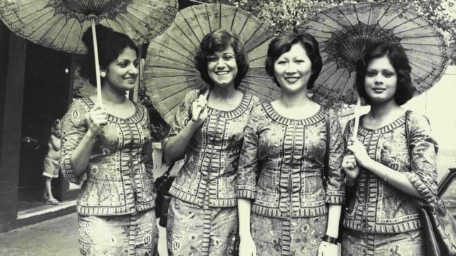
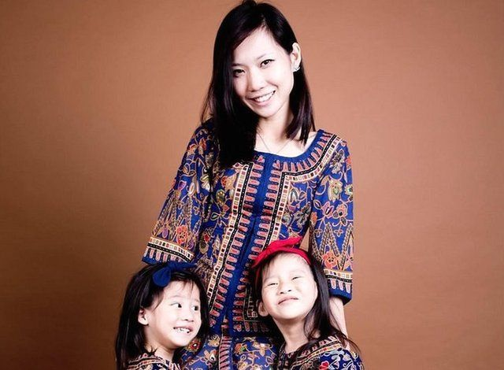
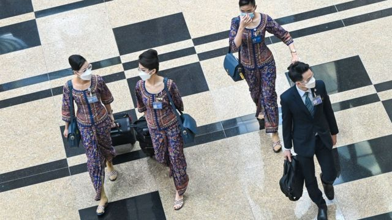
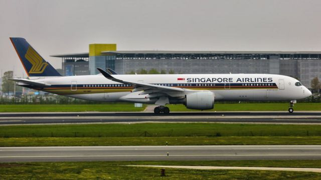

# [World] 新加坡航空怀孕空姐不再被辞职 半世纪的争议规定走进历史

#  新加坡航空怀孕空姐不再被辞职 半世纪的争议规定走进历史

  * 梁艳婷 
  * BBC记者 新加坡报道 

> 图像加注文字，强制怀孕空服员辞职的规定在新航持续了50年。

**“飞行是我的第一份工作，所以我没有任何基础去跟其他行业做比较。我的工资比人低，我也没想过这是不是故意的，因为大家都这样。”**

当胡佩珊（Clara Fu）发觉自己怀孕以后，喜悦瞬间变成了忧虑。

这位新加坡航空公司（Singapore Airlines）的前任乘务员（空中服务员）知道她必须离开，因为公司规定乘务员在怀孕满三个月（first trimester）之后必须辞职。

她最终回到了工作岗位，过了没多久又怀上了。胡女士告诉BBC，作为家中唯一经济支柱，丢工作实在让她承受不了。

因此她把孕肚藏起来，继续执飞了五个月。直到被一位乘客发现她大腹便便才辞职。

胡女士说：“那时很难过。我设法若无其事地过日子。”

> 图像来源，  AFP
>
> 图像加注文字，新入职的新航乘务员须接受14周培训，内容包括打扮、备餐与应急处置等。

新加坡航空在7月终止了这项存在了半个世纪的规定。西盟斯律师事务所（Simmons & Simmons）合伙人陈思良（Clarence Ding）告诉BBC，由于新加坡没有反歧视法律，这样的做法过去一直是合法的。

陈思良说：“这并不是说新航的政策毫无问题，（新加坡的雇佣指引）有说雇主必须实行公道的雇佣政策。”

陈先生补充说：“指引不具备法律效力，也没有订明违反指引有何惩处。企业遵守指引的唯一理由是（新加坡政府）人力部三令五申雇主必须这样做。”

“人力部掌握实权，有能力透过严厉审查雇佣操作和削减申请工作准证权利来制裁雇主。”

新航并未交代改变政策的理由，但这正值世界各地航空公司此前在新冠疫情期间大规模裁员过后，如今因人手短缺而顾此失彼之际。

在新规则下，怀孕乘务员可以申请调职到其他部门最多九个月，在分娩后重新执飞。

新航表示：“迄今为止，申请了地勤职位的合资格乘务员都获编配了适合其专长的岗位。”

##  新航空姐半个世纪的枷锁

> 图像来源，  Fairfax Media Archives/Getty Images
>
> 图像加注文字，新加坡1965年自马来西亚独立，新航1972年拆伙自马来亚—新加坡航空，此后“新加坡女郎”一直是其重要的企业形象代表。

自新航半个世纪以前成立开始，女性在空勤人员中肩负着服务顾客的关键角色。

这家航空公司的乘务员被称为“新加坡女郎”（Singapore Girl），她们身穿纱笼卡峇雅（Sarong Kebaya）制服，那是来自东南亚部分地区 娘惹女性  的传统服饰，法国女装设计师皮尔·巴尔曼（Pierre Balmain）据此设计了制服。

新入职员工须接受为期14周的培训，学习举止谈吐、备餐和应对紧急情况。

伊丽莎白·罗（Elizabeth Low）曾于1980年代在新航工作。她说，许多女性认为能担任此角色是莫大荣幸。

她说：“你决不能怀孕，没有人对此愤愤不平。大家都知道，为了事业，你必须牺牲家庭生活。”
 “新加坡企业管理学院”的一篇报告称  ：“新航的商誉，以及由此带来的职业自豪感，让其招聘过程出现高度筛选。”

报告说：“每次招聘约有10%申请人成功受聘，并被送往培训，踏上成为新加坡女郎的第一步。”

2011年，入职新航不到两年的孔丽婷（Ashley Hong）因为怀孕而离职。

虽然她认为为安全起见，怀孕的乘务员应该停止飞行，但她盼望当时能选择留在公司。

> 图像来源，  Ashley Hong
>
> 图像加注文字，孔丽婷如今是五孩之母。

孔女士说：“我以为当我们找上这份工作的时候，大家心知肚明这份工作有它的限制，而且有个限期，就是当你怀孕的时候。”

“当你明知到结果会是这样，也就没任何空间给你觉得不开心。”

##  “性别歧视”

新加坡妇女行动及研究协会（AWARE）过去十多年一直对此提出异议。协会表示接到了被迫离职的机组人员投诉。

AWARE执行董事林淑美（Corinna Lim）对BBC说：“新航要求员工怀孕后辞职的行为绝不能接受。这是性别歧视。”

“即使这在某程度上是合法的，这样做还是明显地违反了新加坡既有保障妊娠法规当中，让母亲们追求事业，自力更生的精神。”

新航曾在2010年宣称，要求怀孕乘务员辞职，是因为“工作的体力需求意味着我们所有乘务员都得有良好体格，以执行职务”。

《海峡时报》当时引述新航的回应说：“作为一个负责任的雇主，我们不敢想象把怀孕乘务员和她们尚未出生的孩子置于险境。”

“我们的乘务员签订的是五年合同，而非长期受聘，女乘务员雇佣关系在怀孕三个月之后终止是基于上述原因。”

> 图像来源，  AFP
>
> 图像加注文字，世界航空业在三年新冠疫情期间经历大裁员，如今疫后交通恢复，航空公司求财若渴。

行业组织国际航空运输协会（IATA）对BBC表示，组织并无此方面政策建议，因为“这是个别企业的HR（人力资源）政策”。

没有其他主要航空公司要求怀孕机组人员辞职；英国航空公司（British Airways）、卡塔尔航空（Qatar Airways）与澳大利亚航空公司（Qantas）均向怀孕空勤人员提供地勤岗位。

香港的国泰航空员工“可选择转职带薪地勤工作，或申请无薪休假，直到法定产假开始为止”。

国泰航空表示：“休假结束之后，当空勤人员成功通过相关安全培训之后，便可重返飞行职务。有关政策已存在超过10年。”

林女士仍然对新航有关乘务员外表的规定忧虑不已。其中，有关身体质量指数（BMI）的规定幅度“或会进一步限制所有人——无论是否产后归来的母亲——的机会，只要她不能符合公司标准”。

新航回应称，该公司“对所有空勤人员（实施）相同的打扮标准”。

##  时移世易

2021年，新加坡总理李显龙称，该国计划将其职场歧视指引庄严地写进法律。

李显龙说：“哲学上，把指引写成法律兹事体大，表明我们不会容忍职场歧视行为。”

他还说将设立审裁处，仲裁涉及性别、国籍、年龄、种族、宗教与残疾的歧视问题。

陈律师说：“近年职场经历了翻天覆地的变化，迫使组织内彻底反省哪些政策能让人接受。”

“这很大程度上是人才争夺战的副产品，企业竞相吸引能者为其效力。”

> 图像来源，  Getty Images
>
> 图像加注文字，新航是世界上领先的优质航空公司。

胡佩珊目前在医药企业工作。她欢迎这些改变。

她说，因为怀孕，她错过了新航每任满五年发放的1.5万新加坡元（1.1万美元；7.73万元人民币）奖金。

胡女士说：“幸运的是我的父母与公公婆婆给我很大支持，没有的话可糟了。”

“新航可是国家航空公司，很应该支持有年幼孩子的女性。要是有更好的支援，我也许还会留在那里工作。”

