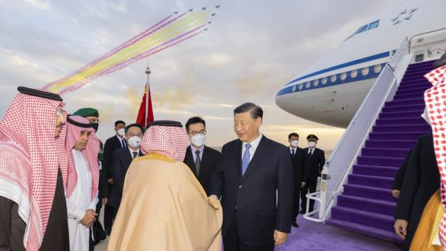
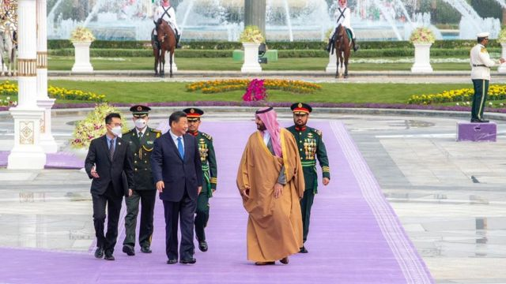
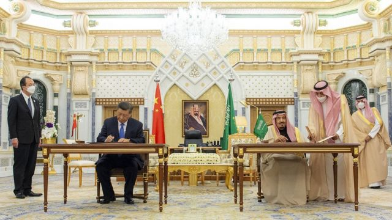
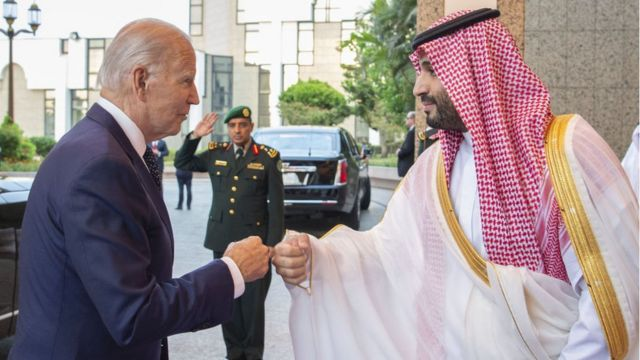

# [World] 习近平访沙特：中国会否全面取代美国在中东影响力

#  习近平访沙特：中国会否全面取代美国在中东影响力

  * 陈岩 
  * BBC中文记者 

> 图像来源，  Xinhua
>
> 图像加注文字，沙方鸣放21响礼炮，礼宾飞机还在空中拉出象征中国国旗的红黄两色彩带。

**当地时间12月7日，中国国家主席习近平抵达沙特阿拉伯首都利雅得，开始国事访问。习近平受到沙特官方的高规格礼遇。**

习近平与沙特的实际掌权者王储穆罕默德·本·萨勒曼（ Mohammed bin Salman ）举行会谈，后与沙特国王萨勒曼签署《全面战略伙伴关系协议》。

沙特官方通讯社报道，习近平抵达利雅得当天，两国企业签署了34项投资协议，涉及绿色能源、信息技术、云服务、交通和建筑等领域。该机构此前称两国将签署价值300亿美元的初步协议。

值得一提的是沙特与华为的合作。沙特官方在一份声明中，本周四沙特与中国科技巨头华为签署了一份备忘录，涉及云计算，以及在沙特城市建设高科技综合体。过去几年华为是受到美国制裁最严厉的中国公司之一。

> 图像来源，  Reuters
>
> 图像加注文字，沙特王储穆罕默德在王宫办公厅广场迎接习近平。

##  礼遇与冷遇

习近平专机进入沙特领空后，四架沙特空军战机升空护航；进入利雅得上空时，6架“沙特之鹰”礼宾护卫机伴飞，专机降落在利雅得哈立德国王机场时，沙方鸣放21响礼炮，礼宾飞机还在空中拉出象征中国国旗的红黄两色彩带。

在机场迎接习近平的是利雅得省省长费萨尔亲王、外交大臣费萨尔亲王、中国事务大臣鲁梅延等王室成员。

第二天，中国车队在悬挂两国国旗的摩托车队与骑兵队的护卫下，抵达王宫办公厅广场。王储穆罕默德迎接习近平并举办欢迎仪式，两人走在紫色的巨大地毯上，检阅了王宫仪仗队。

中国和沙特媒体都聚焦在沙方高规格的礼遇，并与7月份拜登访问沙特的低调仪式做对比。当时，拜登对穆罕默德王储涉嫌“卡舒吉遇害案”多次批评，但在俄乌战争后高企的油价面前，不得不寻求沙特协助增产原油。

当时拜登并未受到与此次习近平同等规格的礼遇，而且他和穆罕默德王储相互“碰拳”替代握手，此举还是引发国内反弹，美媒认为只有熟识的老朋友才碰拳礼，传达的讯息比握手还遭；卡舒吉的未婚妻发推特称，（这一幕）让卡舒吉“又死了一次”。

值得注意的是，美国前总统特朗普在2017年访问沙特也受到高规格礼遇，沙特国王萨勒曼甚至亲自到机场迎接，在国宴前沙方还组织了传统剑舞（Ardah）欢迎仪式，特朗普也单手持剑面露微笑；离开时特朗普还收到沙特方面80多件赠礼，包括白虎皮、猎豹皮制的长袍，以及装饰豪华的匕首等。

##  中沙各取所需

“对于沙特而言，这些峰会可以被视为一个重要的战略步骤，可将自己定位为中国在海湾地区和更广泛地区的主要合作伙伴。”BBC国际媒体观察部（BBC Monitoring）指出，由于沙特发现自身与阿联酋等邻国的竞争愈发激烈，一个强韧的利雅得-北京关系，可以帮助它重新确立在海湾地区的主导地位。

最近，颇具影响力的《中东报》（Asharq Al- Awsat）发表评论文章称，利雅得重视自身与北京在政治上的相似性，称中国的“政权稳定”，并且合作不附加其他条件和“政治上的期望”。

更强大的伙伴关系也将有助于沙特将自己打造成全球旅游、体育赛事和投资目的地的“2030愿景”，以使该国经济摆脱石油依赖而实现多样化。

中国作为全球最大的石油进口国，建立与沙特的关系变得愈发重要，因为后者是全球最大的石油出口国。在中国快速放松疫情管控之际，政府寄希望经济快速复苏来弥补今年以来封控造成的损失，而确保能源供应稳定，甚至进一步拓展与沙特在基建、通信等领域的合作，都有助于这一过程。

“如果仔细观察，（这次访问）的意义远超双方的协议和成果。”台湾亚洲交流基金会访问学者胡莎娜（Sana Hashmi）向BBC表示，这次访问更重要的意义是，习近平确保第三任期后，可以向党和国内舆论证明中国在国际上是个强国，尤其是在近期的抗议活动后。

> 图像来源，  EPA
>
> 图像加注文字，习近平与沙特国王萨勒曼签署《全面战略伙伴关系协议》。

##  美国：不在场的主角

习近平访问沙特之际，沙特与传统盟友美国的关系持续紧张。

今年2月俄乌战争爆发后，油价暴涨，为了应对随之暴涨的物价，拜登访问沙特，希望其主导的石油输出国组织（OPEC）能够增加产量，压低油价。但10月，欧佩克却在之后宣布减产。拜登随即表示，此举将使华盛顿审视与该组织的长期关系。

此次习近平的高调访问并密集会见多国首脑，再加上美沙关系遇冷，俄乌战争等因素，使外界猜测全球大国在该区域的影响力可能发生更深层次的变化。

阿拉伯新闻（The Arab News）网站发表文章称，习近平代表一个“新的多极世界”，并指出他“似乎准备重置全球地缘政治的平衡”。

在访问前，习近平在沙特的《利雅得报》发表署名文章称，他正在进行一次“开创之旅”，以“开启中国同阿拉伯世界、海湾阿拉伯国家、沙特阿拉伯关系新时代”，并称“中国将同阿拉伯国家继续高举不干涉内政旗帜”。

中国官方媒体新华社报道，两国领导人会谈时，王储穆罕默德也表示，“坚决反对任何外部势力以人权等名义干涉中国内政。”

这并没有逃过白宫的注意，白宫警告说“中国正试图在全世界扩大影响”，称其目标“不利于维护基于规则的国际秩序”。

> 图像来源，  Getty Images
>
> 图像加注文字，拜登和穆罕默德王储相互"碰拳"替代握手，此举还是引发国内反对，美媒认为只有熟识的老朋友才碰拳礼，传达的讯息比握手还遭。

此前《经济学人》评论认为，在国际关系中，中国并不打算使其他国家变得更像中国，而是希望建立一种“管得更少”的国际体系，使一个主权政府不必屈从于其他国家对于人权的定义，换言之，一种更适合威权政体生存的体系。中国经常说“互不干涉”“相互尊重”都是基于这一原则，即“主权优先”，而非“人权优先”。

上述评论还认为，中国的做法之一就是在第三世界国家中拓展双边关系，获得支持者。中国强大的经济实力和对人权状况的不关心，使很多受够美式国际体系的国家更青睐中国。

胡莎娜认为，对比拜登和习近平在沙特的不同礼遇，折射出两者与沙特关系的变化，中国希望利用沙特日益增长的反对西方的情绪，以期在某种程度上在该区域建立反对西方的联盟。北京想展示自己在中东既是一个朋友，也是一个战略上的玩家。

但沙特和美国绑定之深并非一次国事访问可以扭转，目前中沙两国发布的合作成果看来，几乎都集中在经贸领域，并未进一步延申到安全和战略领域。

BBC国际媒体观察部（BBC Monitoring）指出，最近沙特官员正在淡化与美国在石油增产上的争端，此前关于沙特在考虑与中国石油交易中用人民币结算的传言，也不了了之。而且纵观该地区媒体，并没有将海湾地区定位为美国或中国的盟友，而是经常理想化地认为在两者的关系中取得平衡。

