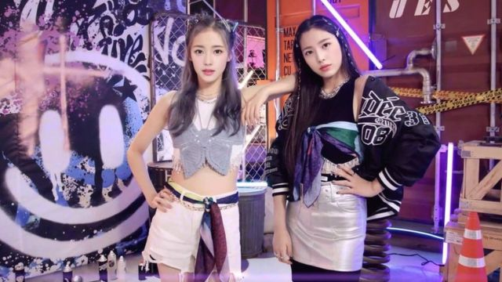
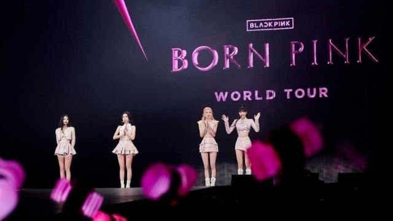
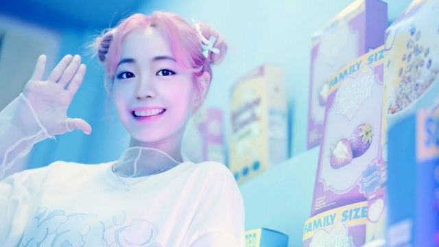
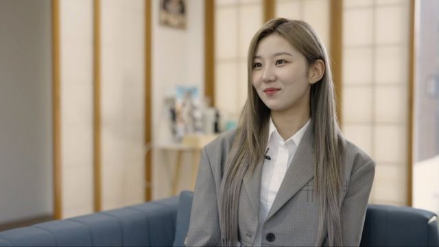
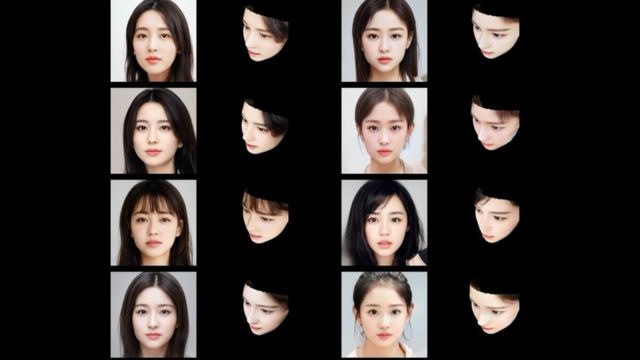
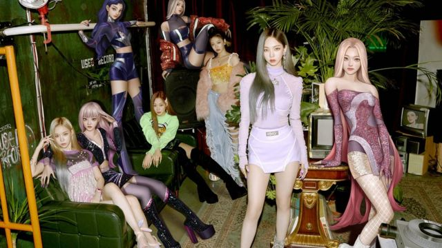
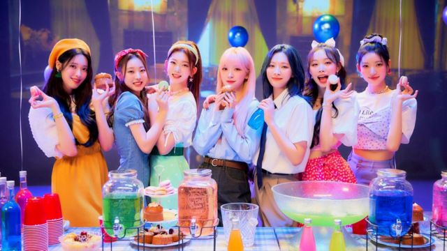
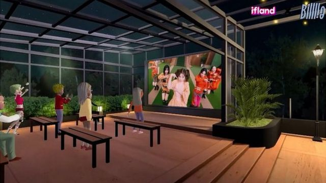
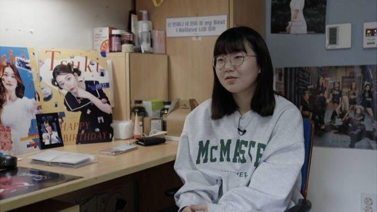
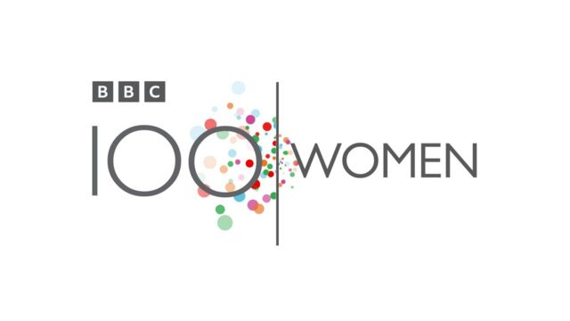

# [World] 韩国Kpop出现AI女团：虚拟歌手走进流行乐坛

#  韩国Kpop出现AI女团：虚拟歌手走进流行乐坛

  * 李允宁（Julie Yoonnyung Lee）、阿米莉亚·亨普希尔（Amelia Hemphill） 
  * BBC巾帼百名（100 Women） 

> 图像来源，  Pulse9
>
> 图像加注文字，Eternity是一支以人工智能生成的K-pop组合，里头的成员都是虚拟的。

**自2021年发表出道单曲《我是真的》（I'm Real）以来，韩国流行音乐（Kpop）组合Eternity（永恒）已经赚到了数百万次浏览量。**

她们能唱能跳，跟粉丝互动与其他乐队没有两样。

实际上，她们与你或许认识的韩团之间存在着一个莫大分别——这11位成员尽是虚拟人物。

非人类，以人工智能（AI）生成的超现实虚拟化身（avatars，又译阿凡达）。

Eternity背后的女将朴智恩（Park Jieun）说：“我们利用Eternity在做的是一门新生意，我想这是个全新行业。”

“采用虚拟艺人的优势是，当K-pop明星容易受制于身体限制，而身为人类他们也会受到精神紧张困扰的时候，虚拟艺人完全不受束缚。”

过去10年间，韩国流行音乐掀起的文化巨浪产生了价值上百亿美元的力量。动听而朗朗上口的曲调，高科技制作，加上流畅、妩媚的舞步，让K- pop成功打进国际主流，成为韩国最赚钱且最具影响力的出口商品。

但无论是顶级K-pop巨星，他们的忠实粉丝军团，还是希望将他们的成功化作资本的东家，都已在展望未来。

随着AI，深度仿冒（deepfake，又译深度造假、深度伪装）与阿凡达技术爆炸式发展，这些流行偶像正把他们的名气引领上一个全新的维度上。

> 图像来源，  YG Entertainment
>
> 图像加注文字，Kpop 天团Blackpink也在利用元宇宙（metaverse）来接触更广泛的受众群。

Eternity成员们的虚拟面孔是由科技企业Pulse9利用深度学习技术产生，朴智恩就是这家公司的总裁。

这家公司最初生成了101张凭空想象的脸孔，然后将它们分成四类：可爱、性感、天真无邪和智慧型。

公司继而邀请粉丝票选他们的至爱，公司雇用的设计师继而根据粉丝的选择，给胜出的面孔动画化。

在直播聊天、视频摄制和线上粉丝见面会上，Pulse9会雇用匿名歌手、演员与舞蹈员，把阿凡达面孔投射到他们身上。

他们的技术就像是深度仿冒过滤器，让角色活起来。

朴智恩告诉BBC巾帼百名专题组：“虚拟人物可以很完美，但它们也可以比人类更人类。”

随着深度仿冒技术走进主流，有人担心这会被利用于未经批准下操弄他人影像，甚或生成危险的误导信息。

一些女性报警称自己的容貌被加进淫秽电影中，俄罗斯总统普京（Vladimir Putin）与乌克兰总统泽连斯基（Volodymr Zelensky）的深度仿冒影片也充斥在社交媒体网站之上。

朴智恩说：“我任何时候都表明，这些都是虚构角色。”

她说，Pulse9在制造阿凡达时，采用了欧盟的AI伦理道德指引草案。

> 图像来源，  Pulse9
>
> 图像加注文字，朴智恩说，虚拟角色“可以比人类更人类”。

朴智恩还看到了虚拟乐队的其他优势：每一位阿凡达都可以由其创作者控制。

这位CEO说：“真人Kpop明星引发的丑闻可以具娱乐性，但也对业务构成威胁。”

她相信自己能好好利用这些新技术，将Kpop艺人为了追赶行业需求而过度受压的风险减至最低。

从组合成员的恋爱传闻到网络欺凌，肥胖羞辱和节食过度，过去几年，Kpop因为各种社会议题而登上新闻头条。

一些年轻的Kpop死于非命，也引起韩国讨论精神健康与网络霸凌问题。许多追星族认为这些事件给他们带来莫大冲击。

2019年，歌手兼演员雪莉（崔真理） 被发现死于家中  ，终年25岁。她据报“肉体与精神因恶意不实谣言扩散而受伤害”，暂停从事演艺事业。

她的闺蜜——另一位K-pop歌手具荷拉—— 不久后也被发现死于家中  。具荷拉在自尽之前曾被男友秘密偷拍，继而因此遭受惨烈的网络欺凌。她本来正为此兴讼维权。

##  AI进场搅动韩流，是威胁还是补强？

真人明星得披星戴月的练习、验出和与粉丝互动，让阿凡达在虚拟世界支援工作，或能减轻些负担。

19岁的韩锐垣是新晋女团mimiirose的主唱，由韩国YES IM娱乐公司担任经理人。

韩锐垣当了将近四年的实习生，时刻盼望着在镁光灯下闪耀的机会——与其他候选人一样，她得每月接受评估，那些被评定为没有进步的人会被驱逐出团。

韩锐垣说：“我经常担心自己没有出头的一天。”

> 图像加注文字，mimiirose主唱韩锐垣时刻担心自己的前途。

没有Kpop明星是一夜成名。当每年都有新乐团问世，要鹤立鸡群，谈何容易。

这位主唱说：“我每朝大约10点钟上班，开声练习就一个小时。之后我唱歌大概两、三个小时，跳舞三、四个小时，再锻炼两个小时。”

“我们练习加起来就超过12个小时，做的不好就只会加班更长。”

但韩锐垣担忧阿凡达在这行业盛行。她认为粉丝们喜欢的是她们真实的一面。

她说：“因为科技突飞猛进，我害怕虚拟人物最终会取代真人偶像。”

> 图像来源，  Pulse9
>
> 图像加注文字，Eternity成员的脸孔都是AI合成产物。

也有别的Kpop乐团迫不及待地拥抱阿凡达技术，其盈利前景似乎还在稳步上扬。

市场调研企业Emergen Research推算，到2030年，全球数字人类与阿凡达市场规模将达5275.8亿美元（3.68万亿元人民币）。

Kpop大户企业中，至少有四家正在为其明星们大手笔投资虚拟元素；2022年盈利最高的Kpop企业中，有五家已投身到这浪潮中。

把自己复制到虚拟世界让他们打破时差与语言障碍，去接触不同粉丝——这是有血有肉的明星们永远无法做到的事情。

举例说，女子组合aespa有四位真人歌手兼舞蹈员——Karina刘知珉、Winter金旼炡、Giselle金枝利（内永枝利）和Ningning宁艺卓——与四位对应虚拟角色——ae- Karina、ae-Winter、ae-Giselle和ae-Ningning。这四位阿凡达可以陪伴粉丝们探索虚拟世界，并能横跨多平台应用。

> 图像来源，  SM Entertainment
>
> 图像加注文字，女团aespa成员有四位真人、四位数字分身。

早已是歌曲排行榜前列常客的Blackpink在2022年创造历史，在她们的虚拟孪生姊妹协助下， 夺得MTV电视网首个最佳元宇宙演出奖  。

来自全球各地的超过1500万人登入网络赌博平台PUBGM，实时观看这组合的阿凡达演出。

新冠病毒病（COVID-19）疫情期间，Moon Sua文秀雅和她的女团Billlie不得不取消现场演出和粉丝会面，她们的经理人公司把团员都复制成阿凡达，在虚拟世界办了个粉丝大派对。

文秀雅说：“毕竟我们第一次办这个，我们都显得有点笨手笨脚的。”

> 图像来源，  MYSTIC STORY
>
> 图像加注文字，全真人女团Billlie在新冠疫情期间利用元宇宙之便来维持与粉丝交流。

“慢慢我们就适应了，一边适应这虚拟世界，一边跟粉丝们聊天。我们都乐透了。”

文秀雅对女团各人分身的像真度印象深刻，但她说自己还是喜欢与支持者们亲身见面。

作为女团主音饶舌歌手的文秀雅说：“我不觉得那是个什么威胁。也许我们看它们演出能学到些什么？我不觉得它们的威胁大得足以取代我们。”

但业界也普遍担心阿凡达技术将带来的道德伦理与版权问题。

音乐杂志《公告牌》（Billboard）的Kpop专栏作家杰夫·本杰明（Jeff Benjamin）告诉BBC巾帼百名专题组：“艺人走进元宇宙、虚拟版本、她们自己的象征符号……诸如此类，充满着未知之数。”

“艺人本身也许会无法控制自己的形象，形成剥削。”

##  影响难料？

19岁的李智秀（Lee Jisoo，音译）是一位工程学院学生。对她而言，Kpop是精神紧张时分散注意力的良伴。自Billlie于2019年成军以来，李智秀便忠心不二的追随着。

她说：“她们对粉丝们的爱很了不起。你情不自禁地更爱她们。”

李智秀除了收藏唱片与官方商品外，还会上网和进入虚拟世界与女团成员交流互动。

她说：“我从Billlie身上所感受到的情感，要是我没有迷上她们的话，是不会感受到的。”

“我想向Billlie回馈这样的感受，让我变狂粉了。我想这对于我来说是正面的。”

> 图像来源，  SK Telecom
>
> 图像加注文字，Billlie在虚拟世界给粉丝们办了一场派对。

但对于Kpop明星和粉丝来说，因为防止网络霸凌与虐待法规没能在此贯彻执行，虚拟世界也可以是一处令人生厌的地方。这个行业一直饱受针对当红明星的网络霸凌与抹黑困扰。

李智秀说：“当我在网上读到有关Billlie的卑鄙刻薄言论时，我会得更紧张。因为这也是在侮辱我所喜欢的东西，结果我自己变得焦虑，感觉心碎。”

首尔执业的儿童和青少年精神科医生郑玉金（Jeong Yu Kim，音译）说，要想知道虚拟技术与AI角色崛起会给年青人造成哪些影响，目前言之尚早。

郑医生说：“我觉得真正的问题是，我们不能真实看见彼此。”

“在虚拟世界，我们可以更自由，做些在外面做不了的事情，你能变成另一个人。K-pop行业是很能回应大众诉求的，他们也会希望旗下艺人能满足他们。”

> 图像加注文字，李智秀自2019年Billlie出道以来便一直支持她们。

本杰明说：“任何演艺事业都是充满着压力的。”

“人们普遍预期艺人们任何时刻都能展示最佳形象，他们被认为理应成为粉丝们的闪亮榜样。”

但他说这些都在改变，整个行业都在转型，以照顾明星们的精神健康需要，减少繁重的工作量。

“明星们也日趋公开地谈论自己的精神状态，这其实更能帮助他们与粉丝紧密联系。”

Kpop行业日新月异，要就虚拟偶像到底是昙花一现还是整个音乐行业的未来，为时尚早。

但在当下，对于智秀等粉丝而言，该追哪帮明星的抉择不费功夫。

“老实说，要是有人问我：‘你想在元宇宙内看100分钟的Billlie ，还是在现实世界看她们10分钟？’我能可选择在现实世界看她们10分钟。”

她相信“喜爱真实偶像与虚拟偶像的人完全不同”，而对于像她一样的人而言，要他们牺牲真人K-pop明星来去拥抱阿凡达，“休想”。

##  “巾帼百名”是什么？
 BBC巾帼百名  每年都会提名100位来自全球各地深具影响力及鼓舞人心的女性。我们会制作一系列关于她们的纪录片和专题报道，彰显她们的成就。欢迎关注专题组的 Facebook  、 Instagram  及 Twitter  ，并使用 **#BBC100Women** 参与交流。

