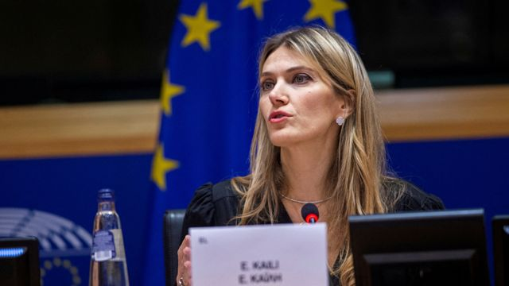

# [World] 卡塔尔被指曾贿赂欧盟官员，欧洲议会主席警告说丑闻显示“民主受到攻击”

#  卡塔尔被指曾贿赂欧盟官员，欧洲议会主席警告说丑闻显示“民主受到攻击”

> 图像来源，  Reuters
>
> 图像加注文字，欧洲议会副主席凯利于上周六被捕，据悉她的财产已被冻结

**欧盟官员涉嫌腐败，有指控称卡塔尔曾贿赂他们，以换取他们对某些决定作出影响。**

欧洲议会主席警告，事件导致“欧洲民主受到攻击”。

“开放、自由、民主的社会正在受到攻击，”罗柏塔·梅索拉（Roberta Metsola）说。

消息指，比利时警方在上周拘捕四人，当中包括欧洲议会副主席伊娃·凯利（Eva Kaili）。

被捕四人被控腐败和洗钱罪，卡塔尔则否认有任何不当行为。

欧盟委员会主席冯德莱恩（Ursula von der Leyen）表示，相关指控“非常严重”，呼吁设立新的道德部门监察这个组织。

BBC驻布鲁塞尔记者杰西卡·帕克（Jessica Parker）报道，比利时当局在过去几天所公布的一些细节令很多人目瞪口呆。

接受记者访问的欧洲议会成员表示，他们对于相关指控的规模和程度感到震惊。

比利时警方于上周五（12月9日）的布鲁塞尔进行了16次搜查行动，缴获价值60万欧元的现金（63.2万美元；51.5万英镑），以及带走一些电脑和手机。

目前未有公布被捕人的身份，但据悉被检控人士当中包括欧洲议会副主席凯利。

担任欧洲议会成员八年的凯利是梅索拉任命的14名副主席之一，她目前已被停职。

她在议会内的社会主义者和民主人士组织（Socialists and Democrats Group）成员身份亦被暂停，同时被起所属的希腊中间偏左的泛希腊社会主义运动党开除党籍。

据报，希腊的检控方已冻结凯利的全部资产。

自周五起，10名议会雇员的IT资源已被“冻结”，以避免丢失任何调查所需的数据。

监察机构和议会反对派成员表示，此宗腐败调查可能引出欧洲议会历史上最重大的腐败丑闻。

##  四人被捕

较早前，四名欧洲议会人员涉嫌受一个海湾国家贿赂。

检控方指，他们怀疑一个海湾国家曾在几个月的时间里通过金钱和礼物影响欧洲议会的经济和政治决定，特别是官员的助手。

最初有六人被带走调查，其中二人已被释放。

上周六（12月10日），欧洲议会主席梅索拉当时从自己的祖国马耳他特地前往布鲁塞尔，按照比利时宪法规定，亲自在场见证一名议会成员家居接受搜查。

梅索拉的发言人表示，她已经决定立即暂停副主席凯利的一切职务。

该发言人同时表示，欧洲议会“坚决反对腐败”，正在与调查方“全面合作”。

比利时联邦检察院的声明指：“他们被控参与犯罪组织、洗钱以及腐败。两人已获调查法官释放。”

当地媒体已经指出该海湾国家就是卡塔尔，但是卡塔尔政府否认有不当行为。

法新社引述卡塔尔政府一名发言人表示：“我们不知道调查的任何细节。任何声称卡塔尔政府有不当行为的指控都是严重错误的假消息。”

该发言人还指，卡塔尔“完全按照国际法律和规则行事”。

##  凯利曾为卡塔尔辩护

匈牙利总理维克多·欧尔班（Viktor Orban）在相关指控曝光后，对欧盟作出嘲讽评论——匈牙利是欧盟成员，但是经常与这个组织意见相左。

他在推特（Twitter）上发布一张经常被使用的迷因（meme: 搞怪的模仿)图片——当中有美国前总统里根（Ronald Reagan，列根）和乔治·HW·布什（George HW Bush，布殊）。欧洲议会曾因法制方面的担忧要求冻结与匈牙利相关的数十亿欧元资金。

凯利作为副主席的职责范围包含中东，而她过去亦曾为卡塔尔辩护。

上月，凯利则 发言  谈论卡塔尔的人权状况，称这个正在举办世界杯的国家是“劳工权益的先锋”，指卡塔尔已经废除被称作“卡法拉”的外劳保证人制度——这一制度曾被人权组织比作当代奴隶制。

“其实卡塔尔世界杯就是一个证明，体育外交能够如何令一个国家发生历史性的改变，通过改革启发阿拉伯世界，”她说。

欧洲议会是欧盟当中唯一通过直选产生的机构。欧盟27个国家的选民 投票  选出约705名议会成员，他们召开会议对立法提案进行审视，并投票通过欧盟法律。

