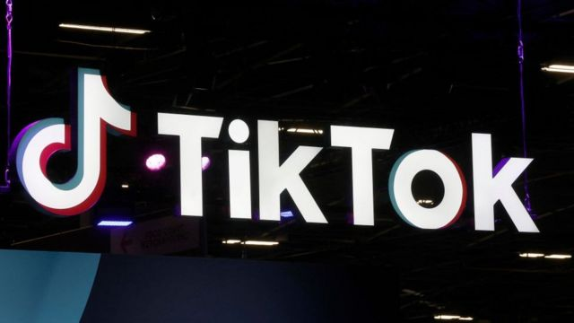
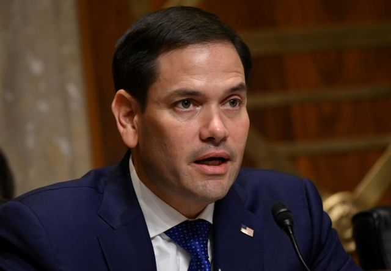

# [World] 美国会议员以担心中国危害国家安全为由 提出禁止TikTok立法提案

#  美国国会议员以担心中国危害国家安全为由 提出禁止TikTok立法提案

  * 娜塔莉·谢尔曼（Natalie Sherman） 
  * BBC商业记者，发自纽约 

> 图像来源，  Getty Images

**美国国会议员以担心国家安全受到威胁为由，提议禁止TikTok（英文版抖音）。这是一款以热门短视频著称的社交媒体应用。**

这项两党法案是美国针对该公司的最新举措，该公司由中国科技巨头“字节跳动”所有。

上个月，美国联邦调查局局长担心，中国可能利用这款应用影响用户，或控制他们的电子产品。美国有几个州已经禁止在政府设备中使用TikTok。

但该法案通过的可能性很小。

> 图像来源，  EPA

TikTok在美国拥有超过1亿用户，该公司称，这一举措是“出于政治动机的禁令，对促进美国国家安全毫无帮助”。

该公司还称，正在制定相关计划，以进一步确保该平台在美国的安全。美国从前总统唐纳德·特朗普（Donald Trump）时期开始审查国家安全。

“我们将继续向国会议员介绍这些计划，”该公司表示。

总部位于华盛顿特区的智库战略与国际研究中心（Center for Strategic and International Studies）研究员凯琳（Caitlin Chin）表示，对TikTok的政治攻击表明美中关系紧张。

但她表示，不太可能很快在全国范围内禁止TikTok，并且，尽管人们普遍认为有必要对美国数据隐私和内容审核规则做出修改，但议员们的进展缓慢。

她还说，到目前为止，对TikTok和中国有所担忧主要因为有可能滥用数据，而不是基于与滥用相关的证据。

“从隐私的角度来看，仅仅阻止TikTok这样的公司运营并不能弥补差距，”她说，并指出其他许多网站也收集类似的信息。

澳大利亚等国也出现了禁止TikTok的呼声，台湾最近也采取行动，禁止在公共设备上播放TikTok。印度在2020年的军事争端中禁用了TikTok。

> 图像来源，  Reuters
>
> 图像加注文字，美国共和党参议员马可·卢比奥是该法案的一位支持者。

在美国，两年前，在特朗普发布禁止下载的行政命令后，TikTok面临实际禁令，但法官阻止了这一措施，因此从未生效。

该禁令最终被拜登总统撤销。

2020年，负责审查外国公司在美所有权的美国外国投资委员会也命令字节跳动出售TikTok。

该公司与该机构的谈判正在进行中。

共和党参议员马可·卢比奥（Marco Rubio）是该法案的一位支持者。他说，该法案得到了至少一名民主党人的支持。

他表示，他的法案将阻止来自中国、俄罗斯及“其他令人担忧的外国”的社交媒体公司进行所有交易。

他说：“这不是为了针对创意视频，而是针对一个每天收集数千万美国儿童和成人数据的应用程序。”

