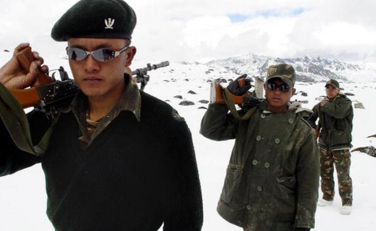
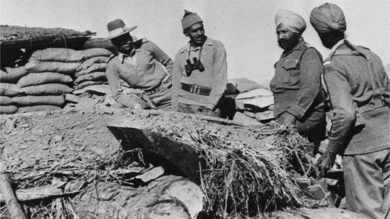
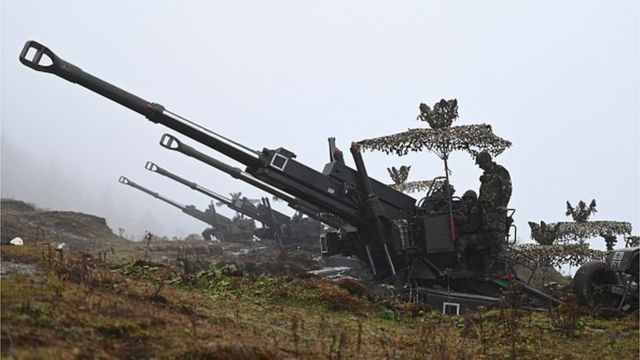
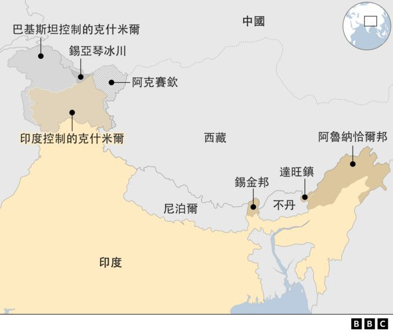

# [World] 印中边境冲突：一道60年的战争阴影

#  印中边境冲突：一道60年的战争阴影

  * 苏蒂克·比斯瓦斯（Soutik Biswas） 
  * BBC驻印度记者 

> 图像来源，  AFP
>
> 图像加注文字，2003年10月31日，印度士兵在阿鲁纳恰尔邦的达旺镇附近海拔16,000英尺的印中边境巡逻，这是中国声称拥有主权的印控区域。

**60年前的那场战斗，开始于一个晴朗的秋日早晨。**

1962年10月23日，中国士兵进入印度东北一个当时叫做“东北边境特区”（NEFA）的喜马拉雅偏远地区，在这个与中国和不丹接壤的地带进行了一场激烈的交火。

今天，这里变成了阿鲁纳恰尔邦——印度控制下一个有超过100万人口的邦，而中国仍然继续声称对它拥有主权。而这里，也正是两国一年多以来最新一次发生冲突的地方。

“爆炸的光点亮了天空，声音在山间回荡，”瑞典记者贝蒂尔·林纳（Bertil Lintner）这样引述印度军人说。他是《中国的印度战争：世界屋脊上的冲突》（China's India War: Collision Course on the Roof of the World）一书的作者。

中国军队冲破了印军的阵地，击毙了17名印军士兵，俘虏13人。面对诧异和装备不佳的印军，他们没有遇到多大抵抗，一路进军。第二天，他们就夺取了达旺镇，一个位于附近山谷里的佛教寺院小镇。

中国军队继续南下。至11月，他们已经到达邦迪拉（Bomdila），那是位于一座山附近的寺院小镇。那里距离以茶园、油田和黄麻种植著称的阿萨姆邦（Assam）只有250公里（155英里）。

然后，在11月21日，中国宣布停火，并迅速撤退至两国之间那条模糊的事实边界以北20公里——那是英治时期的印度在地图上划定的中印边境“实际控制线”。

> 图像来源，  Getty Images
>
> 图像加注文字，1962年11月，一场短暂的战事中，印度伤亡惨重（图为中印边界冲突期间，印军在印度北部拉达克地区的一座工事）。

“战事结束了。两个星期内，中国人民解放军士兵就回到中国控制的那部分山区，”林纳写道。印度一方统计的军人死亡数字为1383人，并有近1700人“在行动中失踪”。中国方面的纪录显示，印度的伤亡数字将近4900人，并有3968人被活捉。

印度防务分析家、新书《了解印中边境》（Understanding The India China Border）的作者马诺吉·乔希（Manoj Joshi）表示，目前还不清楚中国撤军的原因。

“是因为他们的补给线拉长了？是他们害怕美国的干预？还是说事实上他们对东部（边境）的主张不那么认真？”他说。

争议性的中印边境被分成三个区域：西边一段围绕拉达克（Ladakh）；中间一段由印度的喜马偕尔邦（Himachal Pradesh）和接壤西藏的北阿坎德邦之间的边界组成；东边一段则是由阿鲁纳恰尔邦的边境组成。

专家表示，那实际上是一条“概念上的边界”——印度说它有3488公里长；中国则说它有2000公里多一点。

印度声称对该边界西部的阿克赛钦高原拥有主权——该地区相当于一个瑞士的面积，由中国控制着。中国则声称对阿鲁纳恰尔邦拥有主权。

> 图像来源，  AFP
>
> 图像加注文字，2021年10月20日，印度士兵在阿鲁纳恰尔邦的实际边境线附近。

在阿鲁纳恰尔邦从未被中国承认的一段东部边界——据印度所说有1126公里长——由麦克马洪线组成。它是以1914年担任印度外交部长的英国人亨利·麦克马洪（Henry McMahon）的名字命名。

亚洲两个最大的国家——也是拥有核武的两个邻国——已经达成协议，停止在这个世界上持续时间最长的边境争议地带擦枪走火。双方大致上都保持着和平，但是又总是指责对方越界和侵入。

但是，中国并没有放弃对阿鲁纳恰尔邦的主权主张，而且仍然将那里的大部分地区称作“藏南”。去年，中国民政部将争议地区的几个地方重新定名，官方媒体称中国的主权主张有“历史和法理依据”。

一些分析人士表示，北京认为阿鲁纳恰尔邦将在中印最终的边界协议中担当角色：德里将会接受中国对阿克赛钦的主权——这处位于战略要地、矿产丰富的冰原地带，从1950年代起就被占据——以此来换取北京接受印度对阿鲁纳恰尔邦的主权。

但是，像英国伯明翰大学的策凌博士（Dr Tsering Topgyal）等专家则认为，情形已不再是如此。

“中国对控制西藏的信心，和北京用阿鲁纳恰尔邦换取阿克赛钦的意愿之间，或者有一定联系。现在，我认为中国处理边境争端的时候，考虑的不再仅仅是具体领土的得失，而是越来越多地将更广大的国家和外交政策利益考虑在内，”策凌博士说。

过去曾经由德里直接管辖的阿鲁纳恰尔，在1987年正式成为一个邦，这令中国非常不满。多年来，印度也加强了边境一带的防备和基础设施，并在附近建起村庄。

印度领导人到访阿鲁纳恰尔邦亦令北京不满。2008年当前总理曼莫漢·辛格（Manmohan Singh）到访该邦并宣布一系列公路建设项目时，中国正式表示过抗议。

2014年，总理纳伦德拉·莫迪（Narendra Modi）宣布计划，建设2000公里的新公路，并发展阿鲁纳恰尔邦过去被忽视的偏远地区。

“我们并不是在做任何事情来影响关系。这不是为了挑战或者与中国竞争，而是保护我们的领土安全，”来自该邦的印度联邦部长基伦·里吉朱（Kiran Rijiju）当时向彭博新闻社（Bloomberg）表示。

策凌博士表示，从中国的角度，与印度继续保持在边境方面的争议“在策略上是合理的”，包括阿鲁纳恰尔邦在内，这是“作为一种克制印度野心和管理其行为的手段，比如它与美国越来越紧密的关系”。

“在中国与所有邻国的边境争端当中，只有印度和中国的争议仍然悬而未决，这是为什么？”他说。

最新一次冲突发生的扬子地区，人烟稀少，据专家所说离中国境内的一个村庄仅5公里。这是有争议的边界沿线的十几个有争议的地区之一，双方都有重叠的主张。

“东边的边界似乎又要热起来了，”乔希说，“而这真的不令人意外。”

