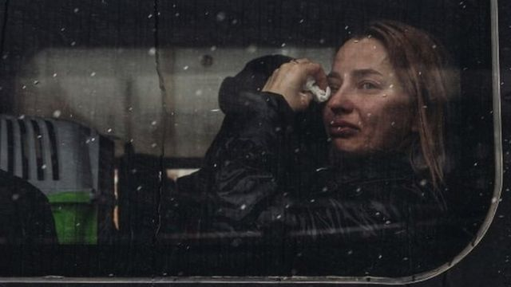
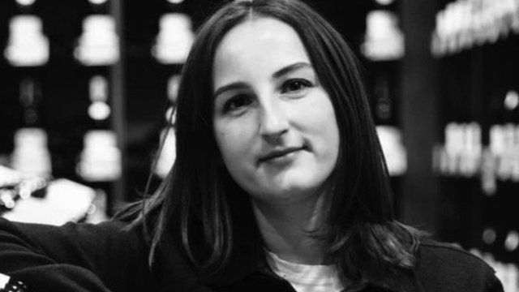
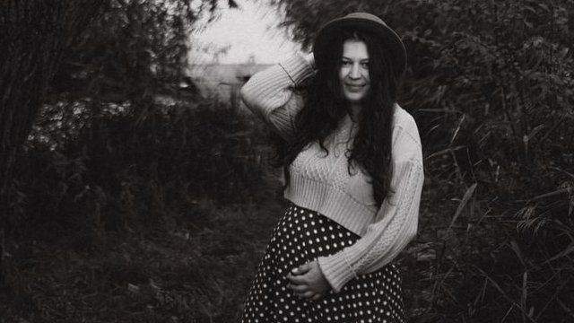
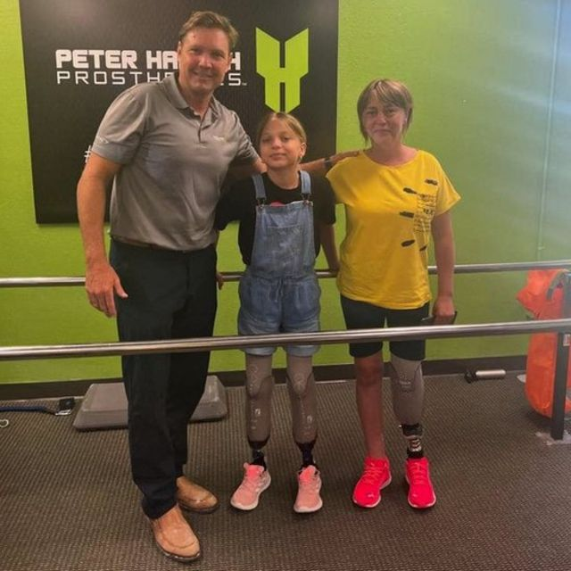
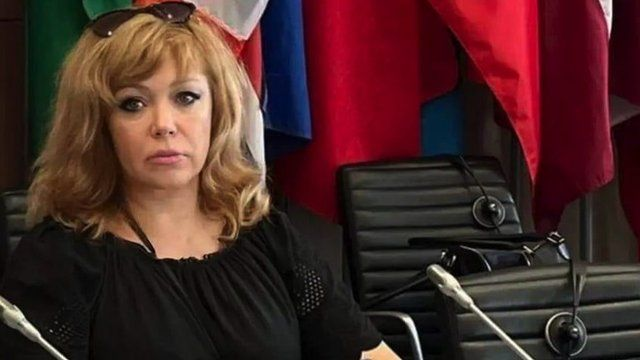
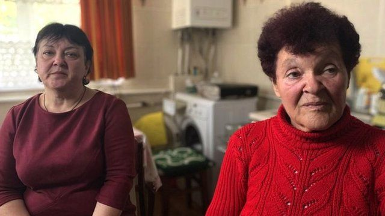
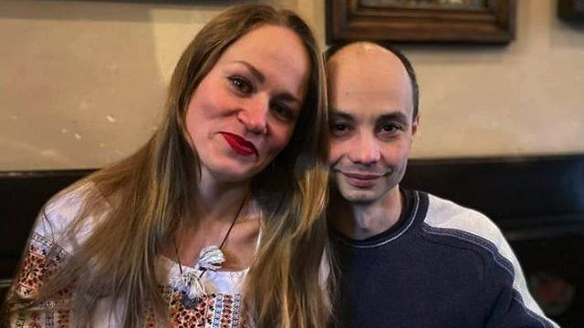
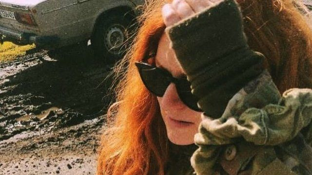
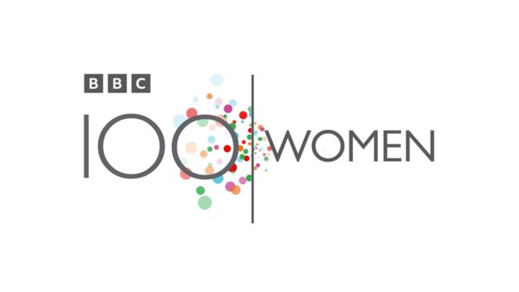

# [World] 乌克兰战争：乌克兰女性在战争中是如何生存的？

#  乌克兰战争：乌克兰女性在战争中是如何生存的？

  * 戴安娜·库里什科（Diana Kuryshko） 
  * BBC乌克兰语记者 

7 小时前

> 图像来源，  Getty Images

**战争给乌克兰女性带来不断的压力和焦虑：她们担心孩子能否放学后平安回家还是会遇到导弹袭击；在死亡人数每日剧增的日子里，她们担心自己的丈夫、兄弟或是父亲能否从战场上活着回来 - 或是她们自己是否能从战火中幸存下来。**

但尽管忧虑重重，生活仍在继续 - 女性仍然在给孩子做饭（即使在没电的时候）、包饺子、并为前线士兵织袜子、在公园散步、修指甲和买礼物。

BBC巾帼百名在这里讲述七名乌克兰女性在战争中的经历。

##  “她很坚强。我们将这样牢记她”

> 图像来源，  Goodwine
>
> 图像加注文字，26岁的维卡

26岁的维多利亚·科瓦尔丘克（维卡，Victoria Kovalchuk）是在废墟中被找到的，她搂着自己深爱的丈夫博丹。附近还有一只宠物猫。

他们一家在基辅的家中安然熟睡时遇到了无人机袭击。他们死在了一起，维多利亚已经怀有身孕。

在已经历时10个月的战争中，俄罗斯向乌克兰发射了数百枚导弹和无人机，导致数万人死亡。俄国打击的目标包括居民楼、学校、购物中心 - 有时甚至是街道。

有些遇难者是在上班、上学或是去商店的路上丧生的；有些人则是在家中安然入眠时被打死的。

维卡的同事说，“维卡热爱葡萄酒和她作为侍酒师的工作。我们非常爱她。”

“她不惧艰难挑战。她很坚强。我们将永远记住她这一点。”

##  “我在逃往防空洞的路上还在喂儿子”

> 图像来源，  Iryna Nemyrovych
>
> 图像加注文字，伊琳娜·涅米罗维奇

33岁的伊琳娜·涅米罗维奇（Iryna Nemyrovych）儿子才4周大。在他出生3天后，即11月21日，俄罗斯部队向乌克兰发起大规模袭击，共发射了70枚导弹。

基辅和其他城市陷入一片黑暗，冰冷的冬天也提前来临。

由于电梯在停电期间无法使用，伊琳娜一家无法住在自己在13层的公寓中。

“在战争中照顾婴儿意味着我必须在有电时给孩子洗澡，而不是在孩子需要洗澡的时候。因为经常没电，我必须手洗许多东西。我在漆黑的房子里换尿布、喂奶和到处走动。就是在逃往防空洞的路上我也没停止给儿子喂奶。”

“我每天都要感谢保护我们的乌克兰部队。因为，尽管这些种种的恐怖，我仍能留在乌克兰，和我亲爱的丈夫和家人一起生活，没有俄罗斯人。”

##  “我仍无法原谅自己去喝茶”

> 图像来源，  Natalya Stepanenko
>
> 图像加注文字，娜塔莉亚和她的女儿

当火箭弹击中乌克兰东部城市克拉马托尔斯克火车站时，娜塔莉亚·斯捷潘年科正要和女儿喝茶。

40岁的娜塔莉亚当时正准备带着11岁的双胞胎雅娜（Yana）和雅罗斯拉夫（Yaroslav）逃离战争。在4月8日，他们正在车站等着一辆疏散火车把他们转移到乌克兰西部去。

在那一天，俄国火箭袭击打死了50人，其中包括5名儿童。

娜塔莉亚失去了一条腿，她女儿失去了双腿。

“我试着站起来，但怎么站呢？ 我看着雅娜，她鞋子没了。我仍然无法原谅自己当时要喝茶，” 娜塔莉亚说。

现在她和女儿正在美国接受康复治疗。她们正在学习如何使用假肢走路，并梦想战争结束后重返家园。

##  “我看到和听说他是如何被杀的”

> 图像来源，  Alyona Lapchuk
>
> 图像加注文字，阿莲娜·拉普丘克（Alyona Lapchuk）

阿莲娜·拉普丘克（Alyona Lapchuk）告诉他们（欧安组织，OSCE）她的丈夫维塔利（Vitaly）是如何在她面前遭受酷刑的。

在俄罗斯人占领南部城市赫尔松之后，欧安组织代表听说俄国人迫害那些亲乌克兰的人。

她丈夫维塔利是一名警察和老师，他拒绝与俄国人合作。他遭到毒打和绑架。

阿莲娜也遭到绑架，他们给她套上头套，但她设法从占领城市逃走了，她丈夫没能逃走。

几个月后，人们在河里找到了维塔利的尸体，他身上有被折磨的痕迹。阿莲娜无法参加葬礼，因为那时赫尔松仍在俄军占领下，她仍然处于危险中。

现在赫尔松已经解放，阿莲娜希望能将跟她丈夫死亡有关的人员绳之以法。

她说，“我亲眼看见和听见他如何被杀害。 这是战争罪。俄国必须要为一切负责。”

##  “我想让俄国人知道他们的丈夫、儿子和父亲是如何折磨乌克兰人的”

> 图像来源，  Lyudmila Mymrykova
>
> 图像加注文字，75岁的柳德米拉（右）和女儿

柳德米拉·米姆里科娃（Lyudmila Mymrykova）75岁，她话不多。退休前，她在米洛柳比夫卡村（Myrolyubivka）做历史老师。

这个位于乌克兰南部的田园般的农庄在俄罗斯人接管后变成了地狱。

柳德米拉回忆说，人们没有食品，他们在挨饿，但会分享最后一块面包。

一天晚上，一名俄罗斯士兵闯进柳德米拉的家，她房子周围种着玫瑰花和果树。柳德米拉受到毒打，被割伤，还在自己家客厅里受到强奸。

在受袭几天以后，她设法逃了出来。今年秋季，乌克兰人收回了米洛柳比夫卡村。

柳德米拉不顾风险讲述她的经历：“我想向全世界呐喊，停止这一切，尽快结束这场血腥战争。我想让俄国人知道他们的丈夫、儿子和父亲是如何折磨乌克兰人的。”

##  “当他回来时，我会吻遍他头上的每一根白发”

> 图像来源，  Olya Taranenko
>
> 图像加注文字，奥里亚和丈夫

奥里亚·塔拉年科（Olya Taranenko）说，“我很想家。”

她曾经住在亚速海岸边的贝尔江斯克（Berdyansk），她在那里教英语，并抚养女儿。她最近刚结婚。像许多乌克兰人的生活一样，奥里亚的人生在2022年2月24日彻底改变。俄罗斯部队进入她的城市，奥里亚被迫逃离家园。

她丈夫、兄弟和父亲都在为乌克兰而战。

奥里亚正在等候他们归来，她继续从事教学和做志愿者工作。她正在帮助筹款购买发电机、汽车以帮助难民。

“有些日子我恨我的手机。我在等待一个短信，但却寂静无声。我真想把手机朝着墙摔过去。我感觉很无助－好像现在我无法和心爱的丈夫取得联系是手机的错。等他回来后，我将亲吻他头上的每一根白发，抚平他指尖每一个新皱纹。在那之前，我只能等待，再等待，从一条信息等到另一条信息。”

##  “没人能从这场战争中再回到从前”

> 图像来源，  Tata Kepler
>
> 图像加注文字，塔塔·开普勒

塔塔·开普勒（Tata Kepler）在她的众多脸书帖子之一写道：“在一个村庄里，有40名平民被抓并被送往俄罗斯。在另外一个村庄，孩子们一听到警报声就哭。（在第三个村庄里）一名妇女不得不把孩子藏在自己家的院子里。”

塔塔是志愿者。自从俄罗斯一开始入侵后，她和她的团队一起走访了大约100个定居点。

当一个城市或村庄从俄罗斯手中被解救出来后，她是第一批抵达那里的人之一，她会给那里的人带去医药、食品和动物饲料。她听他们的故事。

她认为重新被乌克兰收复村庄的许多人都需要心理帮助：他们濒临崩溃、惊恐不安、饱受压抑。他们的亲人被绑架、谋杀、被肢解。

她说，“没有人将能从这场战争中返回到从前。我们永远是战争的侥幸幸存者。”

 BBC巾帼百名  每年评出100个全世界各地具有启发性和影响力的女性请在 Instagram  , Facebook  和 Twitter  上关注BBC巾帼百名系列，并以 **#BBC100Women** 的话题标签参与讨论。

