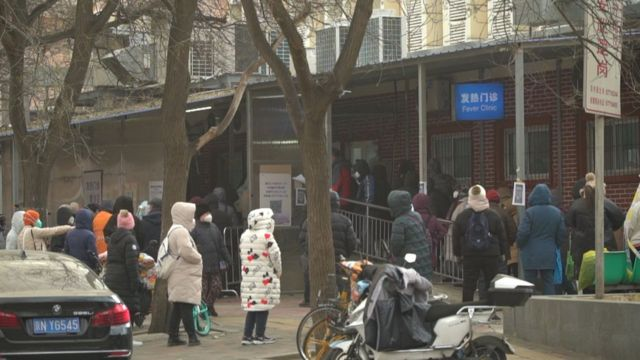
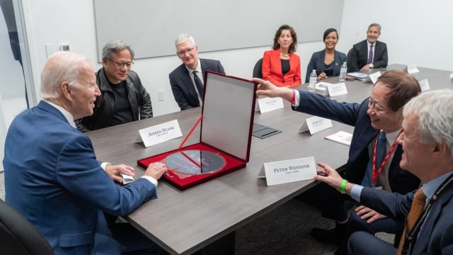
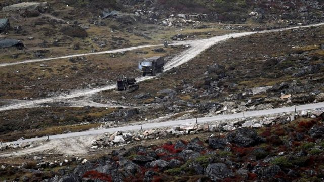
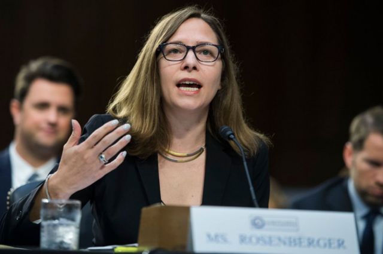

# [World] 台积电美国工厂、中国疫情、中印边境冲突等本周重要故事

#  台积电美国工厂、中国疫情、中印边境冲突等本周重要故事

> 图像加注文字，周一，一家医院发热门诊部外排起了队。

**12月第二周，台积电在美国的工厂揭开面纱。在中国，新冠防疫政策迅速扭转之后，医院在承受相当大的压力。美国代表团访问中国，公众关注中美关系能否解冻。**

另外，中印边境再起冲突。这是自2020年6月以来两国军队第一次发生此类冲突。

刚刚过去的一周，BBC中文有以下新闻内容受到读者的关注。如果你错过了它们，BBC中文带你一一回顾。

1\. 台积电美国工厂揭开面纱 “逆全球化”之下的赢家是谁 

> 图像来源，  Joe Biden Facebook
>
> 图像加注文字，台积电董事长刘德音（右二）赠送给拜登的礼物是一张晶圆。

总部位于台湾的晶圆代工公司台积电（TSMC），在美国亚利桑那州凤凰城的晶片厂扩大投资，上周美国总统拜登（Joe Biden）亲自出席厂房第二期正式“装机”典礼，与来自台湾的台积电公司宣布2024年会达到月产2万片5奈米晶片（chip， 芯片）产能。拜登当场宣布“美国制造业回归”。

这场聚焦拜登政府产业政策的大秀，出席的有美国商务部长雷孟多（Gina Raimondo）、台积电创办人张忠谋、董事长刘德音还有台积电美国大客户苹果执行长库克（Tim Cook）、超微（AMD）行长苏姿丰及荷商艾司摩尔（ASML）执行长温尼克（Peter Wennink）等，被称为“科技界奥运会”盛典。

这场科技界大事，同时也充满浓浓的政治意味。

2\. 新冠病毒感染病例激增，中国医疗系统受压 

在中国的新冠防疫政策发生迅速的180度大转向之后，这个国家的医院已经承受了如此大的压力，医护人员都可能将病毒传染给病人。

现在看来，由于人手短缺，前线医护工作者都被要求上岗，哪怕他们自己也感染了病毒。

3\. 印度军方：与中国军队在有争议的喜马拉雅地区发生冲突 

> 图像来源，  Getty Images
>
> 图像加注文字，印度军队说，最新的小规模冲突发生在阿鲁纳恰尔邦的达旺地区。

印度表示，在边境的一个争议地区印度军队与中国军队发生了冲突，这是自2020年6月以来两国军队第一次发生此类冲突。

2020年6月加勒万河谷冲突造成至少24名士兵死亡之后，中印两国一直在努力缓和紧张局势。

印度军方称，12月9日，两国军人在位于印度东北部的阿鲁纳恰尔邦（中国称藏南）的达旺地区发生冲突。

4\. 美国代表团访问中国为布林肯铺路 两国能否管控分歧 

> 图像来源，  Getty Images
>
> 图像加注文字，美国国家安全委员会中国事务高级主任罗森伯格（Laura Rosenberger）

自中美两国元首上月在巴厘岛提出稳定双边关系的期望后，高层官员开始进一步接触。

美国亚太事务助理国务卿康达（Daniel Kritenbrink）、美国国家安全委员会中国事务高级主任罗森伯格（Laura Rosenberger）等高官访问中国，中国外交部副部长谢锋在河北廊坊与他们举行会谈。

根据美国国务院的声明，他们的访问为布林肯明年年初的访华铺路。布林肯将是拜登政府执政两年后访华的美国最高级别的官员。

5\. 球王圆梦、法国卫冕与黑马神迹：2022世界杯的四种结局 

> 图像加注文字，莫德里奇、姆巴佩、梅西和布法尔。

2022世界杯进入最后的白热化阶段，残酷的淘汰赛令巴西与英格兰两大夺冠热门提前出局，葡萄牙八强赛落败亦意味着克里斯蒂亚诺·罗纳尔多（Cristiano Ronaldo，基斯坦奴·朗拿度）的世界杯冠军梦碎。

如今战至最后四强，阿根廷、克罗地亚、法国和摩洛哥是目前仍有机会在这个周末的卡塔尔捧起大力神杯的球队。

在此之前将进行半决赛，决出最后决赛的双方。

阿根廷对克罗地亚，法国对摩洛哥的半决赛是赛前很少人能够预见的对决，而无论结果如何，四个可能的结局将会是扣人心弦的经典故事。

6\. 曼城领馆抗议风波：中国召回六名驻英国外交官 

在中国驻曼彻斯特总领事馆外发生抗议者遭攻击事件两个月后，北京方面召回六名外交官，其中包括驻曼彻斯特总领事郑曦原。

英国曾要求这些外交官放弃外交豁免权，允许警方就 10 月发生的抗议者被殴打事件向他们提问。

英国外交大臣詹姆斯·克莱弗利 (JamesCleverly) 对这6人中没有一人将面临司法程序表示失望。

