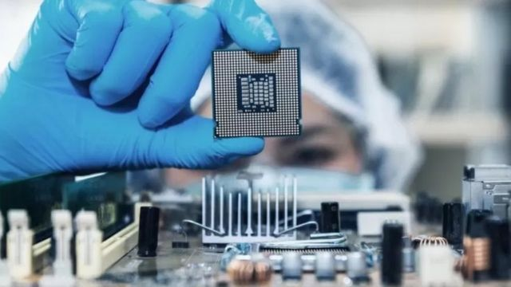
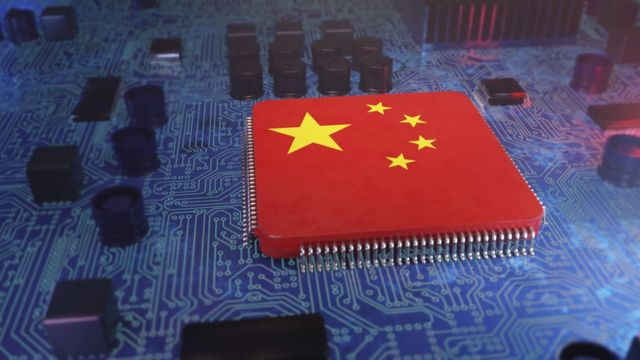
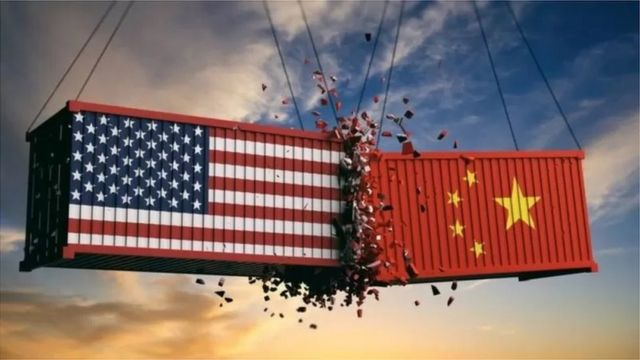
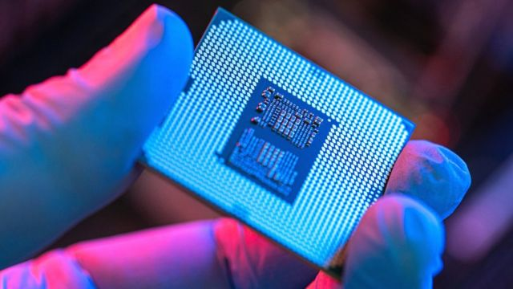
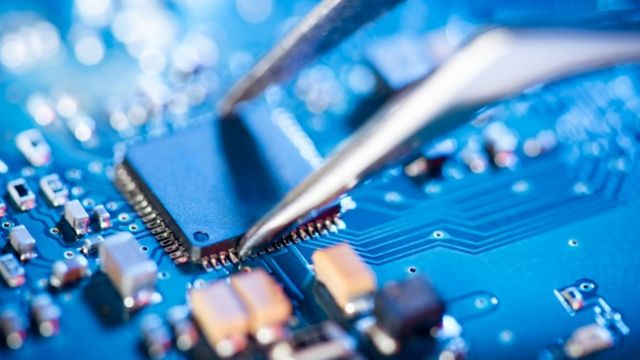

# [World] 美中芯片战：技术争端如何上演

#  美中芯片战：技术争端如何上演

  * 苏兰贾娜·蒂瓦里（Suranjana Tewari）& 乔纳森·约瑟夫斯（Jonathan Josephs） 
  * BBC新闻 

> 图像来源，  Getty Images

**美国正迅速加大努力，试图阻碍中国在半导体行业的进步——不管是智能手机还是战争武器，半导体都至关重要。**

去年10月，华盛顿宣布了一些迄今范围最广的出口管制措施——对于那些使用美国工具或软件向中国出口芯片的公司，无论芯片在哪里制造，都必须获得许可证。

华府的措施还包括，阻止美国公民和绿卡持有者为某些中国芯片公司工作。绿卡持有者是指有权在美国工作的永久居民。

这些措施切断了向中国输送美国人才的关键渠道，将影响高端半导体的发展。

##  美国为什么要这么做？

> 图像来源，  GETTY IMAGES
>
> 图像加注文字，美国正迅速加大努力，试图阻碍中国在半导体行业的进步。

先进的芯片被用于超级计算机、人工智能和军事硬件。

美国表示，中国对该技术的使用对其国家安全构成威胁。

美国商务部副部长艾伦·埃斯特维兹（Alan Estevez）宣布了这一规定。他表示，目的是确保美国正在尽一切努力防止“具有军事用途的敏感技术”被中国获取。

他说：“导致威胁的环境一直在变化，我们今天正在更新政策，以应对这些挑战。”

与此同时，中国称这些管制为“技术恐怖主义”。

亚洲芯片生产国，如台湾、新加坡和韩国等，对这场恶战将如何影响全球供应链表示担忧。

过去一周，在芯片方面的冲突有三个重要进展。

##  更多中国企业被列入“实体名单”

> 图像来源，  Getty Images

拜登政府又将36家中国企业列入华府的“实体名单”，其中包括大型芯片制造商YMTC。

这意味着，美国公司向它们出售某些技术时需要得到政府许可，而这种许可很难获得。

美国的限制措施影响广泛。上周，总部位于英国的电脑芯片设计公司安谋控股（Arm）证实，由于美国和英国的控制，该公司没有向包括科技巨头阿里巴巴在内的中国公司出售其最先进的设计。

安谋控股表示，该公司“致力于遵守其业务所在司法管辖区的所有适用出口法律法规。”

##  中国向WTO投诉

> 图像来源，  Getty Images

中国已就美国对半导体和其他相关技术的出口管制向世界贸易组织提起诉讼。

这是自拜登总统2021年1月上任以来，北京对美国提起的第一起WTO诉讼。

在提交给WTO的文件中，中国指控美国滥用出口管制，以维持“其在科学、技术、工程和制造业领域的领导地位”。

它还说，美国的行动威胁到“全球工业供应链的稳定”。

美国回应称，WTO不是解决国家安全问题的“合适平台”。

美国商务部负责出口管理的助理部长西娅·肯德勒（Thea Kendler）说：“美国的国家安全利益要求我们采取果断行动，拒绝（相关国家）获得先进技术。”

诉状明确指出，美国对大约2800种中国商品的出口实施了限制，但其中只有1800种是国际贸易规则允许的。

美国有60天的时间试图解决这个问题。如果没有，中国将可以请求一个专家组来审查此案。

本月早些时候，世贸组织裁定，美国在前总统特朗普领导下对钢铁和铝征收的关税违反了全球贸易规则。

在中国出口到美国的商品中，有三分之二要缴纳关税。

美国表示“强烈反对”这一裁决，无意取消这些措施。

##  与日本和荷兰的会谈

> 图像来源，  Getty Images

日本和荷兰可能会对中国实施出口管制，限制日本和荷兰企业向中国市场销售先进产品的能力。

周一，白宫国家安全顾问杰克·沙利文（Jake Sullivan）表示，美国与两家主要芯片制造设备供应商讨论了对中国采取类似管控措施的问题。

沙利文对记者表示：“我不会抢在任何宣布之前。”“我只想说，我们对讨论的坦诚、内容和强度感到非常满意。”

美国的管制不仅针对芯片制造商。还会影响芯片制造设备的制造商。

日本或荷兰的大公司可能会失去一个利润丰厚的大型高端机器买家。

荷兰芯片设备制造商阿斯麦（ASML Holding NV，又译艾司摩尔）的首席执行长温宁克（Peter Wennink）质疑荷兰是否应该限制对中国的出口。

温宁克表示，为了应对美国的压力，荷兰政府自2019年以来已经停止阿斯麦向中国出售其最先进的光刻机。

他对荷兰媒体表示：“也许（美国认为）我们应该坐下来谈判，但阿斯麦已经做出了牺牲。”

##  未来会怎样

> 图像来源，  Getty Images

芯片制造商也面临着制造更先进芯片以支持新产品的压力。

例如，苹果的新款笔记本电脑将采用行业领头羊台积电的3纳米芯片。一根人类头发大约有5万到10万纳米长。

分析师们表示，美国的管制措施可能使中国进一步落后于其他芯片生产国；北京方面已公开表示，希望优先发展半导体制造，并成为该领域的超级大国。

尽管最新的措施不像去年10月宣布的那样全面，但美国在半导体产业上面已明显孤立了中国。

