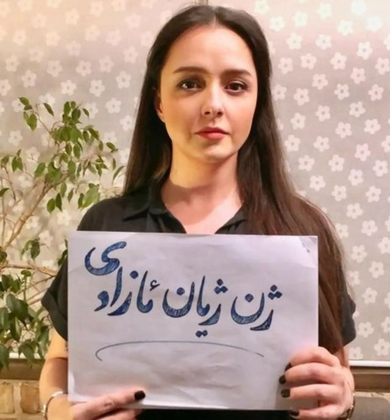
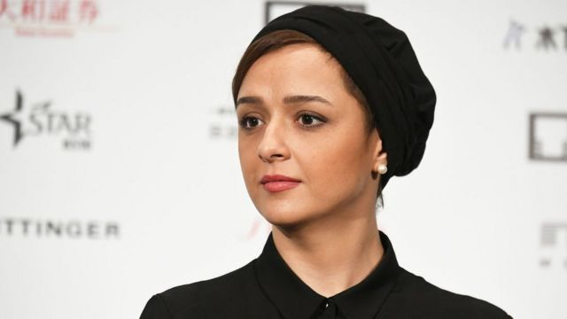

# [World] 伊朗知名演员塔兰涅·阿里多斯蒂因支持抗议活动被捕

#  伊朗知名演员塔兰涅·阿里多斯蒂因支持抗议活动被捕

> 图像来源，  Taraneh Alidoosti
>
> 图像加注文字，塔兰涅·阿里多斯蒂（Taraneh Alidoosti）

**伊朗当局逮捕了此前声援反政府示威者的该国知名的女演员塔兰涅·阿里多斯蒂（Taraneh Alidoosti）。**

阿里多斯蒂因在第89届奥斯卡金像奖最佳外语片《推销员》中的角色而享誉国际。

官方媒体称，她因对席卷该国的抗议运动“散布假消息”而被拘留。

在上周的 Instagram 帖子中，她谴责当局处决了一名因参与抗议活动的男子。

在帖文中，她还指责一些国际组织没有公开发声，反对处决莫森.谢卡里（Mohsen Shekari）。

当局指控谢卡里是一名“暴徒”，后将其处以绞刑。他于 9 月在德黑兰了一条主要道路上设障，并用砍刀打伤了一名军警。

“他的名字叫穆赫森.谢卡里。每个国际组织都在看着这场流血事件而不采取行动，这是人类的耻辱，”阿里多斯蒂写道。

根据国家通讯社 IRNA 在社交媒体电报（Telegram）账号上的一篇帖文，她因未能提供"与她的指称相符的任何文件“而遭被捕。

阿里多斯蒂拥有超过 800 万粉丝的 Instagram 帐户也于近期被关闭。

> 图像来源，  Getty Images
>
> 图像加注文字，塔兰涅·阿里多斯蒂（Taraneh Alidoosti）

这位 38 岁的女演员是伊朗最成功的女演员之一。她主演的《推销员》获得了 2016 年奥斯卡最佳外语片奖。

自从抗议运动爆发以来，她经常发声， 对伊朗政府试图镇压全国骚乱提出批评。

这场骚乱是由一名在警察拘留期间死亡的年轻女性 阿米尼（Mahsa Amini）引发的。于 9 月引发的。

上个 月，阿里多斯蒂在 Instagram 上发布了一张自己没有戴头巾的照片，以表示声援示威者，从而引起了人们的注意。

抗议运动已成为伊朗政权自1979年革命以来面临最严峻的一个挑战之。 当局已经处决了两名被判犯有“moharebeh”罪的男子——大致意思是“与上帝为敌”。

根据伊朗法律，这种罪行被定义为通过使用武器威胁生命或财产“造成公共不安全”。

