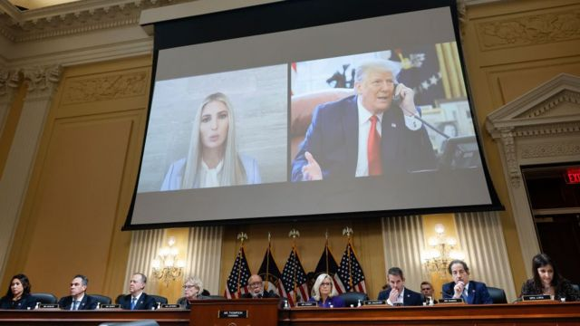
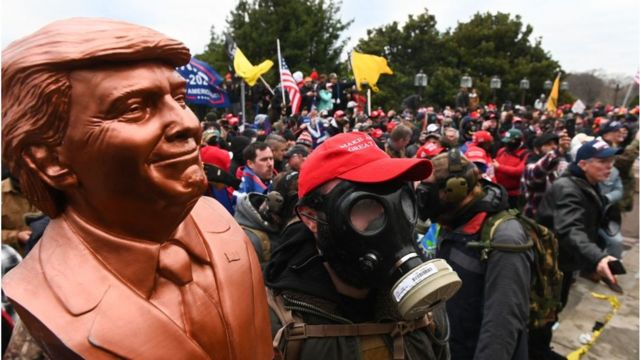
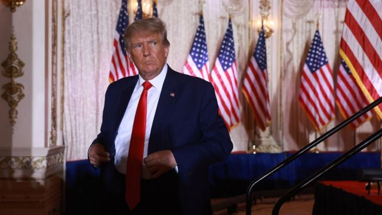

# [World] 美国国会骚乱：调查委员会公布结果，要求以四项罪名刑事起诉特朗普

#  美国国会骚乱：调查委员会公布结果，要求以四项罪名刑事起诉特朗普

  * 麦克斯·马查（Max Matza） 
  * BBC记者 

> 图像来源，  Getty Images

**美国国会就去年国会骚乱事件进行的一项调查指，前总统特朗普（Donald Trump）应该受到刑事起诉，包括煽动罪。**

这个民主党领导的委员会投票一致通过，要求美国司法部对特朗普作出检控。

该委员会还公布一段视频，显示特朗普前助手霍普·希克斯（Hope Hicks）曾警告特朗普考虑他的身后名。

特朗普支持者在2021年1月6日冲击美国国会大厦，扰乱拜登（Joe Biden）的总统当选认证程序。

特朗普否认自己有不当行为，并发表一份声明，抨击这个委员会是一个“袋鼠法庭”（kangaroo court，指认不公平法庭裁决）。

在对骚乱事件进行了约18个月的调查后，美国众议院挑选的委员会在周一（12月19日）的最后一次会议中建议对特朗普作出四项起诉：

  * 煽动、协助、支持或鼓励暴乱 
  * 妨碍官方程序 
  * 用阴谋欺骗美国 
  * 阴谋作出虚假陈述 

美国司法部并不需要跟从国会委员会的建议，不过检控官已经在考虑是否对特朗普作出起诉。

虽然该委员会的行动大致上只是象征性，但是委员会主席形容，起诉的建议是一份“走向公义的蓝图”。

司法部发言人周一拒绝就该建议置评。

参与该委员会工作的马里兰州民主党国会议员杰米·拉斯金（Jamie Raskin）表示：“暴乱是对美国国家威信的一种叛变。”

“这是严重违反联邦法的行为，而宪法本身对此已有注脚。”

委员会中的七名民主党及两名共和党人在周一公布了他们初定的161页执行摘要。当中指控特朗普在国会骚乱前夕和期间实施一个“多层面的阴谋”来阻挠选民的意志。

众议院委员会指，特朗普散播他自知不实的说法，称2020年总统选举胜利被窃取，之后又向政府官员、司法部以及他自己的副总统施压，以帮助颠覆选举结果。委员会指控他煽动国会骚乱，作为阻止向拜登和平移交权力的最后尝试。

长达数百页的完整报告预计将于周三（12月21日）公布。

周一，委员会也公布了他们证据库中的一段视频，当中显示特朗普长时间的助手希克斯表示，她曾警告过特朗普，若继续就选举发表虚假言论，他和他的团队都是在“损害他的身后名”。

她表示，特朗普当时对她的担忧不置可否。

她在作供中称，特朗普总统“说的话大致上相当于‘如果我输了就没有人在意我的身后名，所以这无所谓’”，特朗普当时还表示“唯一重要的是赢”。

> 图像来源，  Getty Images
>
> 图像加注文字，特朗普和女儿伊万卡远程出席国会委员会的听证会

委员会还批评前总统的大女儿、前白宫非正式顾问伊万卡·特朗普（Ivanka Trump）没有“配合”调查人员。

报告指，伊万卡与白宫新闻秘书麦凯尼（Kayleigh McEnany）“显示出对一些问题的记忆不尽不实”，或者记得的也不如特朗普其他亲信那样“坦诚直接”。

特朗普上月再度启动总统选战，他的阵营发表声明指控委员会是由“‘Never Trump（永不要特朗普）’的党派人士”进行“表演式的审讯”，并指他们是“这个国家历史中的污点”。

“这个袋鼠法庭不过是一个侮辱美国人智商和讽刺我们民主制度的形象工程。”

> 图像来源，  Getty Images
>
> 图像加注文字，美国国会骚乱当日的人群举着特朗普的塑像。

该委员会还表示会向众议院道德委员会提及四名共和党成员，包括共和党党魁凯文·麦克锡（Kevin McCarthy），指他们未配合委员会调查。

“如果我们国家的法治和民主要幸存，就不能再发生这种事，”委员会主席、密西西比州民主党人本尼·汤普森（Bennie Thompson）说。

“一旦信念被破坏，我们的民主制度也一样。特朗普破坏了这个信念。”他说。

目前已经有超过900人收到了和国会骚乱的相关起诉。

##  迎接特朗普的将是什么？

> 图像来源，  Getty Images
>
> 图像加注文字，特朗普较早前在海湖庄园宣布，他会再次参选总统。

关于2021年的国会骚乱事件，这个国会委员会公布的报告概要当中称：“若不是有特朗普，那个1月6日中的所有事件都不会发生。”

BBC驻北美记者安东尼·泽克尔（Anthony Zurcher）分析指，这次建议起诉特朗普的投票令这场持续18个月的调查产生了一个混乱的结尾，但是相关的建议更多是政治性而不是法律性的。

假如特朗普被以委员会提出的罪名起诉并定罪，他可能面临数十万美元罚款以及最长20年的监禁，且不被允许再参加未来的总统选举，但到目前为止，委员会的投票大致上仍是象征性的。

国会没有任何权力以相关的联邦法律起诉特朗普——这个权力只属于美国司法部。委员会现在相当于提出所有依据，从而建议司法部采取行动，但是司法部如何处理这些依据，则完全不由委员会控制。

与此同时，司法部似乎本身已经在考虑起诉特朗普——由联邦检察官召开的陪审团已经向数十名特朗普政府官员发出传票，要求收集政府文件，而同样的文件已经被国会委员会复核过。

而国会骚乱也不是特朗普可能面对的唯一一宗法律调查。美国司法部长特别顾问杰克·史密斯（Jack Smith）也在调查特朗普离任后对海湖庄园（Mar-a- Lago）文件的处理手法，佐治亚州地区检察官在调查特朗普与该州官员的联系是否违反州法律；此外还有一系列民事案件。

特朗普一直试图将所有针对他的刑事和民事调查描绘成政治迫害，而国会委员会也没有做太多来反驳他的说法。只不过，委员会的这番建议会让媒体持续数天发布关于特朗普的负面新闻标题，并不断令美国民众回想起去年国会骚乱中的混乱场面。

这些都显示，试图重整旗鼓参加2024年总统选举的特朗普将会面临越来越大的政治阻力。

