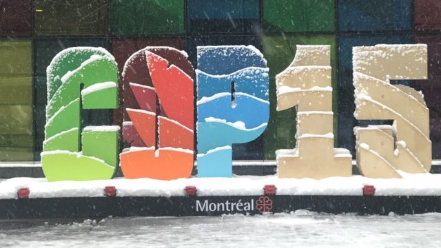
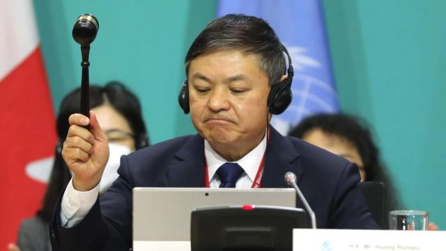
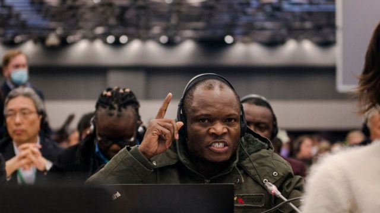

# [World] COP15：联合国生物多样性大会达成“历史性”协议

#  COP15：联合国生物多样性大会达成“历史性”协议

> 图像来源，  BBC/H Briggs
>
> 图像加注文字，联合国生物多样性大会COP15达成"历史性的"框架协议

**在加拿大蒙特利尔举行的COP15联合国生物多样性大会上达成的“历史性的”协议。它有何内容？中国作为主席国有没有完成任务？**

世界各国已同意到2030年保护地球的大约1/3的陆地和水域，这是一项旨在保护生物多样性的协议。

生物多样性是指地球上所有的生物以及它们在维持地球的复杂生命网络中的连接方式。

科学家警告说，随着森林和草原以前所未有的速度消失，海洋受到污染的压力，人类正在将地球推向安全极限之外。

这包括增加SARs CoV-2（引起新冠疾病的病毒）、埃博拉（伊波拉）和艾滋病毒（爱滋病毒） 等疾病从野生动物蔓延到人群的风险。

蒙特利尔峰会被视为让大自然走上复苏之路的“最后机会”。在整个会谈过程中，各国对应该如何制定具有雄心壮志的计划，以及如何为计划提供资金存在较大分歧。

一个很大的症结是如何资助全球拥有世界上最杰出生物多样性的地区的保护工作。

中国作为这次会议的主席国，也是首次主导有关环境问题的联合国重大政府间谈判，协调了绝大多数国家的利益和立场，最终推动协议通过。

##  协议内容

这份协议名为昆明-蒙特利尔全球生物多样性框架，为直到2030年乃至更长一段时间未来的全球生物多样性治理提出了规划。

这个框架的目标被简称为“30 x 30”，旨在为未来10年的行动制定规范：在2030年前，保护全球30%的陆地和水域。

_框架的要点包括：_

  * 维护、加强和恢复生态系统，包括制止物种灭绝和维护遗传多样性； 
  * 生物多样性的“可持续利用”——基本上确保物种和生境能够为人类提供服务，如食物和清洁水； 
  * 确保公平和平等地分享来自自然的资源，如来自植物的药物的惠益，并确保土著人民的权利得到保护； 
  * 为生物多样性提供资金并投入资源：确保资金和保护工作到达需要的地方。 

##  中国的主席国作用

由于中国此前实行极度严厉的新冠疫情防控措施，《生物多样性公约》秘书处于2022年6月宣布，COP15的主要部分将于2022年12月转往加拿大蒙特利尔举行，但中国仍是这次会议的正式主席国。

> 图像来源，  IISD Mike Muzurakis
>
> 图像加注文字，中国生态环境部部长黄润秋主持了COP15大会，并且在协调各国立场方面做了大量工作。

中国生态环境部部长黄润秋主持了COP15大会，参与协调各国立场。

COP15大会的一个关键的症结是金融资金问题，与在埃及举行的气候峰会COP27相呼应，一些国家一直在呼吁建立一个新的基金来帮助保护生物多样性，但这被其他国家拒绝。

经过激烈紧张的谈判，尽管刚果民主共和国代表（也是为资金争议）拒绝支持大会官方达成的框架，但会议主席黄润秋仍一锤定音，在敲定最终协议时敲下木槌。

刚果民主共和国政府提出抗议，称最终协议是非法的，违反了谈判达成共识的规则，但联合国驳回了这一投诉。

绿色和平组织中国全球政策顾问李硕表示，中国对谈判给予了相当大的重视，并弥合了富国和穷国之间的鸿沟。

他表示，这是一项推动全球进步具有里程碑意义的协议，应该推动中国在倡导保护自然生态方面发挥更大的国际作用。

##  各方反应

国际组织，各国政府及媒体对上述框架协议的达成基本持肯定赞扬态度，大多数评论将此协议称为具有历史意义。

联合国环境规划署执行主任安诺生（Inger Andersen）说，该框架及其相关的一揽子目标、具体目标和融资目标，只是重新调整人类与自然界关系的第一步。

加拿大环境部长史蒂文·吉尔博特说，达成框架确实是一个标志着历史的时刻，堪比巴黎气候协议。

> 图像来源，  Andrej Ivanov/AFP
>
> 图像加注文字，刚果民主共和国代表称缺乏资金而不支持最后框架协议，但反对无效。

欧盟环境，海洋和渔业专员维京尼乌斯·辛克维奇乌斯表示，大自然是承载人类生存之舟，它既可载舟，亦可覆舟。

英国皇家鸟类保护协会高级国际政策顾问乔治娜·钱德勒表示，由于在蒙特利尔达成的框架协议，人类和自然都应该变得更好。

总部在纽约的野生动物保护协会（Wildlife Conservation Society）的苏·利伯曼认为，该框架是一种妥协，尽管它有几个好的、艰苦努力才争取到的元素，但它本可以在改变人类与自然的关系，阻止对生态系统、栖息地和物种的破坏方面更进一步。

