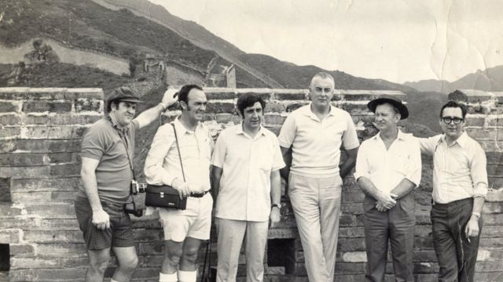
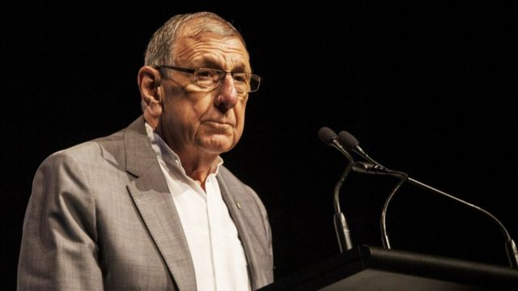
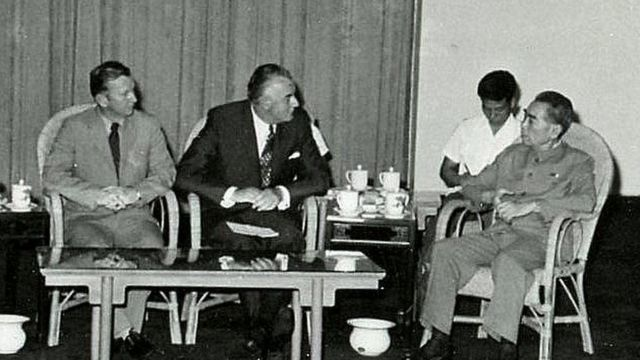
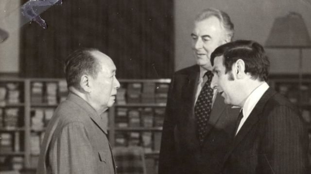

# [World] 中澳建交50年：澳大利亚首任驻华大使回忆半世纪前两国建立邦交内幕

#  中澳建交50年：澳大利亚首任驻华大使回忆半世纪前两国建立邦交内幕

  * 蒂凡尼·汤布尔（Tiffanie Turnbull） 
  * BBC记者，发自悉尼 

> 图像来源，  Stephen Fitzgerald
>
> 图像加注文字，1971年，惠特拉姆（左四）率领澳大利亚代表团访华（图为惠特拉姆与代表团成员在万里长城）。

**1971年，一位年轻的澳大利亚学者在首都堪培拉的一家酒馆里喝酒时突然接到了一个改变他人生的电话。**

“当时酒吧里的人喊道：这里有一个叫斯蒂芬·菲茨杰拉德（Stephen Fitz Gerald）的人吗？”

电话那头是当时澳洲政坛最有权势的政治家之一，也是后来的总理高夫·惠特拉姆（Gough Whitlam）。时任反对党工党党魁的惠特拉姆在电话中问这位中国研究专家，是否愿意和他一起前往中国执行历史性访华的外交任务。

“我说是的！我当然乐意！”菲茨杰拉德告诉BBC。

“然后，惠特拉姆用他那高超的智慧问我说：那您介意乘坐经济舱吗？”

那个时刻有助为澳大利亚与中国建立外交关系奠定基础。在50年前，也就是1972年12月21日，这个目标完成了。

##  严重分歧

> 图像来源，  The Whitlam Institute
>
> 图像加注文字，菲茨杰拉德博士研究中国数十年。

但是，对惠特拉姆先生来说，这次旅行是一次冒险的政治行动。

1971年，中国共产党在冷战中强势登上世界舞台，寻求改善对外关系并在联合国占有一席之地。

但它面临来自美国等主要参与者的阻碍，美国拒绝承认中共是中国的合法政权。

澳洲当时亦是如此。菲茨杰拉德说，当时中国在澳洲仍然是一个存有“严重分歧”的问题。

澳大利亚当年只有3%的人口是在澳洲或欧洲以外的地方出生。许多澳洲人对外来文化持怀疑态度。而共产主义的“红色威胁”也令人担忧。这种恐惧交织在中国身上。

菲茨杰拉德解释，对许多澳洲人来说，当时在澳洲保守党政府谈到“中国的下行推力”所带来的威胁时，许多人对此产生了共鸣。这很容易“让人联想到澳大利亚被中国人接管的想法，不仅仅是中国人，而是共产主义的中国人”。

“这是一个强有力的信息……尽管它根本不可能发生。”

另一方面，惠特拉姆是长期倡导澳洲与中国建立关系的政治人物。菲茨杰拉德表示，这并不是因为在意识形态上我们要对中国共产党有同理心。“你不需要喜欢他们......但你怎么能不与这么大的国家的政府建立外交关系？”

但是，即使在惠特拉姆领导的工党内部，许多人也将任何走向中国的步骤都视为国内的“政治死亡”。

菲茨杰拉德说：“所以在处理这问题需要有许多方面的勇气。”

##  偶然的大使

如果说，惠特拉姆与中国接触似乎是不可避免的结果，那么菲茨杰拉德与中国的缘分却带有意外色彩。

一开始，菲茨杰拉德并没有选择研究中国。但这一切都从他作为外交事务学员的第一天被分配到中文班学习的那一刻开始，一切就像滚雪球一样开启了他的中国之门。当惠特拉姆来找他的时候，菲茨杰拉德已经去了学术界。

对菲茨杰拉德来说，如果邀请访华是一个惊喜，那么这趟旅行本身就更让人感觉超现实了。

菲茨杰拉德表示：“在那些日子里，你必须‘走进’中国，因为没有航班”。“我们不得不去香港，坐火车到边境，携带行李过关，通过中国一侧的移民和海关，然后搭上另一辆火车。”

澳洲代表团在两周内参观了中国当时的企业、工厂、学校和风景名胜。菲茨杰拉德回忆说，他不断向“困惑的”中国官员解释什么是澳洲人的幽默感。

##  与周恩来会面

> 图像来源，  Stephen Fitzgerald
>
> 图像加注文字，惠特拉姆（左二）与周恩来（右）会晤的资料照片。

当然，代表团的真正目标是会见当时的中国总理周恩来。

“我们一直不清楚这是否会真的发生。直到有天深夜，中国官员来到我们下榻的酒店，开始把人们送上汽车。”

菲茨杰拉德补充说：“我们开车穿过空荡荡的北京街道，来到人民大会堂，走上楼梯，穿过昏暗的走廊，进入一个房间，周恩来就站在那里。”

当期待已久的会议开始时，周恩来请记者们留在房间里，这让代表团感到惊讶。

而这次会议改变了澳大利亚对中国的感情。

“中国人曾被妖魔化为红魔和黄祸的混合体 ，几乎就像他们头上有角一样。而一个最成熟、最文明、最礼貌、最富于外交风采、最迷人的中国人就在我们面前。”

“当我看到惠特拉姆和周恩来之间的那次会谈时，我得出一个结论，我们与中国的关系将永远改变。”

“在那个阶段，我们与中国外交关系之间的所有障碍就是1972年12月的大选。”

> 图像来源，  Stephen Fitzgerald
>
> 图像加注文字，1973年，毛泽东会晤了惠特拉姆和菲茨杰拉德。

惠特拉姆后来确实赢得了大选，当上总理，终结了23年的保守派执政。在几周内，1972年12月21日，他的政府承认了中华人民共和国，两国建立了邦交关系。

不久之后，菲茨杰拉德被派任到北京，担任澳洲驻中华人民共和国的第一位大使。当时，他只有34岁，是澳大利亚有史以来最年轻的大使。

“当然，这是令人生畏的一件事。它不可能不令人敬畏，”他说。“但我认为这种感觉真的被兴奋所淹没！”

菲茨杰拉德告诉记者，当时惠特拉姆总理期望澳大利亚与中国建立一个可与其他大国建立的关系相媲美的关系。

但 50年过去了，今天，现实情况却大大不同了。

##  今天的课题

> 图像来源，  EPA
>
> 图像加注文字，黄英贤在抵达北京后说对话是处理问题的先决条件。

两个国家曾经从彼此的贸易中获益匪浅，但双边关系最近跌至历史低点。由于贸易、人权和“外国势力干涉”等争端，两国高层接触中断了两年。

但就在11月，今年5月份新上任的工党总理安东尼·阿尔巴尼斯（Anthony Albanese，又译艾巴尼斯）成为自2016年以来第一位与中国国家主席习近平进行面对面会谈的澳洲总理。

阿尔巴尼斯当时表示，这次会面是一次“热情”和“非常有建设性”的谈话，但在澳洲认为的关键问题上没有任何进展。许多专家并不乐观地预测两国关系很快就有显著改善。

澳大利亚智库洛伊研究所（Lowy Institute）研究员徐元敬（Jennifer Hsu）向BBC分析称两国冲突点太多了。 她解释，其中许多矛盾在于“根本的”差异，例如政府制度或价值观：“这些问题不是一次会议，甚至几次会议就能迎刃而解。”

另一场相似会议在周三（12月21日）举行。澳大利亚外交部长黄英贤（Penny Wong）在北京会见中国外长王毅。 这亦是三年多来澳大利亚部长首次访问中国首都。

菲茨杰拉德同意，今天的中国政府似乎更加“独断专行” （dictatorially minded）及强势（assertive），但50年前发生的事情仍对现在有所启发：“当时的澳洲政府认识到，无论发生什么事，你仍然需要与那个政府维持联系。”

“这并不意味着一切的往来都是甜蜜或轻松的，但是意味着双方仍在互相对话，”他告诉BBC。

