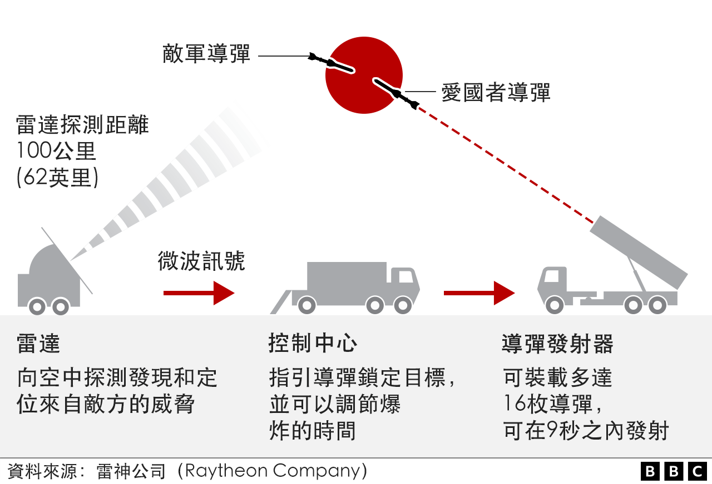
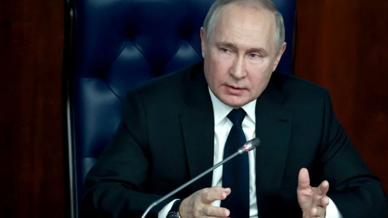

# [World] 乌克兰战争：泽连斯基到访白宫，美国承诺450亿援助

#  乌克兰战争：泽连斯基到访白宫，美国承诺450亿援助

**乌克兰总统泽连斯基（Volodymyr Zelensky）到访美国，在白宫会见了总统拜登，并在美国国会进行了演讲。**

泽连斯基要求美国向乌克兰支援更多武器，同时誓言乌克兰“永远不会投降”。

“要令俄罗斯军队完全撤离，需要更多的炮弹，”乌克兰总统说。

这是自俄罗斯于10个月前入侵乌克兰以来，泽连斯基的首次外访。他表示，乌克兰“面对一切困难……至今仍屹立不倒”，他们“永远不会投降”。

美国已宣布将向乌克兰提供更多支持，包括一个爱国者导弹系统。总统拜登表示，不会让乌克兰独自奋战。

另一方面，俄罗斯总统普京则称，乌克兰的战事不应归咎于俄罗斯，同时指责一些“第三方国家”的政策造成了两个国家的“共同悲剧”。

##  拜登：“你不会孤身一人”

在会面时，拜登向泽连斯基表示，面对俄罗斯的入侵，美国将会“尽可能长时间”地坚持与乌克兰并肩。

“你永远不会孤身一人，”拜登在白宫会见泽连斯基的时候向他表示。

拜登确认将向乌克兰提供新一波超过20亿美元（17亿英镑）援助，并承诺之后会再拨450亿。

泽连斯基对华盛顿的支持表示感谢。

“今年乌克兰人民遭受了如此多不必要的痛苦和损失，”拜登在周三（12月21日）的联合记者会上表示，“但是我想要你知道，泽连斯基总统，这一路上的每一步，美国人民都和你在一起。而我们会一起和你并肩。”

拜登还向媒体表示，他对于保持国际联盟的团结“完全不担心”。

外界担忧一些盟友可能对于俄乌冲突的代价及其扰乱全球粮食和能源供应所带来的影响感到担心，但美国总统表示，他感觉“非常好”，相信可以团结一致支持乌克兰。

拜登称，俄罗斯总统普京“没有意图停止这场残酷的战争”。

作为乌克兰最重要的盟友，美国已经承诺了500亿美元（410亿英镑）的人道、财政及安保援助——远超过其他国家。

泽连斯基表示，希望美国国会能够通过给予乌克兰的450亿美元额外援助，以“帮助我们捍卫我们的价值和独立”。

BBC驻北美记者安东尼·泽克尔（Anthony Zurcher）报道指，尽管拜登支持乌克兰的言辞有力，但现实比他所说的更复杂——美国的盟友正面临着一个能源价格高企的漫长冬天和随着之而来的经济压力；而且，美国公众对于持续援助乌克兰的支持率已经有所下跌：最近一项民调显示，有三分之一受访者不支持美国继续援助乌克兰，有一半则认为乌克兰应该尽快达成停战协议。

在1月将会取得众议院控制权的共和党人则警告，他们不会为乌克兰开具“空白支票”。

而泽连斯基表示，无论美国国会如何变化，他都相信民主共和两党将会支持他的国家。

泽连斯基是乘坐美国空军飞机从波兰城市热舒夫出发抵达华盛顿。在白宫与美国总统会面之后，他向美国国会联席会议发表了演讲。他身着标志性的军绿色上衣和军靴，演讲过程中得到多达10次的起立鼓掌。

他表示，自己的国家“面对一切困难”仍然屹立不倒，并预言明年俄乌战争将迎来“一个转折点”。

他誓言乌克兰将永远不会投降，但同时表示他的国家需要更多武器。

“我们有火炮，是的，谢谢你们，”他向现场与会者说，“这足够吗？老实说，并不够。”

“要令俄罗斯军队完全撤走，需要更多的大炮和弹药，”他说。

在演讲结尾，泽连斯基向国会展示了一面由乌克兰东部前线城市巴赫穆特（Bakhmut）守军签名的战旗。他在到访华盛顿之前探访了当地。

华盛顿在周三宣布的安全援助项目包括一个新的爱国者导弹系统，预计将会帮助乌克兰保护其城市的关键设施免受俄军导弹和无人机攻击。

周三的记者会上，曾是喜剧演员的泽连斯基在回答记者提问时出现了一个少有的轻松场面。

这位乌克兰总统表示：“爱国者系统安装之后会发生什么？之后我们就会向拜登总统发信号，说我们想要更多爱国者。”

“我们在打仗，不好意思，我真的很抱歉，”在白宫东厅现场的人笑起来时，他用故作严肃的英文说道。

拜登也轻轻笑起来说：“我们在准备了。”

##  俄罗斯的反应

俄罗斯外交部表示，将这个地对空导弹系统送给乌克兰，将会被看作是一个挑衅的举动。

周三较早前，普京曾表示，他认为乌克兰的战争不应该被归咎于俄罗斯，俄乌两国是在经历着一个“共同悲剧”。

普京在国营电视台播放的讲话中向俄军高官表示，他仍然视乌克兰为“兄弟般的国家”，而俄乌冲突是“第三方国家政策造成的结果”。

> 图像来源，  Reuters
>
> 图像加注文字，普京指，俄乌战争应归咎于“第三方国家的政策”

俄罗斯在今年2月24日入侵乌克兰。美国军方估计， 至少已有10万俄军士兵和10万乌克兰士兵死伤，另外还有约4万平民死亡。

普京一直暗示，乌克兰战争是西方国家试图将其在欧洲的势力东扩所造成的结果，但这一观点在俄罗斯以外一直未获承认。

他的这一看法似乎是源自1991年苏联解体之后，北约组织的不断扩大。普京在周三的讲话中还表示，西方一直在对苏联解体后独立的各国进行“洗脑”，而首当其冲的就是乌克兰。

“多年来，我们都试图与乌克兰建立好邻居的关系，提供贷款和低价能源，然而并没有用。”

据联合国记录，全欧洲各地，包括俄罗斯，已经有780万名乌克兰难民。但是，这个数字并不包括那些在乌克兰境内被迫离乡背井的人士。

