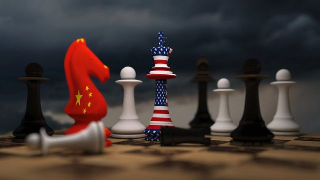
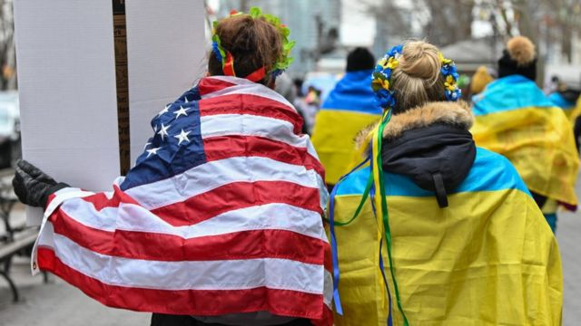
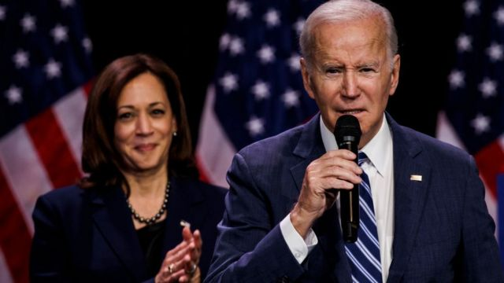
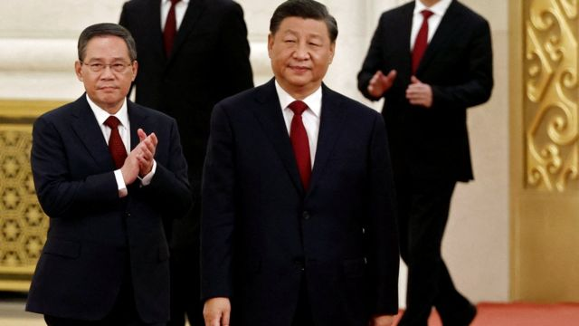
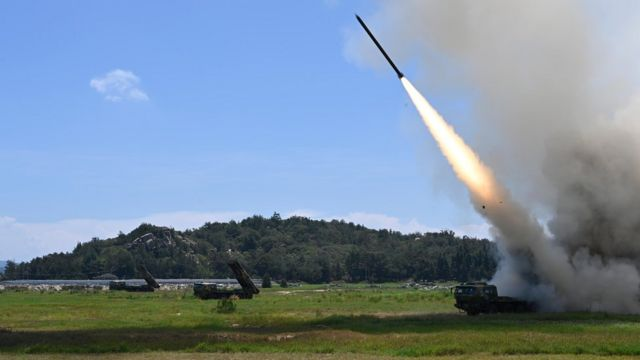

# [World] 中美关系年终回顾与展望：大国竞争将走向何方？

#  中美关系年终回顾与展望：大国竞争将走向何方？

  * 常思颖 
  * BBC中文 

> 图像来源，  Getty Images

**过去一年，美中关系的主轴是竞争与对抗。两个大国陷入一方行动、一方反制的漩涡，双边关系呈螺旋式下降。**

台湾问题是主要症结。双方都认为对方言行不一，持续的“口水战”与相互指责令互信丧失，一场热战如箭在弦上。

临近年底，关系恶化才开始降温。两件国内政治大事——中共二十大和美国中期选举——落幕后，两国关系似乎迎来一些转机。但综合分析认为，降温不代表缓和，未来一年并不乐观。

##  2022年主轴：激烈的竞争和对抗

过去一年里，美国两党对华强硬共识持续强化，国会的两党多数与拜登政府密切合作，在战略、科技、军事等方面逐渐形成以抗衡中国影响力为宗旨的政策框架。

与特朗普不同的是，拜登强调中国破坏国际秩序，他通过加强伙伴关系抗衡中国的影响力。

今年2月，美国公布了 最新的《印太战略》  ，打算从南亚到太平洋诸岛各个地区加强美国的领导地位。5月，拜登开启就任以来首次东亚之行，推出了由韩国、日本、印度、越南等13个政府共同参与 “印太经济框架”  （IPEF），旨在数字经济、供应链、绿色能源等方面加强成员国之间的联系。

拜登还通过强化共同的价值观来团结盟友。比如5月24日，美国与澳大利亚、印度和日本的领导人在东京 举行四方安全对话  （QUAD），强化在网络安全、医疗、基础设施和教育方面的关系。

今年2月，俄乌战争打响，将美国与西方国家的联盟推入空前高峰。

> 图像来源，  Getty Images
>
> 图像加注文字，纽约集会上，人们身披美国和乌克兰国旗

拜登政府与欧盟和北约一起建立了广泛的国际联盟，纷纷谴责普京总统的行为，并在多个领域对俄罗斯发起制裁。这无疑对中国形成强大压力，不得不走钢丝一样地在各个利益团体之间保持平衡。中国一方面避免谴责俄罗斯，一方面在经济上对俄罗斯提供支持——印证了中俄两国在北京东奥会后的共同宣言“合作无止境”。

科技方面，与中国的竞争此起彼伏。其中最受瞩目的是7月国会参众两院通过的针对芯片行业的高额补贴法案 《芯片与科技法案》  （CHIPS and Science Act 2022），将对高科技产业补贴 2800亿美元。这奠定了未来五年支持企业与中国竞争的主旋律。

10月，美国出台了更广泛的出口管制措施，限制中国企业获取高科技计算机芯片的能力，并阻碍中国在人工智能方面的进步。这被认为是20世纪90年代以来美国在向中国输出技术方面最大的政策转向。

“美国政府的所作所为，越来越多地是在应对中国在经济、安全、治理等方面构成的严峻挑战”，乔治·华盛顿大学（George Washington University）国际关系教授罗伯特·萨特（Robert Sutter）对BBC中文说，“这些挑战已经持续很长时间了，美国最近几年才做出抵抗”。

他所说的是美国政界近年来达成的“华盛顿共识”。此前美国认为通过接触（engage）中国，在经济上对中国打开大门，就能改变中国的政治体系。这种观点已经被抛弃。正如白宫国家安全顾问沙利文（Jacob Sullivan，苏利文）所说，美国不再寻求从根本上改变中国的制度，而是希望创造一种环境使两个大国在国际体系中运行。

在10月美国发布的 《国家安全战略》  中，中国被视为“唯一一个有意向重塑国际秩序的竞争者，并且越来越多地拥有经济、外交、军事和技术力量来实现这一目标。” 根据该战略，美国的目标是“战胜（out- compete）中国”。

> 图像来源，  Getty Images
>
> 图像加注文字，8月3日，台湾台北，美国众议院议长佩洛西（中）与台湾总统蔡英文（右）。

随着今年8月美国众议院议长佩洛西（Nancy Pelosi，裴洛西）到访台湾，美中关系的紧张达到顶峰。

中国在台湾周边发起了前所未有的军事演习，指派军机多次穿越“台海中线”，打破了多年来两岸只在两侧巡航的默契。中国还中断了与美国在气候变化、军事交流等关键领域的合作。观察者惊呼，一场战争犹在眉睫。

中美两国相互指责对方破坏台海和平与稳定。在3月和7月仅有的两次元首通话中，台湾问题依然是重点分歧。 习近平在7月强硬指出  ，“民意不可违，玩火必自焚”。

前美国亚太事务助理国务卿、亞洲政策協會研究所（Asia Society Policy Institute）副所长丹尼尔·罗素（Daniel Russel）近日在一个论坛上表示，两国陷入“安全困境”：“我们都把自己看到的问题归咎于对方，都坚持认为自己做的事情是完全合理的，是对方走错了路，需要改变方向的也是对方。”

“两国关系已经到了非常危险的阶段，充满了竞争、不信任和误解”，罗素说。

##  脆弱的转机

美中两国在临近年底时迎来缓解紧张关系的契机。不过，这一契机可能非常短暂。

在中国，习近平主席在中共20大中巩固了权力，进入第三任期，外交成为他接下来的一项重点。重头戏便是与拜登总统在印尼巴厘岛的会晤。

虽然美国一直对中国的集权体制表示反感，不断强化民主与集权的意识形态的差异，并指责中国在人权方面的恶劣记录，但在全球领导人、高层领袖以及媒体聚焦的场合，拜登总统与刚刚完成权力巩固的中国领导人会面并握手，一定程度上显示了对他的政权合法性的默认。

华盛顿智库史汀生中心（Stimson Center）中国项目主任孙韵在一档节目中说，习进入第三任期后要对自己大国领导人的形象进行再塑造，“没有比同美国总统见面是更好的宣示了”。

“同拜登的见面充分显示出习近平是跟拜登平起平坐的，是世界领袖，而且他们讨论的是中美关系对世界的影响这样的重大战略问题。”

在美国，中期选举尘埃落定。民主党保持参议院多数，共和党以微软优势占据众议院，与此同时，特朗普的支持者大多落选。这一结果令拜登政府在处理对华关系上可以较少地受到国内政治的牵制。

拜登在选后国家演说中自信地说道，“美国人通过投票再一次发声并且证明，民主就是我们的特性。”

美国巴克内尔大学（Bucknell University）国际关系教授朱志群此前对BBC中文说，在顺利完成两件国内大事之后，双方领导人都更加自信，有理由放软身段处理外交事务，加上两国都面临疫情后经济复苏的挑战，“当前合作是最佳时机”。

> 图像来源，  Getty Images
>
> 图像加注文字，美国总统拜登于11月10日在华盛顿特区发表讲话。民主党在中期选举中避免了“红色浪潮”。

中国已经开始接受与美国官员进行互动。12月11日，美国亚太事务助理国务卿康达（Daniel Kritenbrink）等高级别官员与中国副外长谢峰在河北廊坊会面，为明年年初美国国务卿 布林肯（Antony Blinken）访华做准备  。这是一年多来首次有美国代表团访问中国，双边均表示对话是“坦诚的”。

不仅对美国代表团表示欢迎，中国近日还接待了日本外相和澳大利亚外长，这两个国家均是美国的安全盟友。

萨特教授说，“中国政府正在尝试以更加开放的态度对待美国以及美国的许多西方盟友，中共的报道更少地强调斗争，在许多公开场合也放下了强硬立场。” 他认为中国做出了一定的让步，放下了对话的前提条件。

他并不清楚中国这样做的动机，但指出中国此前采取的强硬态度“得到了适得其反的效果，必须通过某种方式改变”。中国逐渐摒弃邓小平时代倡导的韬光养晦的路线，转向敢于斗争的“大国外交”。过去几年，一些中国外交官在多个场合表现出咄咄逼人的姿态，被西方国家称为“战狼外交”，损害了中国的对外形象。

萨特教授强调，目前中国的改变是“有限的，但很重要”。 “这并不意味着中国改变了立场，但表示他们准备好了要更加开放、更加灵活，我认为这是两国关系取得进展的好迹象，至少在处理紧张关系方面可能会有所进展。”

美国丹佛大学（University of Denver）国际关系学院教授赵穗生对BBC中文说，中国国内出现了很多问题，包括经济衰退、疫情管控从动态清零到无序地放开，都使中国处于非常脆弱的地位，所以对于中国领导人来说，现在处理中美关系非常重要。

> 图像来源，  REUTERS/Tingshu Wang
>
> 图像加注文字，10月23日，在中国北京人民大会堂，新任政治局常委习近平和李强在中共二十大后到达会场会见媒体。

##  2023年：持续竞争与管控风险

不过，缓和关系的时机可能很快消逝。专家分析，未来一年里，美中两国免不了激烈的竞争与对抗。

“一个巴掌拍不响”，赵穗生说，未来一年里当美国大选的序幕拉开，包括特朗普、蓬佩奥等对华强硬的共和党人必定会把中美关系议题提上日程，在这种情况下，民主党也不会示弱，激烈的交锋会对中美关系产生负面影响。从过去的大选经验来看，打“ 中国牌” 成为越来越常见的选举策略。

“从美国的角度来看，不可能在大选期间做出缓和中美关系的任何姿态。顶多就是政府所讲的管控分歧，使关系恶化不至于导向战争。”

另外，由共和党控制的众议院可能出现不可预测的因素，令政府难以控制事态发展，从而难以引导双边关系的走向。

有望成为下一届众议院共和党领袖的麦卡锡（Kevin McCarthy）多次批评拜登与民主党控制的众议院对中国不够强硬，他在11月下旬对美国媒体表示，如果他当选议长，将成立中国问题特别委员会，负责立法和监察工作，尤其是要重启调查新冠疫情的起源问题。在关键的台湾问题上，如果下一任众议院议长继续访台，可能再次引发台海区域的激烈冲突。

萨特教授认为，国会一些共和党人展示出强硬姿态，的确会令拜登政府的对华政策变得复杂，但“重要的是，政府的政策基本上与国会大多数人一致，在许多方面都有共识，包括佩洛西访台。”

“政府对这一事件的反应是坚决的，美方随后也采取了一系列措施，表明对台湾的支持是坚定的，不会被中国军演吓倒”，萨特教授说。他因此认为，由共和党控制的众议院在台湾问题上除了做出强硬的姿态以外，没有太多可以发挥的余地。

> 图像来源，  Xinhua
>
> 图像加注文字，台湾国防部称，中国大陆军方在首天演练发射了11枚东风导弹。

也有专家认为，目前中国的开放态度只是表象，未来会继续强硬。

美国迈阿密大学（University of Miami）政治学教授金德芳（June Teufel Dreyer）对BBC中文说，中国目前对其他国家的开放态度不代表做出了让步，而是“政治舞台上的一种姿态，没有实际意义”。现实主义的她认为，如果中国真的希望合作，就要在实际行动中表现出来，比如在气候问题上实现2030年前碳排放达峰；停止军队穿越印中边境；进口更多澳洲的煤炭等等。

金德芳引述近日一则报道称，日本将于明年2月把高龄大熊猫“永明”和他的双胞胎子女送回中国。这只象征中日友好特使的熊猫已经在日本生活了近30年，他的11个子女都被送回中国。

“一边在言辞上表示希望建立更好的关系，一边在行动上做着别的事，即便只是一只熊猫，也说明了问题”，金德芳说。

对中国来说，美国也言行不一。一边表示坚持“一个中国”政策，一边对台湾提供实质性支持。中国国防部发言人11月在中美防长会面后表示，“中方对于发展两国两军关系的态度是真诚的，但基本前提是美方必须说到做到，信守承诺。”

金德芳认为明年美中双边关系将“维持现状”：“双方继续相互指责，相互发表陈词滥调，表示为了世界和平需要合作；但与此同时，继续他们目前在做的事——美国不会在澳英美防御协议（AUKUS）方面有所让步，中国也将继续对其他地区施加压力。”

萨特教授也说，“目前大多数国会成员和政府都在努力应对中国构成的严重挑战。这种势头非常强劲，今年已经如此，明年还会出台更多措施。”

有学者建议，当美中双方都不愿意做出单方面让步时，在行动上显示一些克制也许能够缓和紧张关系。

哈佛大学费正清中国研究中心政治学教授罗伯特·罗斯（Robert S.Ross）近日在一个论坛上提议，每年美国的军舰约有10次穿越台湾海峡，如果将这个数字减少一半，“国会不会注意到，但台湾和中国大陆会”。

“如果我们在未来表现出一些克制，中国也许会觉得我们已经稳定了对台政策，这或许会有帮助”，罗斯说。

赵穗生认为，中美两国目前在台湾问题上很难走出漩涡，“只能是延缓（冲突）爆发”。“这就是解决办法，虽然不理想，但也比战争和冲突更好。”

