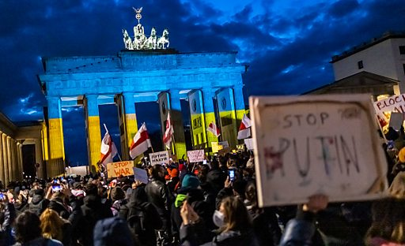

# [World] 2022年全球大事件影片回顾

#  2022年全球大事件影片回顾

**2022年全球大事件影片回顾**

2022年，全球经历两年多的疫情封锁和隔离，人们迫切盼望重启全新生活。二月份，俄罗斯坦克越境进入乌克兰境内，发动二战以来欧洲最大规模军事袭击，触发全球能源危机及通货膨胀；全球气候变迁，导致火灾水患频发，多地录得破纪录高温；在美国，共和党人和权威人士预测中的选举“红色浪潮”并未发生；这一年，英国失去了一位女王，迎来了一位国王，唐宁街更换了三位首相；九月，伊朗22岁女子阿米尼（Mahsa Amini）疑因违反头巾规定，在被道德警察羁押期间死亡，触发全国大规模示威浪潮；而在2022年的最后几周，中国的“清零”政策同样引发罕见大规模抗议，当局随后仓促解封重开国门，社会正在混乱中直面感染激增。

BBC中文与您一起回顾这极不平凡的一年。

