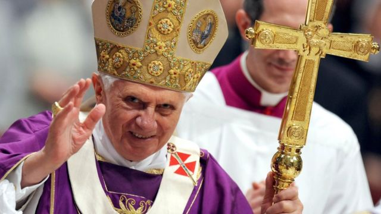
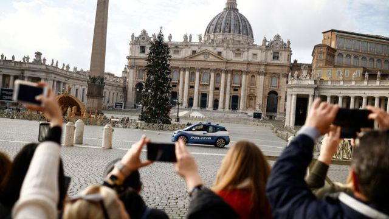
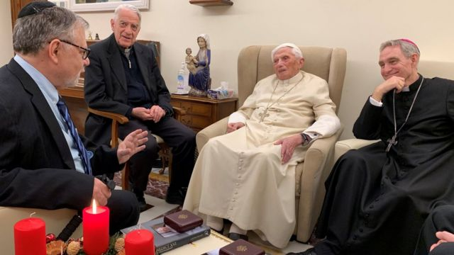
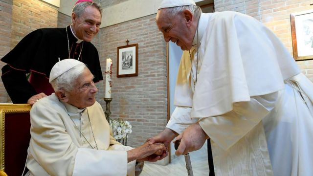
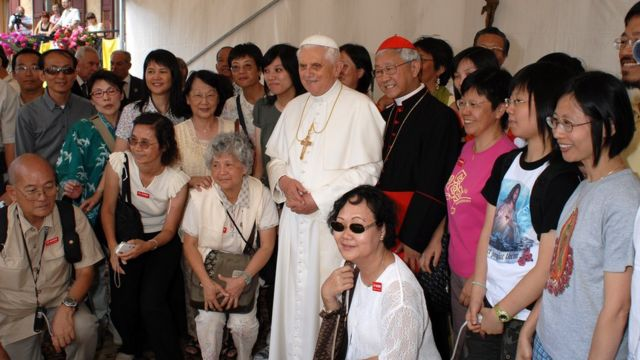

# [World] 前罗马天主教教皇本笃十六世逝世 享年95岁

#  前罗马天主教教皇本笃十六世逝世 享年95岁

最近更新： 7 小时前

> 图像来源，  EPA
>
> 图像加注文字，2013年，本笃十六世主动宣布退位，在教会历史中写下重要一页。

**梵蒂冈宣布，罗马天主教荣休教皇本笃十六世（Pope Emeritus Benedict XVI）逝世，享寿95岁。**

教廷公告称，本笃十六世在星期六（12月31日）罗马时间09:34（08:34 GMT；北京／台北／香港时间16:34）于梵蒂冈教会之母修道院（Mater Ecclesiae）内逝世。

本笃十六世本名若瑟·拉青格（Joseph Ratzinger），1927年4月16日出生于德国巴伐利亚， 2005年被推举为教皇  。 2013年  ，只担任了八年教皇的本笃十六世宣布因健康理由退位，成为了600年来首位在世时辞任的罗马天主教教皇。

本笃十六世自退位以来一直居住于教会之母修道院内。现任教皇方济各（Pope Francis）曾说，他经常到修道院探望老教皇。

本笃十六世老教皇的死讯公布后，梵蒂冈圣伯多禄广场上，与他曾担任主教的德国慕尼克，均敲响了钟声致哀。

梵蒂冈的声明说，荣休教皇的遗体将从星期一（1月2日）起停放于圣彼得大教堂（St Peter's Basilica；圣伯多禄大殿）供信众瞻仰，星期四（5日）举殡。

方济各将主持这场葬礼，这将是罗马天主教历史上极其罕有，由教皇将其前辈下葬。

> 图像来源，  Reuters
>
> 图像加注文字，本笃十六世死讯公布后，梵蒂冈圣伯多禄广场被清空。游客聚集在意大利罗马一侧拍照纪念此历史时刻。

本笃十六世已患病一段时间，但方济各星期三（28日）公开呼吁“特别为荣修教皇本笃十六世祷告”，引起了外界对老教皇健康状况的关注。

英国首相苏纳克（Rishi Sunak；辛伟诚）对荣休教皇逝世表示难过；法国总统马克龙形容荣休教皇任内“以灵魂和智慧为一个彼此更亲如兄弟的世界而努力”。

意大利总理梅洛尼（Giorgia Meloni）说，本笃十六世是“信仰与理性的巨人”；德国总理舒尔茨（Olaf Scholz）认为，对于德国内外许多人而言，本笃十六世是“天主教会的灵魂人物，有争议的个体和聪明的神学家”。

> 图像来源，  Reuters
>
> 图像加注文字，2022年12月1日，本笃十六世（右二）在梵蒂冈接见拉青格奖得主。

> 图像来源，  Getty Images
>
> 图像加注文字，现任教皇方济各（右）称他常到教会之母修道院看望荣休教皇本笃十六世（中）。图为两人在2022年8月会面。

BBC

榮休教宗本篤十六世小資料

  **1927年** 生於德國巴伐利亞 

  **本名** 若瑟·拉青格（Joseph Ratzinger）但選擇了本篤為名號，拉丁文意思為「受庇佑的人」 

  **第265任** 羅馬天主教教宗，2005年4月19日當選 

  **8年** 在位教宗，但在2013年因健康問題而宣布退位 

  **通曉多種語言** 包括德語、英語、意大利語、法語、西班牙語、葡萄牙語，還有教會通用的拉丁語 

  **愛貓之人** 還會幫忙照顧流浪貓 

資料來源：dowym.com 

本笃十六世在被推举为教皇前曾担任罗马教廷信理部部长、宗座圣经委员会主席、国际神学委员会主席及枢机团团长，能讲十种语言。

批评者认为他代表了教会中压制对话和讨论的势力。但是他的支持者指出，老教皇在纳粹德国的经历使他坚信教会一定要代表真理和自由。

在本笃十六世任内的大部分教皇生涯中，天主教会面临着数十年来神父虐待儿童的指控，法律索赔和官方报告。

2022年早些时候，这位前教皇承认，他在1977年至1982年担任慕尼黑大主教期间，在处理虐待案件时犯了错误。

##  本笃十六世任内的中梵关系

> 图像来源，  Getty Images
>
> 图像加注文字，2007年7月，教皇本笃十六世在意大利北部卡多雷的洛伦扎戈（Lorenzago di Cadore）与香港主教陈日君枢机（右四）和华人朝圣信众合照。

天主教会在全世界的信徒约有13亿人。天主教在意大利，爱尔兰，菲律宾等世界很多国家信仰者人口中占比超过80%以上。在美国人口中超过23%。

在中国，官方数据称中国现有天主教徒约550多万人，教职人员约7000多人，教堂、会所约6000处。

但因为中华人民共和国与梵蒂冈并无正式官方关系，中国尚有官方不承认但效忠梵蒂冈的“地下教会”，中国官方公布的天主教徒人数在海外被认为严重低估。

中华人民共和国与梵蒂冈的关系在继任教皇方济各上任后取得较大改善，这会否导致中华民国在欧洲唯一的邦交国改变关系，成为了台湾外交问题的焦点之一。

罗马天主教香港荣修主教陈日君枢机 在本笃十六世宣布退位时曾说  ，教廷万民福音部内的一些官员对中共政权过份妥协，而本笃十六世最终撤换了有关官员，说明了教皇不满他们对中国的态度。

中国官方媒体也转发了海外媒体有关前教皇本笃十六世逝世的消息。天主教香港教区对荣休教皇逝世表达“深切哀悼及思念”。

