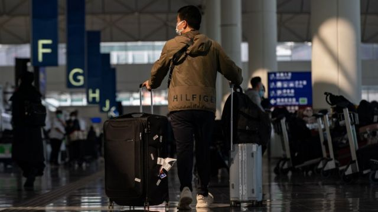
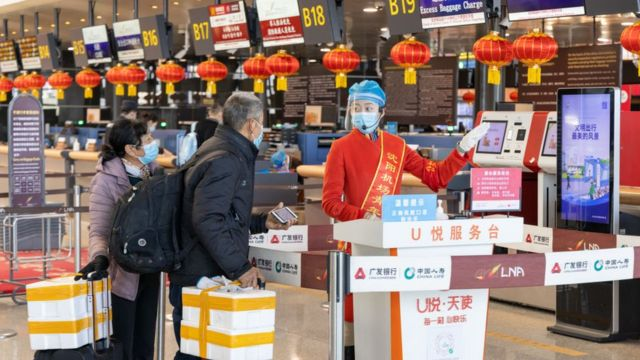
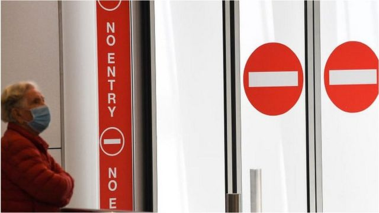
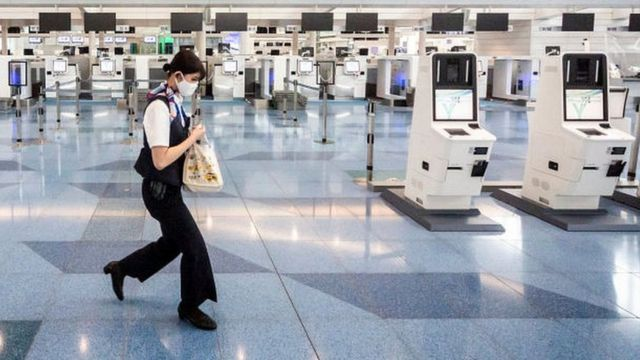
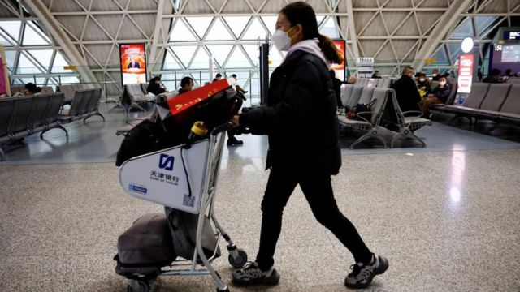

# [World] 新冠疫情：全球各地对中国旅客采取的入境限制措施 持续更新中

#  新冠疫情：全球各地对中国旅客采取的入境限制措施 持续更新中

> 图像来源，  Getty Images
>
> 图像加注文字，在封控长达三年后，中国将于1月8日将全面放开旅行限制。

**北京已经宣布将从1月8日开始放开新冠疫情爆发以来实施的边境管控措施——这是自2020年3月以来，中国大陆首次开放边境。**

但是在其境内新冠病毒新增感染病例出现爆炸式增加之际，这一决定引发各国担忧。

一些国家担忧的另一个原因是中国大陆确诊病例激增，但缺乏透明的官方统计数据。

截至1月1日，中国官方公布的新冠死亡人数为5249人，远低于很多人口大国，但官方已停止全民核酸检测，不再公布新冠感染人数，其死亡数据的统计标准也和大多数国家不同。

中国当局称疫情“总体在预期和可控之中”，放宽限制是基于科学的有计划步骤。

美国、日本、印度、台湾等国家和地区已于上周宣布开始对来自中国的旅客实施入境限制，英国、韩国、以色列等也在稍后相继宣布对中国旅客实施新的检测措施。

摩洛哥是最先宣布完全禁止中国旅客入境的国家。

我们来看看目前各国对来自中国的旅客采取了怎样的措施。

##  法国、西班牙、意大利

意大利、法国和西班牙在上周先后宣布，来自中国的旅客在入境前须进行新冠病毒检测。

法国政府表示，从中国飞往法国的旅客须提供出发前48小时内的新冠检测阴性证明。

另外，法国会从1月1日起对入境的旅客随机抽样进行核酸检测。

抵达西班牙的中国旅客需在出发前有核酸检测阴性证明，而如果已完成接种新冠疫情则可以无需检测，但是西班牙对于某些中国的新冠疫苗并不予承认。

西班牙卫生部长卡罗琳娜·达里亚斯（Carolina Darias）称：“在全国层面，我们将会在机场实施管控，要求来自中国的旅客提供新冠检测阴性证明，或者完成疫苗接种。”

法国和西班牙并未具体说明措施将从何时开始执行。法国卫生部和交通部表示，政府将发布法令并通知欧盟成员国。

法国在周日敦促欧盟各国对来自中国的旅客进行新冠检测，目前欧盟内部仅法国、西班牙和意大利三国宣布实施针对中国旅客的检测措施。

意大利将对所有来自中国的旅客强制进行核酸检测——此前意大利媒体报道，一架从中国抵达米兰的航班上有52%的乘客核酸检测呈阳性。

上周四，欧洲疾病预防控制中心表示，强制检测的措施在整个欧盟执行并无合理性，因为在中国爆发传播的病毒株在欧洲大陆已经存在，且有相应程度的免疫。

不过，世界卫生组织（WHO）则表示，一些国家决定实施相关措施“可以理解”，同时敦促北京更进一步公开新冠疫情的相关数据。

##  英国

英国于上周末宣布，从中国前往英格兰的旅客在登记前须提供新冠检测阴性证明。

> 图像来源，  Getty Images
>
> 图像加注文字，中国在确诊病例激增时重开边境，引发各国担忧。

英国卫生及社会关怀部（The Department of Health and Social Care）表示，从1月5日起，将要求乘坐直飞航班从中国前往英格兰的旅客出示出发前的新冠检测结果。

英国卫生安全局（UK Health Security Agency）将从1月8日起启动监测措施，对来自中国的旅客进行抽样检测。

英国卫生大臣巴克莱（Steve Barclay）指英国政府正采取“考虑周全的预防措施”，并表示相关措施属暂时性质。

相关措施只对抵达英格兰机场的旅客适用，目前中国没有直飞航班前往苏格兰、威尔士和北爱尔兰。

##  澳大利亚、加拿大、美国

此前曾表示不会对中国旅客采取额外措施的澳大利亚，于周日宣布将从1月5日起要求来自中国的旅客提供出发前48小时之内的新冠检测阴性证明。

> 图像来源，  James D. Morgan

澳大利亚卫生部长马克·巴特勒（Mark Butler）表示，由于缺乏来自中国的传染病学数据，有充分理由采取预防措施。

巴特勒强调，澳洲政府欢迎中澳两国间民众继续旅游往来，并表示相关的暂时性措施是“反映目前关于中国的情况缺乏完整的信息”。

澳大利亚的相关措施对来自香港和澳门的旅客同样适用。

加拿大也宣布从1月5日起要求来自中国大陆及港澳的旅客提供两天内的新冠检测阴性证明，暂时为期30天。

加拿大交通部长阿尔格布拉（Omar Alghabra）表示，将会根据所获得的数据，以科学方法应对流行病疫情，以保护加拿大人。

美国在上周三（12月28日）已宣布了对中国旅客采取同样的防控措施，以“减慢”新冠病毒的传播。

与加拿大一样的是，美国也允许超过10之内感染过新冠病毒的人士持新冠康复证明入境。

相关规定亦适用于经第三国转机进入美国或在美国机场转机前往第三国的旅客，而美国也表示会“继续监察状况”并按需调整措施。

##  日本、韩国

韩国总理韩德洙在上周表示，来自中国的旅客将需要在登机前提供核酸或抗原检测阴性证明。

他们还需要在入境韩国一天内进行一次核酸检测。

> 图像来源，  Getty Images
>
> 图像加注文字，旅游禁令时期的日本东京机场

日本则在较早前宣布，从12月30日起，所有来自中国或7日内到过中国的旅客将要在抵境时进行核酸检测，结果呈阳性且有症状者将须隔离7日，无症状者隔离5日；同时从中国前往日本的航班也会减少。

日本对来自香港的航班亦实施限制可降落机场数量等措施，上周从香港到日本多地的多个航班取消。

日本当局一度限制来自香港的载客航班只能使用日本当地四个机场，在香港政府致信日本当局要求撤回相关决定后，日本将将可使用机场增加至七个。

##  摩洛哥

摩洛哥将会从1月3日起禁止所有来自中国的旅客入境，“直至另行通知”，禁令适用于任何国籍人士。

摩洛哥是第一个对来自中国的旅客实施全面入境禁令的国家。

该国外交部的声明指，这是因应中国新冠疫情的相关状况演变而作出的决定，但强调禁令不会影响“两国人民的深厚友谊和两国间的战略合作关系”。

在新冠疫情前，每年前往摩洛哥旅游的中国游客达数十万。

##  其他

除此之外，其他国家或地区也对来自中国的旅客采取各自的检疫措施。

印度要求来自包括中国在内的五个国家旅客在入境前提供新冠检测阴性证明，结果呈阳性或有症状者将要隔离。

以色列则向外国航空公司发出指令，要求来自中国的旅客须提供新冠阴性证明才能进入该国，同时也建议本国公民非必要暂不前往中国。

马来西亚也将对中国旅客增加额外的跟纵和监察措施。

与中国大陆之间有边境限制的香港此前表示计划在1月中旬落实通关，而官员表示通关将会分阶段进行。

香港政务司司长陈国基在周一（1月2日）表示，将争取最早在1月8日实行首阶段通关，同时表示会建议两地旅客事先做核酸检测取得阴性结果再过关，但未提及更详细或任何强制性的措施。

台湾则规定 ，在1月1-31日期间从中国大陆抵达的旅客将须进行核酸检测，结果呈阳性者须居家隔离。台湾中央流行疫情指挥中心公布的首日数据称，1月1日在桃园机场对来自中国大陆的旅客进行检测的结果显示，阳性率达到27.8%。

但并非所有国家和地区都对中国旅客实施特别措施——德国、瑞士和葡萄牙等国目前未表示会对来自中国的旅客采取新的规定。

但是德国卫生部长表示，该国在试图调整系统，在全欧洲的机场对新冠病毒变种进行密切监察。

> 图像来源，  Reuters
>
> 图像加注文字，中国可能是最迟进入与病毒共存状态的国家之一。

全世界各地均已经进入与新冠病毒共存的状态，中国则是在坚持“清零”防疫政策三年多后，于12月初忽然转向，解除几乎全部防疫措施。

中国外交部在较早前表示“目前疫情形势总体在预期和可控之中”。

