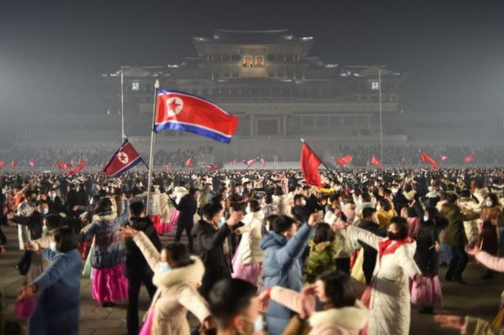
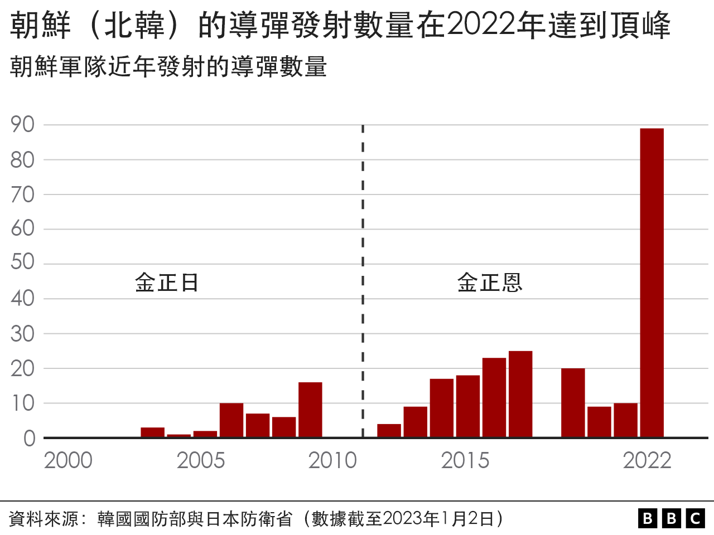
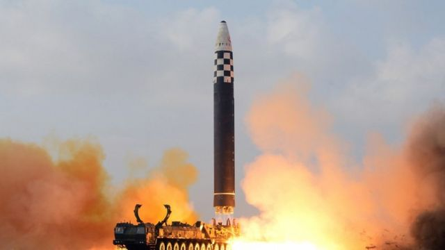
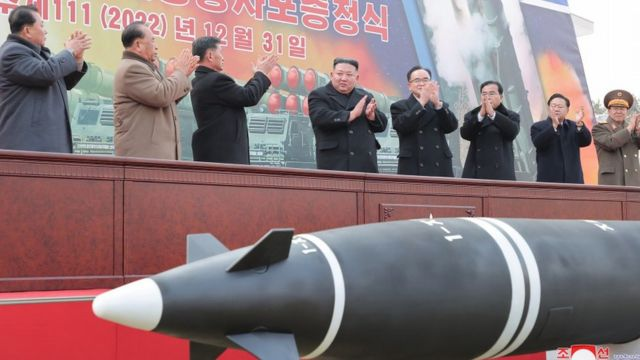
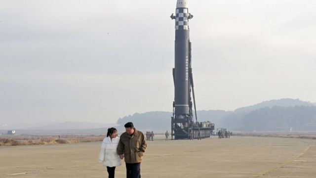

# [World] 朝鲜局势：从核武到接班人，2023年我们会看到怎样的金正恩

#  朝鲜局势：从核武到接班人，2023年我们会看到怎样的金正恩

  * 吉恩·麦肯锡（Jean Mackenzie） 
  * BBC驻首尔记者 

> 图像来源，  Getty Images
>
> 图像加注文字，朝鲜民众在平壤庆祝新年。

**朝鲜的2022年是破纪录的一年。**

它在这一年发射的导弹比历史上任何时候都多。事实上，朝鲜迄今为之发射的导弹里有四分之一是在2022年飞上天的。也是在这一年，金正恩宣布朝鲜成为了核武器国家，而且这些武器会一直存在。

这使得朝鲜半岛的紧张情势态势升级到了2017年以来的最高点，当时的美国总统特朗普（Donald Trump）还威胁要以“炮火和怒火”对付朝鲜。

如今，接下来会是什么？

##  核武进展

2022年，朝鲜在武器方面取得重大进展。它在年初就测试了为攻击韩国而设的短程导弹，之后就测试了能够以日本为目标的中程导弹。

到年末，它已经成功试射了其迄今为止最强大的洲际弹道导弹——火星17，理论上它能够瞄准美国本土的任何一处。

金正恩也降低了使用核武器的门槛。在9月宣布朝鲜不可逆转地成为核武国家之后，他声称这些武器不再只用于避免战争，而是可能被用作先发制人和攻击，来赢得战争。

在年末之际，他召集了执政劳动党的成员，列举出他在2023年的目标。

他任务单上的头等大事是“大幅增加”核武器的生产。他说，这必须包括大规模生产更小型的战术性核武，可能用于与韩国作战。

据卡内基国际和平研究院（Carnegie Endowment for International Peace）的核武专家安吉特·潘达（Ankit Panda）所说，这是最重大的进展。

> 图像来源，  KCNA
>
> 图像加注文字，朝鲜在2022年发射了迄今为止数量最多的洲际导弹。

要制造战术型核武，朝鲜首先必须制造出微型核弹，能够装载入小型导弹当中。全世界目前尚未见到证据显示平壤有能力做到这一点。情报界在2022年大部分时间里都在等待朝鲜测试这样的装置，但是相关的测试并没有发生——这很可能将会出现在2023年。

金正恩的“新年愿望”清单上的其他事情包括间谍卫星——他声称会在今年春天将它发射上太空轨道；还有更可靠的固态燃料洲际弹道导弹——这能够比现有型号更出其不意地攻击美国。

于是我们可以假定，2023年将会同样很有2022年的感觉，平壤将会继续积极地测试、完善和扩大其核武器库，而不顾联合国的制裁。

确实如此，进入新年不到三个小时，它就已经进行了它的第一次导弹测试。

但是，潘达却说：“来年的多数导弹发射可能不会是测试了，但是演习，因为朝鲜现在已经准备将它的导弹用在可能发生的战斗中了。”

##  还谈判吗？

有如此多的目标要进行，朝鲜领导人不太可能选择在今年与美国重回谈判桌。上一轮无核化谈判在2019年崩盘，自此之后金正恩就没有再表现出对话的意愿。

其中一种思路是，他在等待自己有最多筹码的一刻。直到他毫无疑问地证明朝鲜有能力对美国和韩国造成破坏的时候，他才会回到谈判桌上谈条件。

另一方面，在过去一年，朝鲜与中国及俄罗斯走得更近了。曾在美国政府任职20年、现在供职于开放核网络（Open Nuclear Network）的朝鲜问题分析人士李敏英（Rachel Minyoung Lee）表示，朝鲜很可能正在对其外交政策作根本性的改变。

“如果朝鲜不再将美国看作是其安全与生存的必须，这就会对未来核谈判的格局产生深刻影响。”她说。

##  朝鲜半岛的紧张局势

与此同时，朝鲜半岛紧张不安的局势正在发展。

每一次朝鲜作出被认为是“挑衅”的事，韩国——有时候还有美国——都会作出回击。

这是从2022年5月开始的，韩国新总统上任，承诺对朝鲜采取更强硬立场。尹锡悦的指导理念认为，阻止朝鲜最好的办法就是以军事力量回应。

他重新开始与美国进行大规模联合军演，对此朝鲜表示抗议并发射更多导弹。这开启了一个用军事力量以牙还牙的循环，双方都曾出动战机到边境，并向海面发射炮火。

> 图像来源，  KCNA
>
> 图像加注文字，在新年致辞中，金正恩声言要“大幅增加”核武器生产。

上周，局势有所升级，朝鲜出乎意料地发射五架无人机进入韩国领空。韩国未能将它们击落，暴露了其防务当中的一个弱点，引发韩国民众的担忧，而此前他们通常都对朝鲜的各种举动不以为然。

韩国总统声言，首尔将会对朝鲜的每一次挑衅予以还击和惩罚。

监察朝鲜的朝韩风险组织（Korea Risk Group）执行长奥卡罗尔（Chad O'Carroll）预计，在2023年，这可能会导致朝韩的直接冲突，甚至造成人命伤亡。

“朝鲜或者韩国任何一方的回应都可能令事态升级，我们可能会看到实际的交火，无论是不是有意。”他说。

一个失误或者误判，情况就有可能急转直下。

##  朝鲜国内状况

同样迫切的一个问题是，2023年对朝鲜人民来说意味着什么？

他们已经经历了与全球疫情有关的三年严厉边境封锁。为了阻止新冠病毒传入，甚至连贸易都暂停了，人道组织相信这导致了严重的粮食和药物短缺。去年，金正恩罕见地承认有“粮食危机”。

2022年5月，朝鲜承认有第一次病毒爆发，但是几个月后就宣布已经战胜疫情。

所以，2023年会是朝鲜与中国边境重开的一年吗？人员进出和供给能够重新恢复吗？

> 图像来源，  KCNA
>
> 图像加注文字，2022年11月，金正恩首次与女儿一起公开露面。

中国的重新开放带来了希望。朝鲜据报已经在为居住在边境附近的民众接种疫苗以作准备，但是由于其医疗系统不可靠，李敏英持谨慎态度。

“除了紧急状况，比如经济接近崩盘之类，在疫情大流行于全世界范围内被认为已结束之前，朝鲜都不太可能会全面重开边境，特别与中国接壤的边境。”她说。

另一个值得观察的进展是，有没有迹象显示在金正恩之后会由谁来执政。他的继承人计划不为外界所知，但是去年，他首次公开让他的一个孩子露面——是一个女孩，被认为是他女儿金朱爱。

她至今已经在三场军事活动当中被拍到，新年还有更多的图片公布，令一些人猜想她是否就是被选中为接班人。

当然，朝鲜的一切都是不可预知的，而2023年似乎注定要与上一年一样，既不可预知又充满变数。

