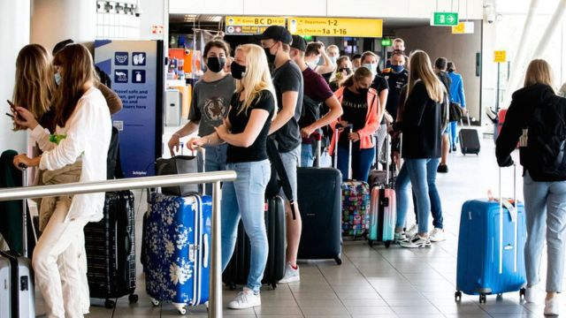

# [World] 中国新冠疫情：旅行限制能防止病毒传播吗？

#  中国新冠疫情：旅行限制能防止病毒传播吗？

  * 事实核查团队 
  * BBC News 

9 小时前

> 图像来源，  Getty Images

**北京宣布新冠“清零”政策结束后，一些国家先后推出针对来自中国的入境旅客的防疫措施，包括检测、隔离等。**

中国宣布将从1月8日开始放开边境管控措施。这是自2020年3月以来，中国大陆首次开放边境允许中国公民出国旅行。

自中国放宽防疫政策后，新冠疫情海啸般爆发。加拿大、美国、法国、西班牙和英国等国家纷纷采取中国入境旅客在抵达时出示核酸阴性结果或隔离阳性旅客的限制举措。

中国外交部发言人毛宁在1月3日的新闻发布会上说：“部分国家采取仅针对中国的入境限制措施缺乏科学依据，一些过度做法更让人不能接受。”

旅行限制对防止病毒传播有效吗？

##  新冠疫情爆发初期发生了什么？

疫情期间，澳大利亚曾实施世界上最为严格的旅行限制措施。从2020年起，堪培拉对非澳洲居民关闭边境，并禁止澳大利亚人出国旅行（少数例外）。

英国等一些国家相对较为宽松，要求国际旅客抵达时在专门的酒店隔离并进接受检测。

2020 年“大流行”（Pandemic）开始后，世界卫生组织 （WHO） 曾表示，总体来讲不支持旅行禁令，因为它们“通常无效”。

世界卫生组织说，“严重干扰国际交通的旅行措施可能只有在疫情爆发初期才是合理的，因为它们可能会为各国赢得时间。”

在奥密克戎变异毒株出现后，世界卫生组织再次警告不要全面禁止旅行，称这不会阻止奥秘克戎在全球的传播。

“（旅行禁令）可能会打消各国报告和分享流行病和测序数据的积极性，由此对全球卫生工作带来不利影响...... ”世界卫生组织说。

> 图像来源，  Getty Images

##  世卫组织现在怎么说？

世界卫生组织总干事 谭德赛2022年12月21日表示  ，“非常关注中国不断变化的局势，重症报道越来越多。”

他说，世卫组织需要更详细的信息来了解中国实地局势可能带来的风险。

他在推特上补充说：“在缺乏来自中国的全面信息的情况下，世界各国以他们认为可以保护其人民的方式行事是可以理解的。”

##  旅行限制会起作用吗？

牛津疫苗集团负责人安德鲁·波拉德教授（Anderw Pollard）告诉BBC新闻：“试图通过调整旅行政策来阻止病毒（传播）已经被证明效果不佳。”

“我们已经看到，大流行期间各国推出旅行禁令，并没有阻止病毒最终在世界各地传播。”

“最终”这个词在这里很重要，因为研究表明，旅行限制往往只会延缓病毒在一个国家传播，但不能完全阻止。
 《英国医学杂志》的一份报告发现  ，对国际旅客的入境限制可能会将传播推迟两个月。

报告其中一位作者、香港大学的格雷品（Karen Grepin）告诉BBC事实核查，“我们在大流行期间了解到，适用于所有旅行者、而不仅仅是来自某些国家的旅行者的普遍性措施比有针对性的措施更有效，例如针对来自中国的旅客。”

“大流行期间唯一被证明有效的旅行限制是那些包括长时间隔离在内的措施，我认为目前人们对这类措施没有太大的兴趣。”

> 图像来源，  Reuters

##  还有哪些其他研究？
 2020 年 12 月发表在《自然》杂志上的一项研究表明  ，新冠病毒刚开始在世界各地传播时，（旅行）限制效果很好，但越晚引入，效果就越差。

德国WZB柏林社会科学中心对180多个国家的旅行限制和死亡率进行研究，得出了类似的结论，并补充说：

  * 一个国家在记录10例以下死亡病例之前禁止旅行时可以带来最大的影响 
  * 隔离所有旅行者比禁止入境更有效（在某些情况下，入境禁令不适用于返回的该国公民） 

另一位为英国政府提供建议的科学家马克·伍尔豪斯教授（Mark Woolhouse）告诉BBC事实核查，对从中国抵达英国的旅客采取防疫限制措施对试图控制英国本土的新冠病例没有多大作用。

他说，“目前英国的病例太多了，输入病例不会带来重大改变。”

##  新变异毒株呢？

有人说，旅行限制将防止潜在的新变异毒株进入英国。

但是伍尔豪斯教授说，如果已经出现变异毒株，旅行限制也会是为时已晚。

“几乎可以肯定它已经传入这里了，”他说，

“只有在（旅行限制措施）实施期间出现变异，此类措施才能发挥作用。即使如此，也只能是延迟、而不是阻止变异毒株的传入。”

此外，新变异出自中国的可能性并不比出自世界其他任何地方的可能性更大。

“虽然中国显然正在经历一波重大疫情，但没有理由去怀疑这波浪潮将成为新毒株出现的熔炉，”伍尔豪斯教授说。

“下一个变异至少是有可能出现在完全不同的地方 - 目前全球每周报告约400万例病例（当然，没有报告的数字要大得多）。为什么只关注中国呢？”

不过，世界卫生组织表示，它担心中国没有分享境内感染人数激增的有关信息，包括是否出现新变异毒株。

“针对中国旅客的措施可能更像是对缺乏信息共享做出回应的政治声明，而不是促进公共卫生的真诚尝试，”马里兰大学公共政策学院的凯瑟琳·沃尔斯诺普（Catherine Worsnop）说。

