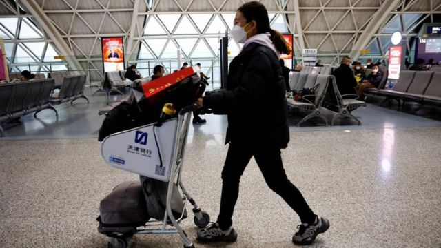
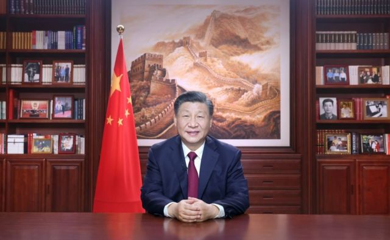
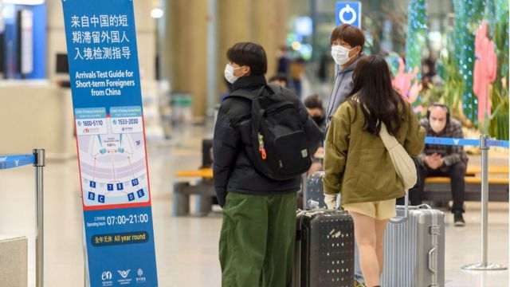
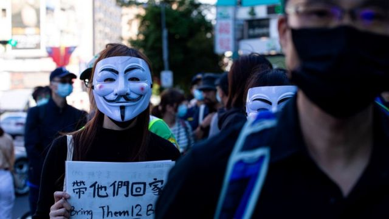
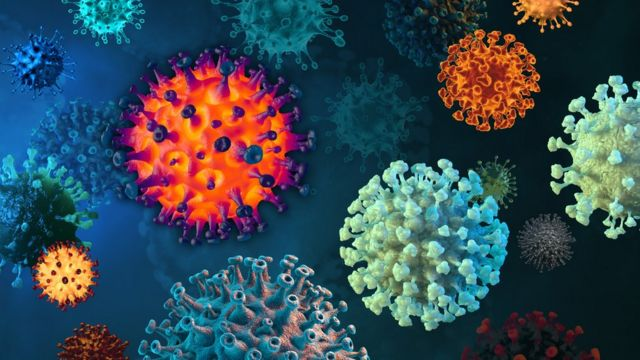

# [World] 习近平的书架、台湾移民署争议事件、新冠变种等本周更多重要故事

#  习近平的书架、台湾移民署争议事件、新冠变种等本周更多重要故事

> 图像来源，  Reuters
>
> 图像加注文字，中国可能是最迟进入与病毒共存状态的国家之一。

**新一年第一周，中国国家主席习近平的书架和新年贺词受到关注。同时，在中国即将对外开放边境之际，许多国家宣布对中国入境游客加强防疫。**

在台湾，移民署发布“港澳居民不得从事活动一览表”，在下架前被记者发现，引发了强烈争议。

另外，一种新的新冠病毒亚变种XBB.1.5在全球引起担忧。

刚刚过去的一周，BBC中文有以下新闻内容受到读者关注。如果你错过了，带你一一回顾。

1\. 习近平的书架与新年贺词：回应抗议、青年人和胡锦涛“被离场”事件？ 

> 图像来源，  Xinhua
>
> 图像加注文字，新年前夕，中国国家主席习近平通过中央广播电视总台和互联网，发表2023年新年贺词。

一位国家领导人的办公室陈列出什么物品，透露着他的行事风格和治国理念。

中国国家主席习近平在2022年底最后一天发表 新年贺词  。他端坐在自己位于北京中南海的办公室，背后的书架上挂着一幅巨型长城图， 旁边摆放着书籍和数十张照片  。

书架上有的照片是第一次出现，包括前国家主席江泽民、前总理朱镕基和习近平之父——中共元老习仲勋的合影，以及习近平与江泽民、胡锦涛的合影。这反应了习近平如何理解江泽民的权力传承，并间接回应了胡锦涛在中共“二十大”上“被离场”所引发的争议。

2\. 多国要求中国旅客提供新冠检测证明 泰国柬埔寨不实施额外限制 

> 图像来源，  Getty Images
>
> 图像加注文字，1月2日，韩国首尔仁川机场，来自中国的旅客需进行新冠检测。

北京将从1月8日开始放开新冠疫情爆发以来实施的边境管控措施——这是自2020年3月以来，中国大陆首次开放边境。但是在其境内新冠病毒新增感染病例出现爆炸式增加之际，这一决定引发各国担忧。

美国、日本、印度、台湾等国家和地区已于上周宣布开始对来自中国的旅客实施入境限制，英国、韩国、以色列等也在稍后相继宣布对中国旅客实施新的检测措施。本文汇总了各国对来自中国的旅客采取的措施。

3\. 一个修女和一个修士的爱情故事 

> 图像加注文字，丽莎和罗伯特·奥帕拉（Lisa and Robert Opala）。

玛丽·伊丽莎白（Sister Mary Elizabeth）成为修女已经有24年，但是在兰开斯特郡普雷斯顿市的一个修道院大厅里，她与一个修士的短暂邂逅，却改变了一切。

修道院长当时命她去接待从牛津某个修道院到访的罗伯特修士，看他是否需要吃点什么。玛丽·伊丽莎白修女的上级被叫去接电话了，于是两人就单独在一起了。

“那是我们第一次共处一室。我们坐在餐桌旁，他在吃东西，然后修道院长没有回来，于是只能由我来送他出去。”

4\. 台湾禁访台港澳居民游行及接受采访？学者质疑法律依据 

> 图像来源，  Getty Images
>
> 图像加注文字，2020年，示威者在台北举标语要求释放12位遭到中国政府拘捕的港人。

台湾移民署在2023年首个工作日发布“港澳居民不得从事活动一览表”，禁止行为包括“游行”和“接受媒体邀请”。有法律学者质疑有关规定“恐吓意味大于法律依据”。记者当天晚间发现该文件目前已下架。

有关文件在1月3日早上刊载于移民署网站“香港澳门居民来台停留线上申请入出境许可证送件须知”的公告栏，列出九项港澳居民不得从事的活动。

5\. 新冠病毒变种XBB.1.5引发担忧 我们对它了解多少 

> 图像来源，  Getty Images

一种新的新冠病毒亚变种XBB.1.5在全球引起担忧，它正在美国等地迅速传播，引发新一轮感染潮。最近，在中国疫情大爆发的情况下，公众也开始担心这一变种会加速传播，甚至带来二次感染。

科学家表示，XBB.1.5具有免疫逃逸性。和其他奥密克戎亚变异株一样，这种病毒传播越多，就越有机会变异。世界卫生组织表示，目前已在29个国家检测到XBB.1.5。

