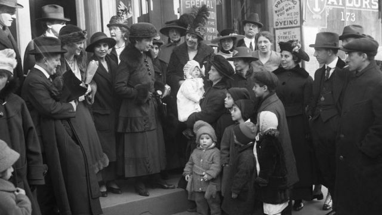
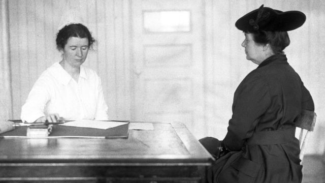
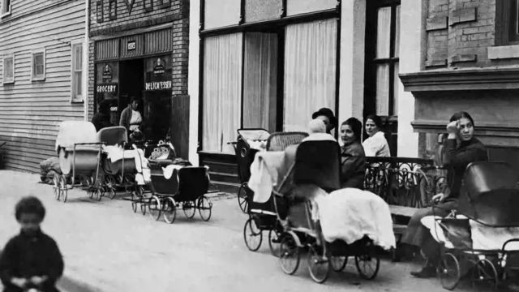
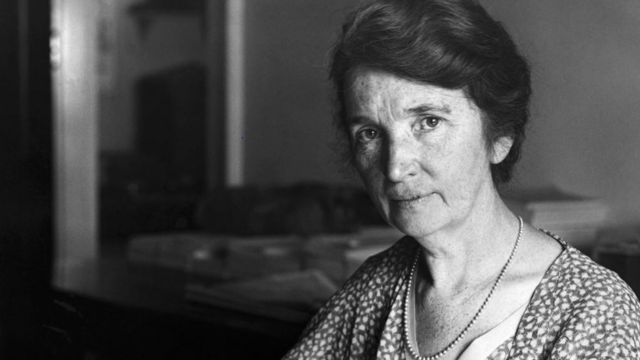
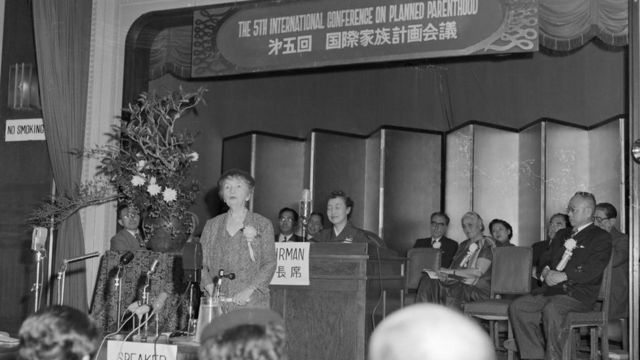
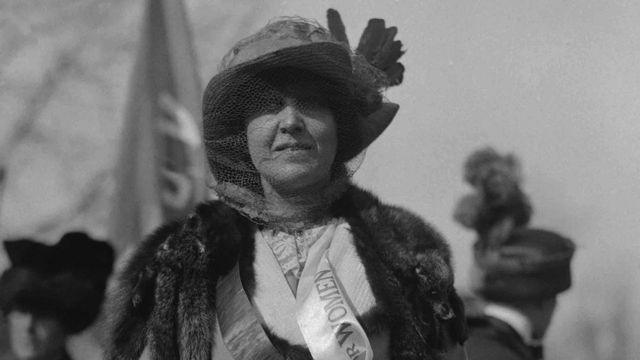

# [World] “避孕之母”——美国第一个节育诊所创始人桑格的争议与传奇

#  “避孕之母”——美国第一个节育诊所创始人桑格的争议与传奇

> 图像来源，  Getty Images
>
> 图像加注文字，玛格丽特·桑格（Margaret Sanger）为女性避孕权铺平了道路，但她的成就也因为她与优生运动有关联而蒙上了阴影。

**“母亲们!一个大家庭你能负担得起吗？想要更多的孩子吗？如果不想要，为什么要生呢？不要扼杀生命，而是要采取措施避免生育。如果想获取安全、无害的相关信息，可以向训练有素的护士查询......”**

1916年这则广告出现在纽约，为玛格丽特·桑格创立的美国第一家节育诊所做宣传。

当时，避孕措施很富争议，而且非法。诊所很快被关闭，桑格随后被判监入狱。但50年后当她去世时，她毕生所做的工作已经在改变全世界的家庭生育计划。

桑格被媒体和学者们誉为“节育之母”，因为是她负责开发了如今广为使用的避孕药。

##  争议人物

然而，她与优生学运动的联系而被指控有种族主义嫌疑，她当初使用的避孕方法和动机至今仍然很受争议。

> 图像来源，  Getty Images
>
> 图像加注文字，桑格和她的妹妹（Ethel Byrne）离开特别服务法庭时被一群人簇拥。

北亚利桑那大学历史和妇女与性别研究教授桑贾姆·阿鲁瓦利亚（Sanjam Ahluwalia）说：桑格留下的成就确实毁誉参半。

她向BBC国际台的《论坛》（Forum）节目组表示：“我不认为这仅仅是单一的妇女解放问题......但我认为要全面否认桑格这样的人物未免过于简单...... 人们需要从历史的角度、以批判的眼光来解读她。”

##  出身贫穷

桑格于1879年出生在纽约州，是11个孩子中的第六个。她的父亲迈克尔是出生于爱尔兰的石匠，生活贫困家徒四壁。她的母亲共怀孕18次，包括7次流产。

桑格最初是提供临终关怀服务的护士，在此过程中她目睹过妇女死于妊娠并发症，也亲眼看过非法地下诊所堕胎造成的恶果。

> 图像来源，  Getty Images
>
> 图像加注文字，桑格开办避孕诊所时，堕胎在美国仍属非法。

明尼苏达大学美国研究和历史教授、《美国与避孕药：承诺、危险和解放的历史》一书的作者伊莱恩·泰勒-梅（Elaine Tyler May说）：“康斯托克法 ”（Comstock laws ）生效，禁止使用邮政系统分发节育、避孕信息或装置。许多州也有反对避孕的法律。

桑格面对的还包括强大的天主教会，避孕在教会被视为有罪。

##  生与不生的权力

1914年3月，桑格出版了《女人的叛逆》（The Woman Rebel）一书，主张女性有权节育。这本书很快引发了法律诉讼。为了躲避入狱的风险，她离开美国到了英国。

在英国，她受到了托马斯·罗伯特·马尔萨斯（Thomas Robert Malthus）作品的影响，他认为地球上的资源无法支持不受控制的人口增长，建议自我控制和推迟结婚。但是，被称为新马尔萨斯主义者的活动人士们开始推动避孕。

英国剑桥大学历史学家卡罗琳·鲁斯特霍尔茨博士（Caroline Rusterholz）说：“她也开始发展另一种说法......控制生育是维持和平和避免粮食短缺的方法。”

##  第一个诊所

桑格最终结束了自我流放回到了美国。她在纽约市一个有许多贫穷移民妇女居住的地区开设了美国第一家节育诊所。

> 图像来源，  Getty Images
>
> 图像加注文字，1916年10月，在纽约布鲁克林安博街（Amber Street）桑格诊所外妇女和男性带着婴儿车。

但诊所仅在几天后就被查，桑格被捕。

她并不气馁，几天后重新开了诊所，并再次被捕，被指控滋扰公众。

1917年，她在铺天盖地的媒体报道中接受了审判，被认定有罪，并被裁定要么入狱30天要么支付罚款。她选择了入狱，在狱中她向囚犯们提供节育信息。

桑格传记作者埃伦-切斯勒（Ellen Chesler）说：“在这一事件中，她成为美国的一个大人物。她的妹妹也在监狱里，还曾绝食抗议。”

出狱后，桑格对她的定罪提出上诉，但未获成功，但法院裁定医生可以出于医疗原因开出节育处方。

##  个人悲剧

在她身陷法律纠纷的同时，她的个人生活也经历动荡。1914年，她与丈夫威廉分居，1915年，她唯一的女儿佩吉突然死亡，年仅5岁。

> 图像来源，  Getty Images
>
> 图像加注文字，玛格丽特·桑格的成就因为她的言论和她与优生学运动的关系至今仍然有争议。

其后她曾有过数段感情，其中包括性行为研究者哈维洛克·埃利斯（Havelock Ellis）和作著名科幻作家H-G-威尔斯（H G Wells）。1922年，她与石油大亨詹姆斯·诺亚-H-斯利（James Noah H Slee）结婚。他成为她宣传节育运动的主要资助者之一。

##  优生学

桑格为她的节育运动在社会上寻求更广泛的支持，并与那些如今被广泛视为持完全不可接受观点的团体联手。

英国剑桥大学历史学家鲁斯特霍兹说：“她与优生学协会合作......并从他们那里获得资金。”

美国国家人类基因组研究会将优生学定义为“一种科学上不准确的理论，认为人口可以通过选择繁殖来优化。”

但在纳粹实施大屠杀之前，对这些理论的阐述并没有受到太多的反对。

鲁斯特霍兹补充说：“她真的想与贫困作斗争，但她仍然赞同一些相当有问题的优生措施，比如她赞成对残疾人实施绝育。"

> 图像来源，  Getty Images
>
> 图像加注文字，桑格到亚洲很多国家推广避孕“家庭计划”。

传记作者埃伦·切斯勒说，桑格有她自己的看法。

“典型的优生学家反对中产阶级妇女节育。他们对种族、阶级和肤色的等级制度感兴趣。她则不然。她希望所有妇女都能少生孩子。”

##  “穷人和生物条件较差的人”

在整个20世纪20年代和30年代，玛格丽特·桑格周游世界，在中国、日本、韩国和印度推广生育控制。

她在写给资助她1935年印度之行的伦敦优生学协会的信中，用优生学的术语来表述：“把节育知识带给穷人和生物条件较差的人。”

她在印度推广杀精粉。

> 图像来源，  Getty Images
>
> 图像加注文字，妇女选民联盟（League of Women Voters）的创始人之一凯瑟琳·麦考密克（Katharine McCormick）为开发避孕药投入了100万美元。

但这引来了很多抱怨，说会引起烧灼感，而且如果没有医生指导很难使用。

北亚利桑那大学历史和妇女与性别研究教授桑贾姆·阿鲁瓦利亚说：“关于节育和提供避孕药具的言论非常盛行，特别是对打工穷人，但相关的技术却并不存在。”

桑格还会见了有影响力的印度人，如圣雄甘地和诺贝尔奖得主拉宾德拉纳特·泰戈尔。

泰戈尔支持节育，而甘地则主张禁欲和自我克制。桑格虽然尽力，但无法改变甘地的意见。

第二次世界大战迫使大西洋两岸的节育运动退出主流意见。但之后，对人口爆炸的担忧重新给了这场运动额外的推动力。

##  神奇药丸

> 图像来源，  Getty Images
>
> 图像加注文字，桑格去世的前一年，第一批避孕药上市。

大约在这个时候，桑格因为对当时包括避孕膜在内的避孕方式的无效和不实用感到沮丧，开始提出一种更方便使用者的口服药片。她在1939年写下了她对“神奇药丸”的梦想，但要把想法变成现实，她需要获得帮助。

第一个重要的盟友是女权活动家凯瑟琳·麦考密克（Katharine McCormick），她资助了口服避孕药的研发工作。桑格还说服了有争议的生育科学家格雷戈里·平卡斯博士（Gregory Pincus）加入研究工作。

麦考密克最初提供了40,000美元，之后资金增长到超过100万美元。

十年后，避孕药片已经研制成功，但在测试和验证方面问题多多。

由于堕胎在美国属非法。因此，在20世纪50年代中期，研究团队前往波多黎各和海地。精神病院和贫民窟的妇女参与了测试，尽管许多人可能都不知道她们服用的药品究竟是什么。

> 图像来源，  Getty Images
>
> 图像加注文字，1929年，桑格（右）被禁止谈论避孕问题后戴上口罩在波士顿抗议。她说：对自己身体都没有掌控的女性不能自认是有自由的。

明尼苏达大学美国研究和历史教授伊莱恩·泰勒·梅说：“当然，这种欺瞒滥用的确发生了。这一点是毫无疑问的。”

1965年，美国已婚妇女可以获得避孕药，1972年美国所有妇女无论婚否都可以获得。

许多其他国家也采用了避孕药。1966年桑格去世时，她应该相当满意地看到了避孕药带来的成果。

##  桑格成就

几十年来，玛格丽特·桑格的节育工作因为与优生学和与非洲裔美国人有关而难脱种族主义嫌疑。

黑人社区曾邀请她去帮助建立诊所。她所谓的“黑人项目”旨在向美国南部的贫困黑人社区传播避孕建议。

这成为争议的开始，由黑人民族主义者和后来的反堕胎活动家提出。

同时，她为美国的性健康和堕胎奠定了基础。

避孕药已经成为世界上仅次于绝育和避孕套之后的最常见的节育方式之一，现在使用避孕药片的妇女超过1.5亿。

