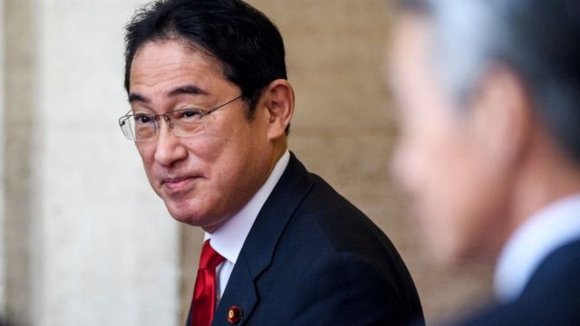
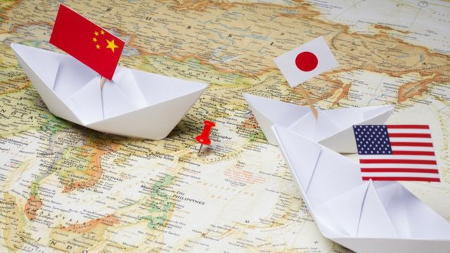
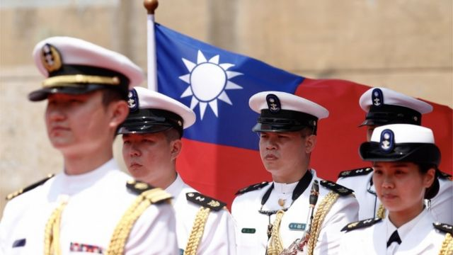
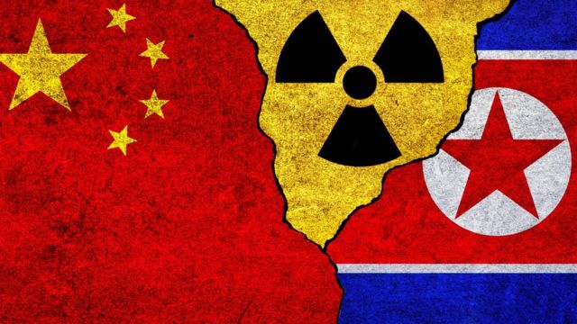
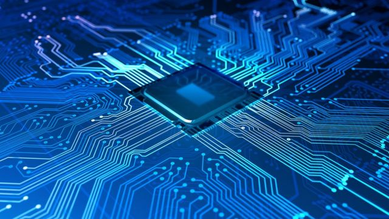

# [World] 日本首相岸田文雄访美，中国、朝鲜和经济安全等议题会主导其与拜登的峰会

#  日本首相岸田文雄访美，中国、朝鲜和经济安全等议题会主导其与拜登的峰会

  * 常思颖 
  * BBC中文 

> 图像来源，  Getty Images

**日本首相岸田文雄周五（1月13日）访问白宫，与美国总统拜登举行首脑峰会，这是他2021年上任以来首次访问美国。两国近日发布** 联合声明  **，称全球进入“战略竞争新时代”。两位领导人将讨论一系列地区和全球问题，其中多个方面涉及到中国的利益。**

根据 白宫早前的一份声明  ，他们将讨论朝鲜核武器和弹道导弹计划，俄罗斯-乌克兰战争，以及如何维护台湾海峡的和平与稳定。另外根据 路透社  ，他们预计还将讨论安全问题和全球经济，包括在半导体等技术出口管制方面的合作。

日本东京大学东洋文化研究所教授松田康博对BBC中文说， 美日两国是军事同盟，像是一个矛和盾的组合，“以前在抗衡威胁时，美国是矛，日本是盾；现在日本也将成为一些矛的部分，那么美国作为矛的角色负担可以得到减轻”。

> 图像来源，  Getty Images

##  “印太地区最大的战略挑战”

就在元首会面之前，日美两国外交部长和国防部长11日举行了“2+2” 会议，会后的 联合声明  中称：“部长们一致认为，中国的外交政策寻求重塑国际秩序，使之有利于自身，并利用中国日益增长的政治、经济、军事和技术力量来实现这一目标。这种行为引起了（美日）联盟和整个国际社会的严重关切，是印太地区最大的战略挑战。”

根据声明，驻日美军的前沿阵势将得到升级，“部署更多多功能、有弹性和机动的部队，来增加情报、监视和侦察、反舰和运输能力”。其中包括在2025年前，将驻扎在冲绳的美国海军陆战队第12团，改编为海军陆战队第12濒海作战团（Marine Littoral Regiment ）。

对此，中国外交部12日在回答记者提问时称：“美日开展双边军事合作应确保不损害第三方利益，不损害地区和平稳定。”

日本内阁上个月刚刚通过了三份安全文件，包括将国防开支提升一倍，发展军事反击能力等，标志着二战以来最大规模的军事改革。

有分析认为， 这在很大程度上是为了应对中国，以及日益增长的台海冲突的风险。

台湾海峡是日本进口天然气和石油的重要航道，日本冲绳的与那国岛距离台湾宜兰只有约100公里，一旦该地区出现战事，将严重影响日本的经济和安全。如日本前首相安倍晋三说，“台湾有事等同于日本有事”。

随著美中两国在该地区的紧张局势加剧，日本越来越担心受到拖累。去年8月，美国众议院议长佩洛西访台之后，中国在台湾周边举行了大型军事演习，向冲绳附近水域发射了五枚弹道导弹，日本政府通过外交渠道向中方表示强烈抗议。

日本与美国在防止台海发生冲突方面有著共同利益，两国均认可国际法对台湾海峡的定义。 松田康博预计，日美领导人“会再次提到台湾海峡的和平与稳定的重要性，比如会提到反对运用武力或擅自改变现状的行为”。

然而， 对于中国，台湾问题属于内政。美日两国就这一问题说事，必将引起中国政府强烈反感。

松田康博认为，日美元首会面期间没有必要在台湾问题上提出新的论述来刺激中国，因为在实际行动上，两国已经在加强同盟关系。

> 图像来源，  EPA

##  日本的“反击能力”

上个月日本通过的三份安全文件中，最重要的变化是寻求拥有反击能力，通过引进巡弋飞弹“战斧”（Tomahawk）等先进武器来实现。过去，如果日本受到飞弹攻击，只能被动应对，将其拦截击落；而最新的反击能力下，日本可以对敌方领土及领海的进行反击。

根据《华尔街日报》所称，美国目前只向英国出售过“战斧”；日本正在就购买“战斧”与美国谈判。

“日本将要拥有反击能力，其主要目的是吓阻敌方。因为中国有意图攻打台湾，同时要攻打在日本的美军基地；假如日本有很强的能力，中国攻打台湾的门槛就会提高”，松田康博说。

他还说，只购买巡弋飞弹还不够，还需要具备锁定地面和海上目标的能力，当前日本缺乏这个系统，岸田文雄在这次会谈中有可能寻求美国的帮助。

“日本希望寻求等级较高的武器，并且需要了解实际应用技能（know-how）。就像具备了攻击潜水艇的设备，还需要能够侦测到敌军潜水艇的能力。”

与此同时，美国也希望日本拥有反击能力，以减轻自身负担， 他说。

松田教授说，美国希望日本朝这个方向发展，但“魔鬼永远在细节里面——高层说可以转让，下层官员舍不得转让，那就没办法”。所以本次首脑峰会将起到高层引领的作用，今后下层再进一步贯彻实施，日本才可以拥有整套设备和实际应用技能。

不过，日本也受到本国法律的限制，其和平宪法规定，日本的军事能力只限于防御。这意味着，即便北京武统台湾时美国介入，日本也不可能跟美国共同作战。

据此，香港科技大学人文社科学院林泉忠教授对BBC中文分析说，日方的主张仍然是强化西南诸岛，以便能够更好的协助美国来应对台海战事，所以，未来美日在推动军事同盟一体化时也不会超过这一范围。

##  朝鲜问题僵局

> 图像来源，  Getty Images

在日本最新的国家安全战略中，中国取代了北韩，成为“迄今最大的战略挑战”，但此次日美首脑峰会，朝鲜问题仍将成为主议之一。

松田康博说，日本每次都对北韩导弹发射提出抗议，但几乎所有的制裁都早就用尽了，因此只能以加强自身能力的方式来提升吓阻的层次。同时，日本仍希望中国根据本身的利益来影响朝鲜的决策，尤其是不搞核试爆。

澳大利亚国立大学政治学者宋文笛（Sung Wen- ti）对BBC中文说，日本抗议没有用，日美通过中国向朝鲜施压也不会有用，因为朝鲜和中国的一向“面和心不和”。

“日美一方面不抱持期待，另一方面又会尝试呼吁中国敦促朝鲜克制。而当事实证明中国无力或无意改变朝鲜试射飞弹等引起区域紧张的行为时，日美便得将朝鲜的挑衅行为部分归因于中国的默许 (enabler)，在国际舆论上取得有利位置，“他说。

宋文笛认为，日本将中国取代朝鲜为“迄今最大的战略挑战”就反映了此思维。一方面从论述上将中国与朝鲜联系起来，把朝鲜问题的责任部分归属于中国；另一方面又暗示，在战略层次上应该把中国与朝鲜的行为分开，因为如果受到实际战火威胁，具有强大常规武力的中国更具实力。

林泉忠说，在朝鲜问题上， 中国能够发挥的影响力非常小，因为它积极发展核武器，压力不仅仅来自西方，也有中国的因素。去年是中韩庆祝建交30周年，朝鲜认为，中国与其邻国的关系越来越近，而忽略了它的价值。

他认为，此次日美首脑峰会中，朝鲜议题不会有太大突破。

据《纽约时报》，朝鲜在去年一年发射了至少92枚弹道导弹和其他导弹，频率之多打破历史纪录。日本和美国将朝鲜的行为视为严重挑战，中国则谨慎回应。去年11月，中国和俄罗斯在联合国安理会上反对进一步对朝鲜的制裁。

##  敏感技术“漏洞”

> 图像来源，  Getty Images

除此之外，日本也在寻求方法应对中国在该地区日益增长的经济影响力，希望加强涉及供应链和敏感技术等方面的经济安全。

在中美两个经济体展开激烈的半导体竞争之际，日本经济大臣西村康稔（Yasutoshi Nishimura）5日访问美国。他表示，日本有意加入美国对中国的芯片禁令。

西村康稔说： “我们在工业和日常生活不可或缺的商品和技术方面，不能过度依赖其他国家，尤其是（不能）仅仅依赖一个特定的国家。”

“建立经济安全是当务之急”，他说。在与美国商务部长雷蒙多（Gina Raimondo）会谈后，他表示，两国将扩大在半导体以及关键新兴技术领域的合作，包括人工智能、生物技术等。

去年10月，拜登政府宣布全面禁止向中国出口高端芯片以及制造技术和材料。但是，如果没有日本和荷兰这两个拥有全球领先的制造半导体芯片生产要素的国家的合作，这一举措缺乏影响力。

美国驻日大使伊曼纽尔（Rahm Emanuel）近日对彭博社说，美国正在与日本、荷兰和韩国讨论限制对中国的半导体出口，需要与三方共同达成协议。

松田康博指出，中国大陆在生产芯片时需要采购工作母机和材料，并引进技术和人员。目前，有美国的护照或者绿卡的人被禁止在中国工作，但日籍或其他国籍的顶尖技术人员依然可以，“这会是很大的漏洞”。

“弥补这一漏洞需要国际合作，如果日本和美国达成一致，会起到模范带头作用，令韩国等地效仿”。

根据白宫2021年6月的一份报告，目前全球半导体制造能力集中在东亚，2019年台湾占全球总量的20%，其次是韩国、日本、中国和美国。台湾去年修改了法律，限制参与芯片制造的人才进入中国大陆。日本和韩国目前未有相关规定。

与此同时，日本希望美国进一步开放市场或转让技术，以弥补制裁中国对产业链造成的损害。

松田康博说，几乎全部的G7成员国都希望美国进一步转让技术，不只是是半导体那样最敏感的领域，还有很多其他顶尖技术。“因为维护经济安全带来的损失比较多，令未来的竞争力变弱”。

“这是一种负面（双负）竞争，当中国的竞争力变弱，欧、美、日也变弱，但他们会争取到更多好处”。

