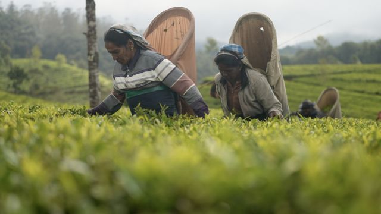
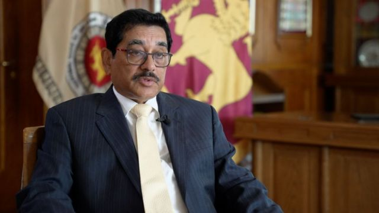
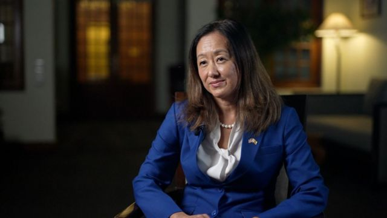

# [World] 斯里兰卡央行敦促中国和印度减记债务

#  斯里兰卡央行敦促中国和印度减记债务

  * 朱永雄（Ben Chu） 
  * BBC《新闻之夜》经济编辑 

> 图像来源，  Jack Garland

**斯里兰卡央行敦促中国和印度尽快同意进行债务减记。**

这个遭到经济危机重创的印度洋国家目前面临债务违约，并通过谈判获得了国际货币基金组织（IMF）29亿美元（24亿英镑）的贷款援助承诺。

但是，在中国和印度同意减记斯里兰卡数十亿美元的债务之前，国际货币基金组织不会发放这笔贷款。（编者注：债务的减记，英文为write- down，一般用来指资产账面价值的降低。 也就是说，一项资产的价值缩水，导致该项资产的账面值高于其当前实际价值，按会计准则将其账面值减记至反映其当前实际价值的水平。减记不等于减免，目的是让债务人获得喘息，减轻短期偿债压力并恢复自我发展。）

斯里兰卡央行行长接受BBC《新闻之夜》栏目采访时表示，迅速采取行动符合各方利益。

纳达尔·韦拉辛哈（P. Nandalal Weerasinghe）说：“他们给我们财务保证这一点越早越好，这对双方都好，无论是债权方还是债务方。”

“这将有助于我们开始偿还他们的债务。”他补充说。

“我们不希望处于这种情况，长时间不履行义务。这对国家和我们都没有好处。这不利于投资者对斯里兰卡的信心。”

尽管斯里兰卡的通货膨胀自去年以来略有缓解，但该国上个月的食品价格同比仍然上涨了65%。

> 图像来源，  Jack Garland
>
> 图像加注文字，斯里兰卡央行行长纳达尔·韦拉辛哈表示，迅速采取行动符合各方利益。

世界粮食计划署（World Food Programme）估计，超过该国三分之一人口的800万斯里兰卡人处于三餐不济的状态，饥饿问题尤其集中在农村地区。

去年，斯里兰卡经济动荡引发了大规模抗议活动，导致前总统于7月逃离该国。

世界银行估计，斯里兰卡经济在2022年萎缩了9.2%，今年将进一步萎缩4.2%。

中国和印度向斯里兰卡提供的贷款约为70亿美元和10亿美元。斯里兰卡政府最初希望在2022年底前与中印达成一项新的支付计划。

韦拉辛哈表示，协议有可能在一月晚些时候达成，但他补充称：“这一切取决于其他各方——我们的债权人真的必须做出决定。”

他补充说，斯里兰卡现在已经向各方提供了所需的有关该国借款的所有信息。

独立分析人士表示，如果对斯里兰卡大幅减记债务，中国会担心对其通过“一带一路”计划向其他发展中国家提供大量贷款带来影响。

与此同时，有报道称，印度担心在债务重组方面获得比其区域竞争对手中国更差的条件。

> 图像来源，  Jack Garland
>
> 图像加注文字，美国驻斯里兰卡大使郑智允表示，斯里兰卡没有时间拖延。

美国驻斯里兰卡大使郑智允（Julie Chung）表示，作为最大的双边债权国，中国承担着更大的责任。

“我们希望他们不要拖延，因为斯里兰卡没有时间拖延，它需要立即得到这些保证，”郑智允对BBC说。

“为了斯里兰卡民众，我们当然希望他们与IMF推进这份协议时，中国不要成为搅局者。”

但是，如果印度和中国最终同意减记对斯里兰卡的贷款，另一个潜在问题就会出现，那就是占斯里兰卡外债总量40%的私人债权人。

在2001年阿根廷陷入经济危机和违约后的几年里，一些美国对冲基金没有接受对在公开市场上购买的主权债券进行重组的方案，而是要求阿根廷全额偿还债务，并将该国政府告上了美国法庭。

1月8日，一大批国际经济学家呼吁“取消”斯里兰卡的债券，他们写道：“斯里兰卡的所有债权方必须确保取消足够的债务，来为当前危机提供出路。”

当被问及斯里兰卡的私人债券持有人时，韦拉辛哈表示：“我们与私人债权人进行了真诚的谈判。我们看到的是他们非常积极，愿意与我们合作。”

这位行长预计，一旦双边债权国达成协议，IMF的资金可以在“四至六周”内发放给斯里兰卡。

**杰克·加兰（Jack Garland）和斯嘉丽·巴特（Scarlett Barter）补充报道。**

