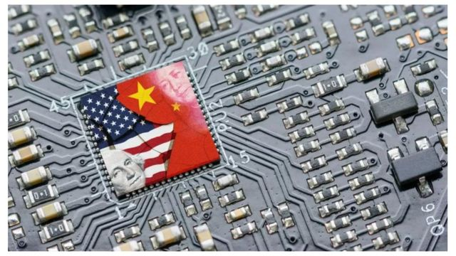
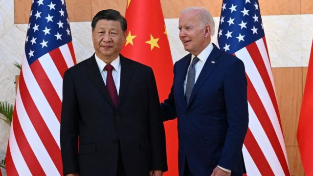
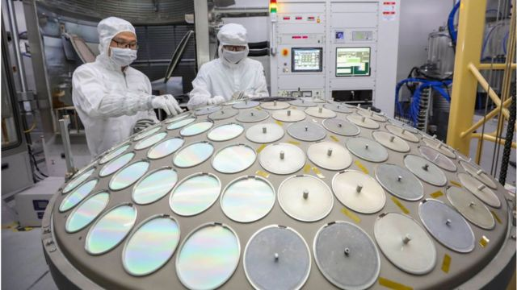
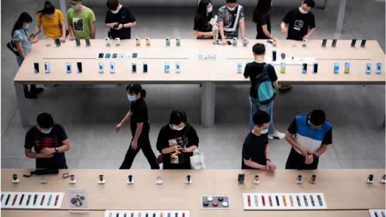

# [World] 晶片大战：美国为何领先中国？

#  晶片大战：美国为何领先中国？

  * 苏兰嘉娜·特瓦里（Suranjana Tewari） 
  * BBC亚洲商务记者 

> 图像来源，  Getty Images
>
> 图像加注文字，2022年美国通过的《芯片与科学法案》，向在美国生产半导体的公司提供 530 亿美元的援助和补贴。

**一个多世纪以来，各国对石油的争夺引发了多场战争，造就全球一些不同寻常联盟以及一场接一场的外交争端。**

现在，美国与中国，这两个全球最大的两个经济体正在争夺另一珍贵的资源：支撑我们日常生活的半导体晶片（芯片 chip）。

这些微小的晶片是一个价值5000亿美元半导体产业的核心，预计2030年将翻上一番。而谁控制了半导体供应链，亦即一个由制造晶片的公司和国家组成的错综复杂网络体系，谁就掌握了成为一个难以匹敌的超级大国之关键。

中国希望拥有生产高阶晶片的技术。这也就是为何美国，亦即大部分半导体技术的来源地，正在设法将其排除在外。

《晶片战争》一书作者、美国塔夫茨大学（Tufts University）副教授克里斯·米勒告诉BBC，这两个国家显然在亚太地区进行军备竞赛。但是，米勒进而又说，而且又不只如此。 “半导体战既发生在传统领域，如船只数量，或生产的导弹。而更多是体现在可用于军事系统的人工智能（AI）算法水平方面，”他说。

目前，美国在这场战役中正在领先，它对中国发起的晶片战也正在重塑全球经济。

##  半导体产业

半导体的制造是复杂的、专业的和深度整合的。

譬如，一部苹果手机iPhone的晶片在美国设计，在台湾、日本或韩国制造，然后在中国组装。现在，印度也开始加大对半导体产业的投资，未来该国的重要性可能会越来越。明显

半导体首先是在美国研发的，但随着时间推移，东亚作为一个半导体制造中心冒出了头，主因是该区域个政府的激励措施，包括补贴。

这种优势让美国能够在冷战期间，在那些“容易受俄罗斯影响”的地区开展商业合作和发展战略联盟。现在，面对北京在亚太地区日益增长的影响力，美国采取类似战略依然奏效。

晶片设计追求更好和更有效。一般来说，晶片是越小越好。因此挑战是：你能在最小的矽晶圆（wafers）上装下多少个“电晶体”（transistors) : 能够打开或关闭电流的微小电子开关。

贝恩谘询（ Bain & Company）矽谷合伙人王珏（Jue Wang 音译）解释：“这就是半导体行业所谓的摩尔定律，基本上是在一定的时间段内将电晶体的密度提高一倍，而这是一个很难实现的目标。”

“正是它使我们的手机运作得更快，我们的数位照片储存能力变得更强大，我们的家居设备智能化水平越来越高，我们的社交媒体内容变得更丰富！”她补充说。

但是，即使对顶级晶片制造商来说，要达到这个目标也不容易。

> 图像来源，  Getty Images
>
> 图像加注文字，习近平和拜登

2022年中，三星成为第一家开始大规模生产3奈米晶片的公司。同年晚些时候，作为全球最大的晶片代工厂和苹果公司的主要供应商的台湾半导体制造公司台积电（TSMC）也宣布将开始量产3奈米晶片。

这晶片有多小？比一缕人类的头发还小的得多，大约是50至100,000纳米。而且，这些较小的高阶晶片功能更强大，这意味着它们将进入更有价值的设备 — 超级计算机、人工智能和物联网。

制程成熟，但较低阶的晶片则支撑日常生活用品，（如微波炉、洗衣机和冰箱）。低阶晶片市场也带来利润，但是对其需求在未来可能会萎缩。

目前，世界上大多数晶片都是在台湾生产。台湾总统蔡英文因此曾引述专家 的“矽盾”（silicon shield）说法，来阐述台湾如何透过半导体产业保护自己，抵御中国。

同时间，北京也已将晶片生产作为国家优先事项，并积极投资于超级电脑和人工智能上。

米勒博士告诉BBC，中国在这一领域还远远没有成为全球领导者，但该国在过去10年一直在迅速追赶，特别是在其晶片设计方面。

米勒说：“纵观历史，只要强大的国家拥有先进的计算技术，他们就会将其部署在情报和军事系统中。”

基于这一点，在半导体晶片供应上依赖台湾和其他亚洲国家让美国感到不安。

##  美国是如何阻挠中国?

拜登政府正试图阻止中国获得制造晶片高阶技术的机会。

2022年10月，白宫宣布了全面的“出口管制”，使得相关公司几乎不可能向中国出售晶片、晶片制造设备和含有美国技术的软件，无论它们位于世界何地。

它还禁止美国公民和永久居民为中国的某些工厂工作，协助“开发或生产 ”晶片。

这在很大程度上打击了中国，因为中国在对外募集设备和人才推动其新兴的晶片制造行业。

譬如，荷兰的半导体艾司摩尔（ASML）公司，将失去它过去从中国获得的大约25%的收入。它是全球唯一生产最先进的光刻机的公司，该机器是用以制造高阶晶片的。

政策研究公司Trivium China的分析师鲍林浩（Linghao Bao 音译）告诉BBC说：“人才在这领域十分重要。若你看看中国半导体公司的高管，许多人都有美国护照，他们在美国接受培训，有的人则有绿卡....所以这对中国来说是一个真正的大问题。”

同时间，美国也想制造更多的晶片。

2022年美国通过《芯片与科学法案》，向在美国生产半导体的公司提供 530 亿美元的援助和补贴，一些行业龙头抓住这一机会。

台积电正在美国亚利桑纳州建两座价值 400 亿美元的工厂，这是他们在台湾以外的唯一高阶晶片工厂。

> 图像来源，  Getty Images

美光科技（Micron Technology ）则是美国最大的内存晶片（memory chips）制造商。该公司生产的晶片对超级电脑、军用设备和任何配备处理器的设备都是不可或缺的。美光已宣布计划在未来 20 年内斥资 1000 亿美元投资在纽约州的一家晶片厂。该公司首席执行官梅洛塔 （Sanjay Mehrotra ）向BBC表示：“《晶片法案》能弥合美国与亚洲生产中存在的成本差距。 公司将会继续投资于我们在亚洲的晶圆厂 ，重要的是全球将有一个公平竞争环境。”

##  中国如何回应

美国的半导体管制法令击中中国的痛处。

在宣布重大的晶片出口限制之后，苹果公司搁置了从中国最成功的晶片公司之一长江存储 (YMTC) 购买内存晶片的订单。

鲍林浩向BBC说，华为公司遭遇为目前的形势埋下了伏笔。 他强调，华为这家通信巨头，从仅次于三星的全球第二大智能手机制造商变成了“基本上已经死了”的情况。

他说：“因此，我们目睹华盛顿要削弱一家中国科技公司是多么容易。中国真的还没有什么好的选择来回击。以前美国针对的是个别中国公司，但这一次，范围扩大到了全中国。”

那么，北京如何回击呢？

在中国经济放缓严重之际，选择撤回商品或服务上做手脚，或是实施自己的出口管制？有分析称，这样做对中国可能弊大于利。此外，北京已向世界贸易组织 (WTO) 提出申诉，但结果可能要等数年。

许多专家说，未来中国将加倍对本土晶片制造业的投资和支持力度。

“以国家战略需求为导向，集聚力量进行原创性引领性科技攻关，坚决打赢关键核心技术攻坚战，”习近平在去年10月召开的中共二十大上说。

> 图像来源，  Getty Images

##  未来发展

短期内，该行业必须应对乌克兰战争和中国经济重启中的颠簸导致的全球经济放缓及通膨。

鉴于新冠疫情给其经济带来的巨大打击，北京也有意在半导体发展上小心行事。

米勒向BBC强调：“未来，美中台与各国半导体公司之间仍然会有许多往来。”

“事实上，只有在逻辑（logic chip）晶片和内存晶片的高端领域，我们才会看到美国协同其他盟友，戮力将中国排除在创新体系之外，而中国则努力建立自己，没有美国干涉的供应链。”

他说，这也意味着半导体生态圈可能出现“部分脱钩”的现象：一边是中国为焦点，另一边是世界其他地区。

这对全球经济影响巨大：它将迫使每个参与者选边站队，也可能断了许多人进入中国市场的路。

