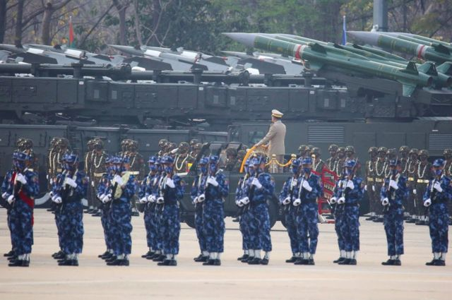
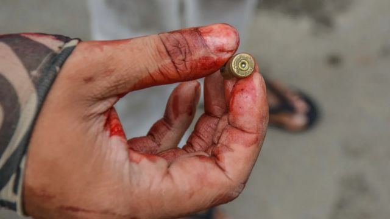

# [World] 缅甸特别咨询委员会报告：全球十余国公司帮助武装该国军政府

#  缅甸特别咨询委员会报告：全球十余国公司帮助武装该国军政府

  * 杉丽雅（Celia Hatton） 
  * BBC记者 

> 图像来源，  HANDOUT
>
> 图像加注文字，报告称，因丁屠杀中使用的武器是在缅甸制造的。

**联合国前高级官员表示，缅甸军方正利用来自至少13个国家的公司生产的大量武器来对付其人民。**

尽管西方主导了对缅甸的制裁，旨在孤立该国军政府，但美国、法国、印度和日本都在名单之列。

报告称，这些武器被用来对反政府人士实施暴行。自军方在2021年2月发动政变以来，缅甸一直陷入暴力之中。

这场政变推翻了民选政府，许多反政变人士加入了少数民族反叛组织，以反对军事统治。

缅甸问题特别咨询委员会（The Special Advisory Council on Myanmar）的报告指出，多个联合国会员国继续向军方出售武器。

“然而，一个同样重要的因素是，缅甸武装部队可以在国内生产各种用于针对平民的武器。”

报告称，这些被点名的公司为缅甸军方提供原材料、培训和机器，而生产的武器并非用于保卫边境。

“缅甸从未受到外国的攻击，”联合国前人权特别报告员、该报告的作者之一李亮喜（Yanghee Lee）解释说。

“缅甸也不出口任何武器。自1950年以来，它就制造自己的武器来对付自己的人民。”

> 图像来源，  Reuters
>
> 图像加注文字，缅甸军方在2021年2月发动政变，推翻了民选的昂山素季政府。

据官方统计，自最近一次政变以来，已有2600多人被军方杀害。然而，真实死亡人数可能是该数字的10倍。

“当它开始时……军方似乎可以压制那些羽翼未丰的反对派运动，但最近几个月和几周的形势已经发生了一些变化，”BBC缅甸语部总监梭温丹（Soe Win Tan）解释道。

“反对派所缺乏的是缅甸军政府可支配的空中力量。”

政变后，国际社会实施的制裁和孤立政策并没有阻止缅甸当局制造一系列武器，包括狙击步枪、高射炮、导弹发射器、手榴弹、炸弹和地雷。

该报告由联合国缅甸独立国际实况调查团（Independent International Fact-Finding Mission）的克里斯·西多蒂（Chris Sidoti）和马祖基·达鲁斯曼（Marzuki Darusman）与李亮喜一起撰写。

他们获得了外泄的军事文件和对退役士兵的采访，以及工厂的卫星图像。照片相当珍贵，2017年拍摄的照片证明在政变前就有国产武器被使用。

> 图像来源，  Getty Images
>
> 图像加注文字，2021年3月，一名反军事政变抗议者拿着一颗子弹。

在因丁村屠杀中，缅甸政府军杀害了10名手无寸铁的罗兴亚人，而士兵们携带的正是缅甸制造的步枪。

“最近，实皆地区发生了大屠杀，”克里斯·西多蒂解释说。“特别是对一所学校的轰炸和炮击导致许多儿童和其他人丧生。”

“在那次事件中发现的武器或……军用炮弹弹壳，可以清楚地被识别出来自这些制造厂。”

据信，一些用于制造武器的设备来自奥地利。特别咨询委员会表示，奥地利供应商 GFM Steyr 制造的高精度机器在多个地方用于制造枪管。

当这些机器需要维护时，它们会被运到台湾。据报道，在运回缅甸之前， GFM Steyr 的技术人员会在那里修复它们。报道说，目前尚不清楚这家奥地利公司的技术人员是否知晓其产品进入缅甸境内。

GFM Steyr 没有回应BBC就该报告置评的请求。

报告的作者承认，他们只发现了该武器生产网络的一小部分，但已有多个国家被认为参与其中：

  * 来自中国的原材料被发现用于缅甸的武器生产，其中包括来自中国以及新加坡的铜和铁。 
  * 通过航运记录和对前军方消息人士的采访，追踪到印度和俄罗斯的公司参与引信和电雷管等关键部件的生产。 
  * 缅甸武器工厂的机器据说来自德国、日本、乌克兰和美国。机器编程软件据信源自以色列和法国。 
  * 报告称，新加坡似乎扮演着一个中转站的角色，新加坡公司充当缅甸军方买家和外部供应商的中间商。 

几十年来，缅甸军方一直受到一系列国际制裁，但这些制裁并未阻止其生产武器。工厂的数量正在成倍增长——从1988年的6家左右增加到今天的25家。

“一直以来，国际制裁很随意的，”克里斯·西多蒂说。“联合国安理会还没有实施制裁，只是个别国家或国家集团实施了制裁。”

“因此，许多公司通过不实施制裁的国家的一些其他公司，或与缅甸当地中介机构打交道来相对容易地规避制裁。”

到目前为止，缅甸似乎没有向其他国家出口武器。然而，它在2019年泰国武器交易会上展示了一系列武器。子弹、炸弹和榴弹发射器都整齐地在摆交易会展示架上。

伦敦拉夫堡大学博士讲师罗南·李（Ronan Lee）说：“普通人在缅甸的生活是非常艰难的。”

“缅甸没有作为一个有活力国家在运作，我认为从内部它濒临崩溃。”

“关心缅甸人民的国际社会现在有机会告诉军方，它不能继续制造用来对付平民的武器。”

