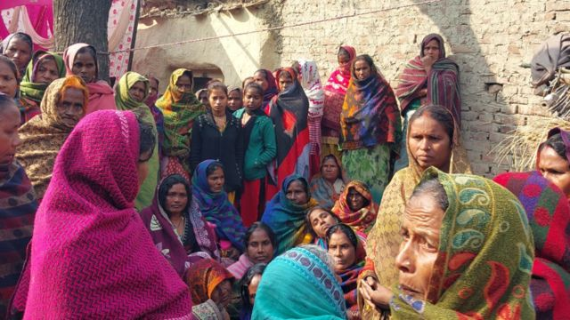

# [World] 尼泊尔空难： 印度罹难者生前机上直播，飞机坠毁一刻影片在网上疯传

#  尼泊尔空难： 印度罹难者生前机上直播，飞机坠毁一刻影片在网上疯传

  * 马亭（ Zoya Mateen） 
  * BBC 记者发自德里 

> 图像加注文字，影片是遇难者之一，印度旅客杰斯瓦尔（ Sonu Jaiswal）在空难前几秒钟在客舱上进行现场直播的画面。

**在尼泊尔30年来最致命的空难发生后的几个小时，有据信是机上罹难者拍摄的飞机坠落一刻的影片在网上广传。**

有片段是遇难者之一，印度旅客杰斯瓦尔（Sonu Jaiswal）在空难前几秒钟在客舱上进行现场直播的画面。

他是来自印度加齐布尔罹难的四个朋友中的一员。他们当时正在在尼泊尔旅游，搭上了从首都加德满都到博卡拉的这班航班。在这段录像中，可以看到窗外博卡拉机场附近环境，机上的乘客没有意识到他们当时离死亡只有一步之遥。

截至目前，机上的72名人无人生还。

从直播影片中可以看到，飞机轻轻飞过棕色的田野上零零散散的蜂窝状的建筑物上，之后，摄影者反转镜头，拍下自己微笑的画面，又把镜头转向飞机上的其他乘客。

_**（提醒：以下细节描绘可能会让一些读者感到不安。）**_

几分钟过去后，传来了震耳欲聋的撞击声。在几秒内，巨大的火焰和烟雾充斥着手机屏幕，不过录影仍持续。听起来像是发动机的发出的尖锐声响，以及玻璃的破碎声，然后是视频结束前的尖叫声。

杰斯瓦尔的朋友和家人告诉BBC，他们在杰斯瓦尔的脸书上看到了这段视频，证实影片真实性。他的朋友卡斯亚普（Mukesh Kashyap）说：“当飞机在塞提河附近的峡谷中坠毁时，杰斯瓦尔开启脸书直播。” 当地记者提瓦里（Shashikant Tiwari）也告诉BBC，卡斯亚普向他展示了杰斯瓦尔的脸书帐号上的影片，而该帐号是被设置为非公开，只开放给得到授权的帐户。

目前还不清楚杰斯瓦尔是如何在飞机上连上互联网并串流直播的。

尼泊尔前国民议会议员沙阿（Abhishek Pratap Shah）告诉印度新闻频道NDTV说，救援人员已经从飞机残骸中找到了杰斯瓦尔手机。“网上流传的（视频片段）是由我的一个朋友发送的，他是从一个警察那里得到的，是真的，”他说。

尼泊尔官员没有证实这些说法，也没有对这段直播录像发表评论，但这段录像可能有助于坠机调查。

这四位印度罹难者分别是贾斯瓦尔、阿比谢克、阿尼尔和维沙尔。 对他们的亲人来说，这些细节都不重要了。他们说自己 “太受打击了，不想知道这些”。“这种痛苦很难解释，”阿比谢克的兄弟钱德拉班告诉BBC。

“政府需要尽可能地帮助我们，我们希望能找回亲人的遗体。”

北方邦加齐布尔当局说，他们正在与这四个家庭和印度驻加德满都大使馆联系，尽全力提供任何协助。“我们还告诉这些家庭，若他们想去加德满都，我们将为他们做出一切安排，”该县县长阿克考里（Aryaka Akhauri）说。

在一些村民的记忆中，这四个罹难者是 “善良、爱玩的灵魂”。他们说，这场悲剧冲击了村里原本平静的生活，令村民大受打击。他们中的一些人还参加了抗议活动，要求政府赔偿这些家庭。这四名男子都是20多岁至30出头，也是多年的朋友，经常玩在一起。

当地人说，他们于1月13日前往尼泊尔，游览加德满都郊区的帕舒帕蒂纳特寺，这是一座宏伟的供奉印度教神的圣地。据报道，这次旅行是杰斯瓦尔的主意。作为三个孩子的父亲，他想祈福，再要一个儿子。参观完寺庙后，四人于上周日出发前往博卡拉，一个在安纳普尔纳山脉附近风景如画的旅游城市，去玩滑翔伞，之后计划返回加德满都。

> 图像加注文字，成群的哀悼者对空难仍感到难以置信。

“但命运对他另有安排！”杰斯瓦尔的一位不愿透露姓名的亲戚告诉当地新闻机构PTI。

机上有五位印度人。官员们说，53名乘客是尼泊尔人，还有4名俄罗斯人和2名韩国人。据报道，机上还包括英国、澳洲、阿根廷和法国的乘客各一名。周一(16号)，印度的社交媒体上充斥着来自坠机现场和杰斯瓦尔拍摄的视频及图片。杰斯瓦尔的父亲说，他自己都不忍心看这段视频。“我只是从儿子的朋友那里听说了这件事，我们的生活已经被打烂了。”

