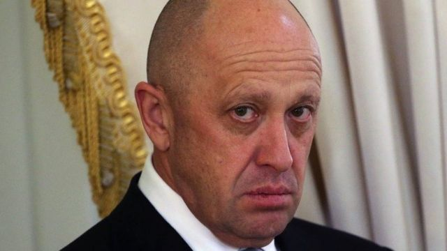
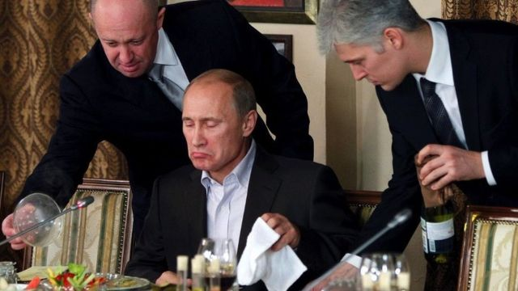
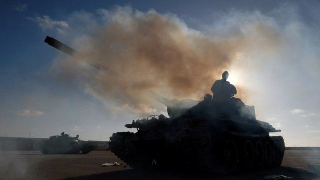
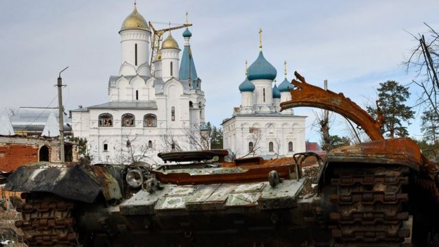

# [World] 乌克兰战争：招募罪犯参战的俄罗斯雇佣军“瓦格纳集团”首领是谁

#  乌克兰战争：招募罪犯参战的俄罗斯雇佣军“瓦格纳集团”首领是谁

> 图像来源，  Getty Images
>
> 图像加注文字，今年62岁的普里戈津最初因开了餐饮公司和餐厅，并为克里姆林宫的官方活动提供餐饮而出名。

**俄罗斯雇佣军瓦格纳集团（Wagner Group，华格纳集团）再次登上媒体头条。一名该雇佣军前指挥官偷渡到挪威，并申请政治庇护。他称在乌克兰战场前线目睹了战争罪行后逃离当地。**

瓦格纳集团首脑叶夫根尼·普里戈津（Yevgeny Prigozhin ）则发表讽刺性声明嘲笑该名指挥官。但随着更多细节的出现，普里戈津可能会受到进一步审查。 作为俄罗斯领导人普京（Vladimir Putin普丁）的盟友，普里戈津领导的瓦格纳集团雇佣军被认为占所有入侵乌克兰的俄罗斯军队的10% 。

##  普京盟友

今年62岁的普里戈津最初因开了餐饮公司和餐厅，并为克里姆林宫的官方活动提供餐饮而出名。

他最著名的照片之一是他正在为普京上菜。随后他获得“普京大厨”这个昵称；两人都来自俄罗斯第二大城市圣彼得堡，双方认识的时间可以追溯到90年代，彼时普京在圣彼得堡市长办公室工作，经常光顾普里戈津深受当地官员欢迎的一家餐馆。

> 图像来源，  Reuters
>
> 图像加注文字，普里戈津最著名的照片之一是他正在为普京上菜（2011年11月11日，莫斯科郊外一家餐厅）。随后他获得“普京大厨”这个昵称。

后来，普里戈津的餐饮业务蓬勃发展，扩展到国家合同领域——他开始为俄国学校、幼儿园乃至军队提供食物。根据俄罗斯反对派政治家阿列克谢·纳瓦尔尼（Alexei Navalny）创立的一个“反腐败基金会”的调查，普里戈津与俄罗斯政府签订的合同价值超过30亿美元。

##  假信息

在2010年代，几项新闻调查将普里戈津与圣彼得堡的一个专门制造虚假信息的组织连结起来。他们称这是一个所谓的网路“水军工厂”（troll factory）； 据报导，这家工厂专门制造诋毁俄罗斯反对派的消息，并大量发布到网路社群上，但对克里姆林宫则制造正面的信息。

2016年，根据当时负责“通俄案”调查的美国特别调查顾问罗伯特·穆勒（Robert Mueller） 进行的一项调查，这个“水军工厂”是莫斯科企图干涉美国总统大选的一部分。

不过，彼时普里戈津否认与这个假信息工厂有联系。但是，2022年11月，在美国中期选举期间普里戈津突然承认企图影响美国政治。他透过自己的媒体发布评论中称：“我们已经介入过（美国大选），我们也正在干涉，我们还将继续干涉。我们以谨慎、准确、如外科手术式地以我们自己的方式去干这些事，而我们明白该怎么做 。”

“在我们执行的精确手术中，我们还要同时切除肾脏和肝脏，”普里戈津说。

> 图像来源，  Reuters
>
> 图像加注文字，利比亚哈夫塔尔将军所属部队的坦克，据信瓦格纳集团向该部队提供过协助。

##  瓦格纳雇佣军

多年来，普里戈津总是否认自己与准军事组织“瓦格纳集团”有关，甚至去法院告了声称是他创立该集团的记者。

2014年，瓦格纳组织首次出现在乌克兰东部，他们帮助当地俄罗斯所支持的分离主义分子控制了乌克兰领土，并在顿涅茨克和卢甘斯克地区建立了两个分裂的政权。

从2014年起，瓦格纳也开始参与世界各地的多场冲突，尤其是在叙利亚和许多非洲国家。据报导，该组织参与军事行动以换取资源，例如在叙利亚，他们协助叙利亚政府控制油田，并借此获得了一定的收入。

在利比亚，瓦格纳为支持退役将领哈夫塔尔领导的利比亚国民军而战，哈夫塔尔领导的部队试图推翻联合国支持的民族团结政府，雇佣军的资金来自该国石油工业产生的收入。在中非共和国，这个雇佣兵团正站在现政府这一边，反对当地的叛乱分子。2022年9月，在俄罗斯入侵乌克兰半年后，普里戈津突然承认确实创立了瓦格纳，因为它被证明是战争中最有效的俄罗斯部队之一。

“我自己清理旧武器，自己整理防弹背心，并找到可以帮助我的专家。从那一刻起，2014年5月1日，一群爱国者诞生了，后来被称为瓦格纳营 ，”普里戈津透过他的媒体，向路透社调查报道证实了有关消息。

普里戈津对普京十分忠诚。同时，他也是少数对俄军在乌克兰的指挥部发出不满的高调声音之一。他与车臣领导人拉姆赞·卡德罗夫（Ramzan Kadyrov）一同批评和讥嘲俄罗斯高级将领亚历山大·拉平 （Alexander Lapin）在乌克兰战役中的败战连连。卡德罗夫讽刺，拉平需要被降级为二等兵，并派往前线。

普里戈津加码赞扬了卡德罗夫的坦率，并发帖称“拉姆赞，你状态真不错！”

从形式上讲，普里戈津在俄罗斯政府中没有任何官方角色。 然而，他的影响力是显而易见的。

军事专家告诉BBC，瓦格纳雇佣军在利比亚使用武器的复杂性超出了军火市场上的供应范围，只能通过最高级别的政府关系获得。

去年3月，俄罗斯入侵乌克兰不久，美国官员就表示至少有1千名瓦格纳雇佣军部署在乌克兰东部： “我们知道他们在那里，”五角大楼新闻秘书约翰·柯比 （John F. Kirby）在去年3月份的简报会上说。 “我们知道，他们想扩大在乌克兰的存在。”

后来，普里戈津开始巡视俄罗斯监狱，招募罪犯到乌克兰作战。没有莫斯科高层允许，这是不可能发生的事情。他鼓励囚犯加入战场，说社会会尊重他们——并随意警告他们不要犯下新的罪行，比如强奸。

“不要喝酒，不要吸毒，不要强奸女性，要守规矩，”他说。

普里戈津也承诺，这些罪犯上战场后，需要在乌克兰战前线待上6个月之后就可以获得自由——既可以返回家园，也可以拿掉罪名。最近，一名过去因为谋杀罪被定罪的前囚犯确实从战争中归来。然而，乌克兰军队声称，瓦格纳一直在使用其士兵作为炮灰，并且有更多的士兵战死沙场；最近一次是在乌克兰东部城镇索莱达尔（Soledar）和巴赫穆特（Bakhmut）周围的激烈战斗中。

> 图像来源，  Getty Images
>
> 图像加注文字，在被解放的斯维亚托希尔斯克镇东正教神庙前被摧毁的俄罗斯坦克。

