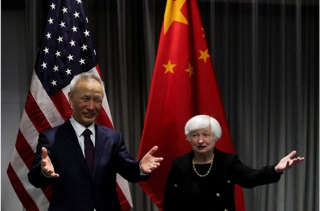
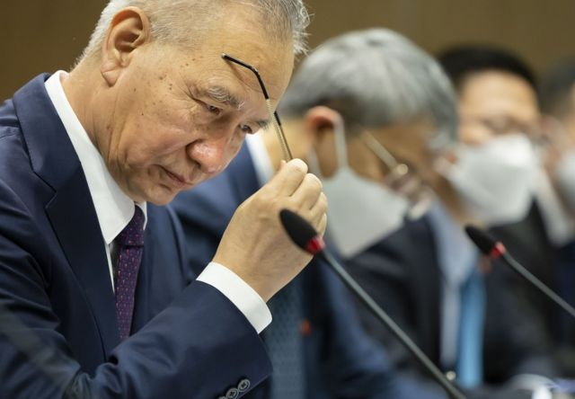
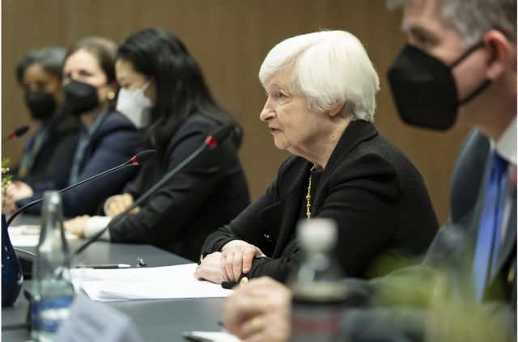

# [World] 中美关系：耶伦与刘鹤首次面谈强调“管控分歧” 谈及美方对华技术政策

#  中美关系：耶伦与刘鹤首次面谈强调“管控分歧” 谈及美方对华技术政策

**在美中两国寻求缓和关系之际，美国财长耶伦（Janet Yellen）与中国国务院副总理刘鹤周三（1月18日）在瑞士苏黎世会晤，两人同意加强宏观经济和金融方面的沟通，中方提及美方对华技术政策的影响。**

这是疫情后耶伦与刘鹤首次面谈，会谈约两个半小时。

中国商务部表示，两人进行了专业、深入坦诚及务实的交流，会谈富有建设性，中方表达了对美国对华经贸和技术政策的关切，希望美方重视这些政策对双方的影响，双方同意经贸团队在各个层级继续保持沟通交流。

> 图像来源，  EPA
>
> 图像加注文字，美国财长耶伦（Janet Yellen）与中国国务院副总理刘鹤周三（1月18日）在瑞士苏黎世会晤。

拜登政府去年10月公布半导体出口管控命令，以限制中国获得先进晶片。华盛顿并游说日本和荷兰配合美国主导的技术出口管制。此前，特朗普政府对华为等中国科技企业实施限制措施，切断从商业渠道获得芯片的能力。

值得注意的是，耶伦在会谈后，美国财政部的声明并没有提及美国对华技术政策。

> 图像来源，  EPA
>
> 图像加注文字，这是疫情后耶伦与刘鹤首次面谈，会谈约两个半小时。

美方声明形容会谈坦诚、实质、具建设性，双方同意就宏观经济和金融议题加强沟通，对全球经济运作非常重要。此外，两人同意加强关于气候金融方面的合作。

两国声明都指出，期待对方前往本国访问。美方指，耶伦希望在不久的将来访问中国并欢迎刘鹤访问美国，但声明没有透露具体日期。中方则表示欢迎耶伦今年适当时候访问中国。

##  “管控分歧”

> 图像来源，  EPA
>
> 图像加注文字，两人在面对面会谈前会见传媒， 皆提到要“管控分歧”。

两人在面对面会谈前会见传媒， 皆提到要“管控分歧”。

耶伦说，面对复杂的全球经济前景，世界上最大的两个经济体“迫切需要”就全球宏观经济和金融问题密切沟通。“虽然我们有分歧之处，我们会直接转达，我们不应容许误解，特别是因缺乏沟通而产生的误会，使我们的双边经济和金融关系不必要地恶化。”

刘鹤表示，中美两国要就包括气候变化和经济在内的问题进行“认真的沟通”和协调。“我们确实认为，我们必须始终牢记大局，努力适当地处理我们的分歧，并寻求共同点。”

去年11月，美国总统拜登和中国国家主席习近平在印尼峇里岛G20峰会期间“破冰”会晤，同意两国要加强沟通合作。

