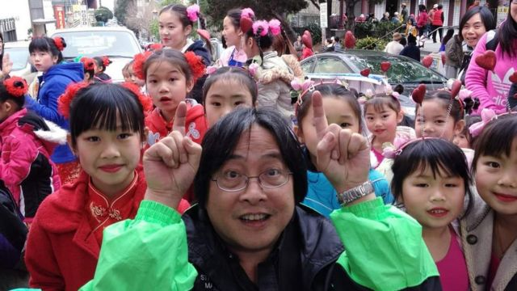
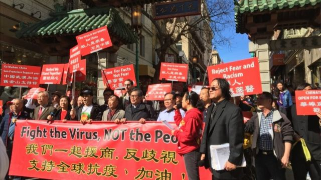

# [World] 农历新年获美国加州列假期 亚裔在仇恨浪潮中感鼓舞

#  农历新年获美国加州列假期 亚裔在仇恨浪潮中感鼓舞

  * Sam Cabral 
  * BBC News 

2 小时前

> 图像来源，  Norman Fong
>
> 图像加注文字，2020年方牧师参与三藩市农历新年庆祝活动

巷子已经打扫干净，大红灯笼高高挂，方诺曼牧师（Reverend Norman Fong）正在寻找麦克风。

他现年71岁，在三藩市唐人街“华埠”长大，20年来主持当地一年一度的新春巡游——但今年不一样，这是农历新年首次成为加州的官方假日。

为期两周的庆祝活动于周日拉开帷幕，农历年在中国、东亚和世界各地有数百万人庆祝。

“这是（关于）人与人之间的关系，互相宽恕，它几乎带有宗教性的，因为它是你生活的一个新开始，”方牧师说。“你希望每个人，甚至是你的敌人，都能得到和平、爱和新气象。”

美国各地向来都有新春庆祝活动，但今年是首次获得州政府的承认。

加州政府雇员不会获得带薪休假，但在疫情后反亚裔仇恨情绪浪潮中，春节假期被视为团结声援的姿态。

在2020年3月至2022年期间，倡议组织“停止反亚太裔”（Stop AAPI Hate）收到近11,500宗针对亚裔的仇恨报告，从口头骚扰到暴力殴打不等。

该组织的报告显示，超过三分之一（4,333宗）发生在加州，该地区有600多万亚裔居民，某种程度成为了仇恨事件的集中地。

该组织联合创办人库尔卡尼（Manjusha Kulkarni）表示，尽管仇恨事件不再是新闻头条，但亚裔美国人，尤其是老人和女性，仍然感到“没有安全感，失去了归属感”。

她说：“加州（对农历新年）的宣言，真的让我们知道，我们的族群值得被看到和听见，我们值得庆祝。”

“把亚裔美国人的经历正常化，作为更广泛的美国经历的一部分，并且不再排挤和漠视我们的社区，这都非常重要。”

> 图像来源，  Norman Fong
>
> 图像加注文字，方牧师在唐人街参与反歧视集会

三藩市唐人街的庆祝活动，是文化融合的典型例子。

根据其网站，新春庆典有花车和乐队巡游，会放鞭炮，还包括唐人街小姐选美、篮球赛和青年会的跑步赛，该活动每年吸引300万现场观众和电视观众，被视为亚洲以外最大的同类集会。

加州其他地方也有大量庆祝活动，圣何西有书法、卡拉OK和武术表演，洛杉矶的蒙特利公园将把市中心变成狂欢地带，里面有食品摊位和游乐设施。

在南部城市帕萨迪纳（Pasadena），来自香港的范乐雯（音译）很想念家乡热闹喜庆的过年气氛。

这位36岁的美食博主准备了萝卜糕和汤圆，在家里贴上红色挥春和摆放兰花，以示吉祥。

她说家人离她很远，但“当我参加新年传统活动时，我觉得我离他们近了”。

> 图像来源，  Lok Man Fan
>
> 图像加注文字，来自香港的范乐雯（右）与丈夫一起庆祝新春

她认为，疫情期间冒起的反亚裔仇恨事件，激发了亚裔社区的活力，许多人希望提升社群的能见度，公开拥抱自身的根，并宣扬自己的历史文化。

“我们可以当美国人，也可以拥抱自己的文化，两者可以共存，”她断言道。

但方牧师说，亚裔和非亚裔社区之间慢慢相互理解，但这个过程并不容易。

他父亲于1919年移民到美国，当时禁止大多数中国劳工进入美国的联邦法律《排华法案》全面实施，他父亲经常面临种族歧视。

方牧师自己也回忆说，他中学时曾被一帮意大利青少年殴打和“折磨”，他们叫他“中国佬”，认为唐人街正在侵占他们邻近的社区。

但他把自己倾注在养育他的社区中，他是唐人街长老教会的牧师，这是美国最古老的亚洲教会。

他执掌华协中心（Chinatown Community Development Center）三十年，通过开发可负担房屋、推动防止逼迁保护等，帮助亚裔居民和企业保持活力。

在他被意大利人殴打后的几十年后，他发起了“吃面节”，让唐人街和邻近的北滩意裔社区的居民，能够进行“公平竞争”——比拼亚洲炒面与意大利面。

“这能唤起我们对历史和社区的热爱，”他说，“这将让所有美国人了解我们真正的历史，更正面地参与（我们的文化）。”

送虎迎兔，方牧师带着盼望进入新的一年。

他说：“一直有两个美国，丑陋的美国和美丽的美国，而我正在为美丽的美国而战。”

“我们刚刚经历了很虎的一年，兔子象征可爱与和平，我希望这将是平静的一年。”

