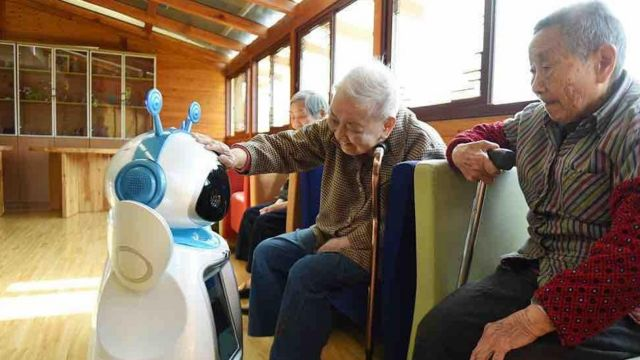
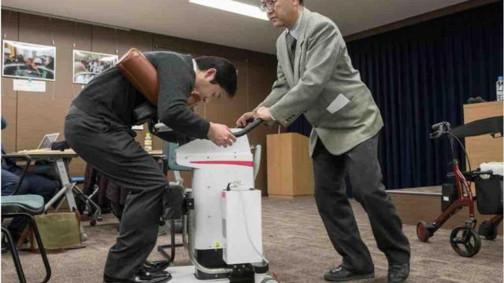

# [World] 全球人口老化及出生率暴跌：五个国家如何力挽狂澜

#  全球人口老化及出生率暴跌：五个国家如何力挽狂澜

  * 佩特拉·齐维奇（Petra Zivic） 
  * BBC新闻记者 

> 图像来源，  Getty Images
>
> 图像加注文字，中国统计局上周的数据显示，中国人口出现了60年来的首次下降，出生率也创下历史新低。

**就在中国官方报告显示人口60年来首次出现负增长后不久，日本首相岸田文雄也发出警告称，日本的低出生率和人口老龄化构成了紧迫危机。**

岸田文雄说：“日本正处于我们能否继续作为一个社会运作的边缘。”

随着日本的出生率降至历史新低，东京官员宣布他们将在与儿童相关的计划上增加一倍支出，以鼓励人们生育更多孩子。但是，日本和中国远非唯一遇到这些问题的国家——以下是各国如何努力提高出生率的措施。

##  保加利亚：长产假

33岁的博里亚娜·安德烈耶娃·格拉玛蒂科娃（Boryana Andreeva Gramatikova）在保加利亚生下儿子后的12个月里，几乎每个月都能拿到全额工资。

“在休产假的第一年，你可以获得工资的90%，第二年你可以获得最低工资， ”她告诉BBC。

根据世界银行数据，保加利亚的65岁以上人口比例为22%，是欧盟中老年人口比例最高的国家之一。为了扭转这一趋势，该国是推出世界上最长全薪产假的其中一个国家。

> 图像来源，  Boryana Andreeva Gramatikova
>
> 图像加注文字，博里亚娜在保加利亚生下儿子后的12个月里，几乎每个月都能拿到全额工资。

联合国儿童基金会（UNICEF）有关发达国家的报告提及，只有一半国家为母亲提供至少六个月的全薪假。爱沙尼亚为产妇提供最长达85周的全薪假，而美国则没有国家带薪休假政策。

博里亚娜告诉记者：“有将近两年的时间来养育孩子带来了一种安全感；你有机会与你的孩子建立联系。如果你碰巧有生着病的宝宝（像我一样），你需要在他身边，这确实会让你放心，因为你知道可以和他在一起，并照顾他，之后还可以回到工作岗位。”

但据联合国分析，尽管有这项慷慨政策，保加利亚预计到2050年将失去20%或更多的人口。尽管保加利亚的产假很长，但在其他方面，这个国家对父母仍不够友好。博里亚娜告诉BBC：“还有很多其他问题，譬如缺乏专业的育儿帮助、低工资、高通胀、高房地产价格，以及男女薪酬差距大。”

##  韩国：提供可观现金援助

虽然保加利亚正以提高产假天数，试图提高该国的低出生率，但在亚洲，韩国正尝试另一种不同的解决方案——发放现金。

从今年开始，韩国每个有新生儿的家庭都有资格获得约745美元的月津贴。

提供高额补助金的原因很简单：据韩国国家统计局数据，两年后，预计每五名韩国人中就有一人将超过65岁。

与许多其他国家一样，韩国过去一直努力确保其公共卫生和社会体系为人口老龄化做好准备。但是，当韩国在2022年的生育率跌至世界最低水平时，其问题变得更加严重。

这就是该国政府将所谓的“婴儿补助金”增加三倍作为回应的原因。补助金将完整提供持续一年，当孩子满一岁时，金额减半。这个过程在接下来的每一年都会继续。

政策制定者希望这笔现金资助能够对韩国所走的人口发展道路产生巨大影响。

韩国卫生和社会事务研究所研究员李相林在去年对BBC韩语部表示，“在短短20年内，预计韩国将超过日本，成为世界上高齡人口最多的国家。”

##  日本：机器人护理师

> 图像来源，  Getty Images
>
> 图像加注文字，机器人护理师旨在对行动不便的人提供支援，而这与老年问题密切相关。

日本以热爱科技而闻名，因此向机器人寻求帮助来应对该国的人口老龄化也就不足为奇了。

据世界银行称，日本劳动力的高龄化已经开始拖累日本经济。除了计划将儿童相关政策预算增加一倍，日本还成立新的政府机构来解决人口老龄化问题

此外，日本还一直在投资机器人，以帮助人们的晚年生活过得更轻松。在国家资金挹注下，日本公司一直投资并设计包括狗和毛茸茸的海豹在内的护理机器人，以帮助护理人员工作。

这些机器人经过精心设计，可以远程监视使用者、对话并协助老人移动。

##  中国：扭转“独生子女”政策

> 图像来源，  Getty Images
>
> 图像加注文字，北京将提高生育率列为优先事项，但事实证明提高生育率比降低生育率更难。

自2016年取消备受争议的“独生子女”政策，并允许已婚夫妇生育两个孩子以来，中国政府一直在提供税收减免和更好的孕产妇保健服务。中国国家主席习近平在2022年11月将提高生育率列为优先事项，但事实证明提高生育率比降低生育率更难。

2023年，中国人口60在过去十年来首次负增长，平均每1000名居民当中有6.77个新生儿降生。

习近平承诺他的政府将在中国“奉行积极主动的国家战略”以应对中国的人口老龄化。但是，未来看起来并不明朗。根据联合国预估，本世纪15至64岁中国人的数量将减少60%以上。

人们担心，劳动力的老龄化可能会影响中国经济很大，而中国经济放缓都会对全球产生冲击。

##  新加坡：终身学习

> 图像来源，  Getty Images

新加坡是世界上另一个老龄化速度最快的社会之一。

为了帮助劳动力应对人口老龄化的挑战，政府已经在终身学习计划上进行投资。

据世界银行称，一些大学为其校友提供与行业相关的课程，从毕业时算起，最长可达20年；还有一些大学为校友提供学分，以抵消与新兴技能相关的课程费用。

新加坡人还可以使用国家长寿保险年金计划，该计划为退休国民每月支付相关年金，直到他们生命结束，同时减轻人们退休资源耗尽的风险。

新加坡政府说，“无论你活多久，都不必担心。”

该计划资金来自于个人账户的强制性月缴供款。因此，只要保单持有人还在世，就能在老年时每月获得现金给付。

